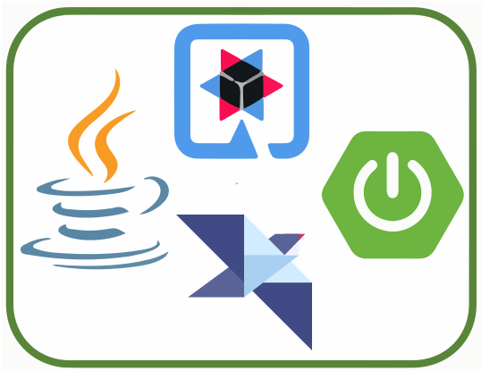
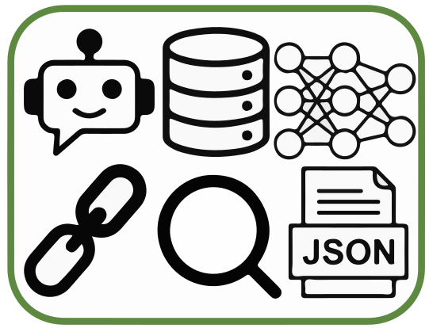

# LangChain4j

用 LLM 的力量为你的 Java 应用加速（Supercharge your Java application with the power of LLMs）。

[快速开始](get-started.md) · [简介](intro.md) · [教程](tutorials/index.md) · [集成](integrations/index.md)

## 与 LLM 和向量存储轻松交互

所有主流商业与开源 LLM 和向量存储都能通过统一 API 轻松接入，帮助你构建聊天机器人、智能助手等应用。

## 为 Java 量身打造

得益于 Quarkus、Spring Boot 和 Helidon 集成，LangChain4j 能平滑融入你的 Java 应用。LLM 与 Java 之间存在双向集成：你可以从 Java 调用 LLM，也可以让 LLM 反过来调用你的 Java 代码。

## 智能体、工具、RAG

我们丰富的工具箱为常见的 LLM 操作提供了大量能力：从低层的提示词模板、聊天记忆管理、输出解析，到智能体（Agents）与 RAG 等高层模式。

## 外部资源

- [示例仓库](https://github.com/langchain4j/langchain4j-examples) — 官方示例代码
- [文档聊天机器人](https://chat.langchain4j.dev/) — 用聊天方式查文档（实验性）
- [Javadoc](https://docs.langchain4j.dev/apidocs/index.html) — API 参考

> 本页面内容对应原站首页。原站：https://docs.langchain4j.dev
