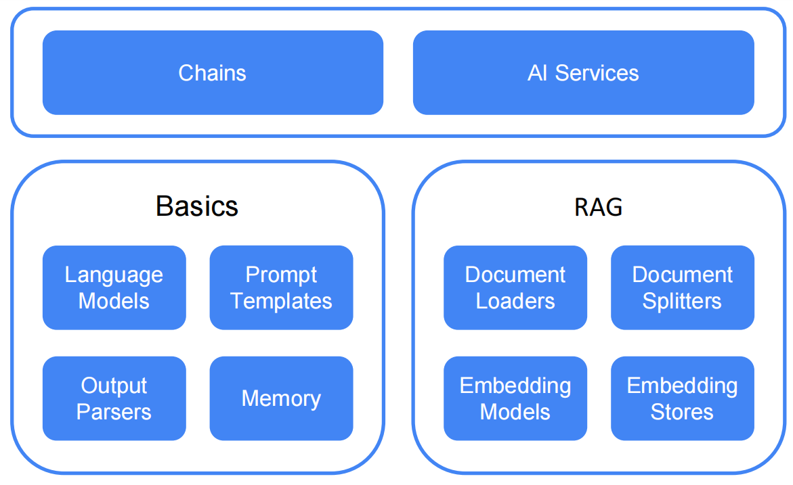

# 简介

欢迎！

LangChain4j 的目标是简化将 LLM 集成到 Java 应用中的过程。

具体方式如下：
1. **统一的 API：**
   LLM 提供商（如 OpenAI 或 Google Vertex AI）和嵌入（向量）存储（如 Pinecone 或 Milvus）
   各自使用专有的 API。LangChain4j 提供了统一的 API，使你无需为其中每一个学习并实现其特定的 API。
   要尝试不同的 LLM 或嵌入存储，你可以轻松地在它们之间切换，而无需重写代码。
   LangChain4j 目前支持 [20 多个流行的 LLM 提供商](integrations/language-models/index.md)
   和 [30 多个嵌入存储](integrations/embedding-stores/index.md)。
2. **全面的工具箱：**
   自 2023 年初以来，社区一直在构建大量基于 LLM 的应用，
   并识别出常见的抽象、模式和技术。LangChain4j 将这些提炼为一个开箱即用的软件包。
   我们的工具箱涵盖从底层的提示词模板、聊天记忆管理、函数调用，
   到智能体（Agents）和 RAG 等高级模式的广泛工具。
   对于每一种抽象，我们提供接口以及多个基于常见技术的开箱即用实现。
   无论你是构建聊天机器人，还是开发一个从数据摄入到检索的完整 RAG 流水线，
   LangChain4j 都提供了丰富的选择。
3. **丰富的示例：**
   这些[示例](https://github.com/langchain4j/langchain4j-examples)展示了如何开始创建各种基于 LLM 的应用，
   为你提供灵感，让你能够快速开始构建。

LangChain4j 于 2023 年初在 ChatGPT 热潮中开始开发。
我们注意到，面对数量众多的 Python 和 JavaScript LLM 库和框架，Java 方面缺乏对应的产品，
我们必须解决这个问题！

!!! note 并非 LangChain（Python）的移植
   尽管名称相似，**LangChain4j 并非 [LangChain](https://github.com/langchain-ai/langchain)（Python）的 Java 移植版——它是为 Java 构建的，而非移植到 Java**。
   它是一个**地道的 Java**库，完全围绕 Java 惯例从头设计：
   类型安全、POJO、注解、接口、依赖注入、流式 API，以及与
   [Quarkus](tutorials/quarkus-integration.md)、[Spring Boot](tutorials/spring-boot-integration.md)、
   [Helidon](tutorials/helidon-integration.md) 和 [Micronaut](tutorials/micronaut-integration.md) 的一等集成。
   它的 API、内部实现和发布周期与 Python LangChain 项目相互独立。

我们积极关注社区的发展动态，力求快速纳入新技术和集成，
确保你始终掌握最新动态。
该库正在积极开发中。虽然一些功能仍在完善中，
但核心功能已经就位，你现在就可以开始构建基于 LLM 的应用！

为了便于集成，LangChain4j 还提供了与
[Quarkus](tutorials/quarkus-integration.md)、[Spring Boot](tutorials/spring-boot-integration.md)、[Helidon](tutorials/helidon-integration.md) 和 [Micronaut](tutorials/micronaut-integration.md) 的集成

## LangChain4j 特性
- 与 [20 多个 LLM 提供商](integrations/language-models/index.md) 的集成
- 与 [30 多个嵌入（向量）存储](integrations/embedding-stores/index.md) 的集成
- 与 [20 多个嵌入模型](integrations/embedding-models/index.md) 的集成
- 与 [5 多个聊天记忆存储](integrations/chat-memory-stores/index.md) 的集成
- 与 [5 多个图像生成模型](integrations/image-models/index.md) 的集成
- 与 [5 多个评分（重排）模型](integrations/scoring-reranking-models/index.md) 的集成
- 支持一个审核模型（OpenAI）
- 支持文本和图像作为输入（多模态）
- [AI 服务](tutorials/ai-services.md)（高层 LLM API）
- [智能体与 Agentic AI](tutorials/agents.md)
- [技能（Skills）](tutorials/skills.md)
- 提示词模板
- 持久化和内存中的[聊天记忆](tutorials/chat-memory.md)算法实现：消息窗口和 token 窗口
- [LLM 响应的流式处理](tutorials/response-streaming.md)
- 面向常见 Java 类型和自定义 POJO 的输出解析器
- [工具（函数调用）](tutorials/tools.md)
- 动态工具（执行 LLM 动态生成的代码）
- [RAG（检索增强生成）](tutorials/rag.md)：
  - 摄入：
    - 从多种来源（文件系统、URL、GitHub、Azure Blob Storage、Amazon S3 等）导入各种类型的文档（TXT、PDF、DOC、PPT、XLS 等）
    - 使用多种切分算法将文档切分为较小的片段
    - 文档和片段的后处理
    - 使用嵌入模型对片段进行嵌入
    - 将嵌入存入嵌入（向量）存储
  - 检索（简单与高级）：
    - 查询转换（扩展、压缩）
    - 查询路由
    - 从向量存储和/或任意自定义来源进行检索
    - 重排
    - 互惠排名融合（Reciprocal Rank Fusion）
    - 自定义 RAG 流程中的每一步
- 文本分类
- 用于分词和 token 数量估算的工具
- [Kotlin 扩展](tutorials/kotlin.md)：利用 Kotlin 的协程能力，以异步非阻塞方式处理聊天交互。

## 两个抽象层级
LangChain4j 在两个抽象层级上运行：
- 低层。在这一层，你拥有最大的自由度，可以访问所有底层组件，例如
[ChatModel](tutorials/chat-and-language-models.md)、`UserMessage`、`AiMessage`、`EmbeddingStore`、`Embedding` 等。
这些是你基于 LLM 的应用的"原语"。
你完全控制如何组合它们，但需要编写更多的胶水代码。
- 高层。在这一层，你通过 [AI 服务](tutorials/ai-services.md) 这样的高层 API 与 LLM 交互，
它向你隐藏了所有的复杂性和样板代码。
你仍然可以灵活地调整和优化其行为，但这是以声明式的方式完成的。

## LangChain4j 库结构
LangChain4j 采用模块化设计，包含：
- `langchain4j-core` 模块，定义了核心抽象（如 `ChatModel` 和 `EmbeddingStore`）及其 API。
- 主 `langchain4j` 模块，包含文档加载器、[聊天记忆](tutorials/chat-memory.md)实现等实用工具，以及 [AI 服务](tutorials/ai-services.md) 等高层功能。
- 大量的 `langchain4j-{integration}` 模块，每个模块都将各种 LLM 提供商和嵌入存储集成到 LangChain4j 中。
  你可以独立使用 `langchain4j-{integration}` 模块。如需额外功能，只需导入主 `langchain4j` 依赖即可。

## LangChain4j 代码仓库
- [主仓库](https://github.com/langchain4j/langchain4j)
- [Micronaut 集成](https://github.com/micronaut-projects/micronaut-langchain4j)
- [Quarkus 扩展](https://github.com/quarkiverse/quarkus-langchain4j)
- [Spring Boot 集成](https://github.com/langchain4j/langchain4j-spring)
- [社区集成](https://github.com/langchain4j/langchain4j-community)
- [示例](https://github.com/langchain4j/langchain4j-examples)
- [社区资源](https://github.com/langchain4j/langchain4j-community-resources)

## 使用场景
你可能会问，我为什么需要这一切？
以下是一些示例：

- 你想实现一个自定义的 AI 聊天机器人，它能访问你的数据并像你想要的那样表现：
  - 客服聊天机器人，它可以：
    - 礼貌地回答客户的问题
    - 下单/修改/取消订单
  - 教育助手，它可以：
    - 教授各种学科
    - 解释不清晰的部分
    - 评估用户的理解程度/知识水平
- 你想处理大量非结构化数据（文件、网页等），并从中提取结构化信息。
  例如：
  - 从客户评论和支持聊天记录中提取见解
  - 从竞争对手的网站中提取有价值的信息
  - 从求职者的简历中提取见解
- 你想生成信息，例如：
  - 为每位客户定制邮件
  - 为你的应用/网站生成内容：
    - 博客文章
    - 故事
- 你想转换信息，例如：
  - 摘要
  - 校对和改写
  - 翻译

## 社区集成
LangChain4j 在[社区仓库](https://github.com/langchain4j/langchain4j-community)中维护一些集成。
它们支持与主仓库集成相同的功能。
它们之间的唯一区别是社区集成拥有与主仓库不同的构件和包名（即构件名和包名带有 `community` 前缀）。
创建社区仓库的目的是将部分集成的维护工作分离出去，从而更容易维护主仓库。
