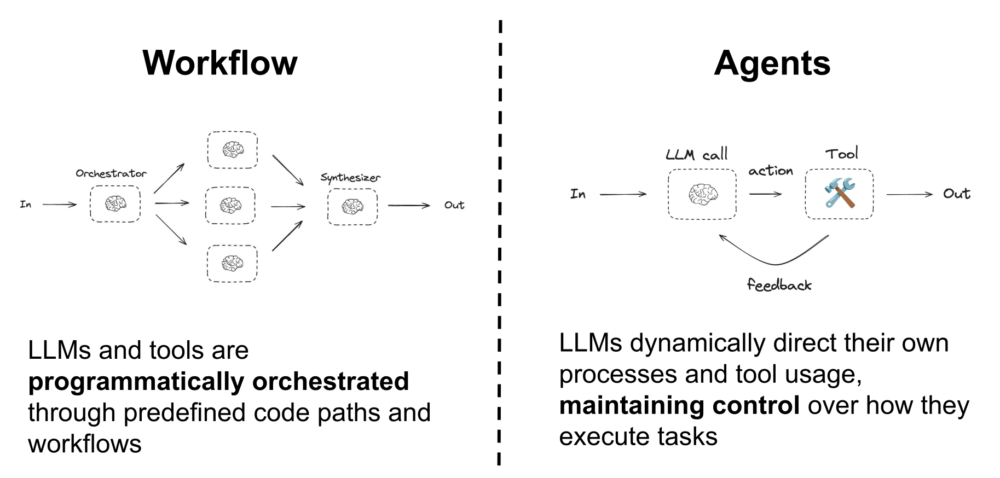
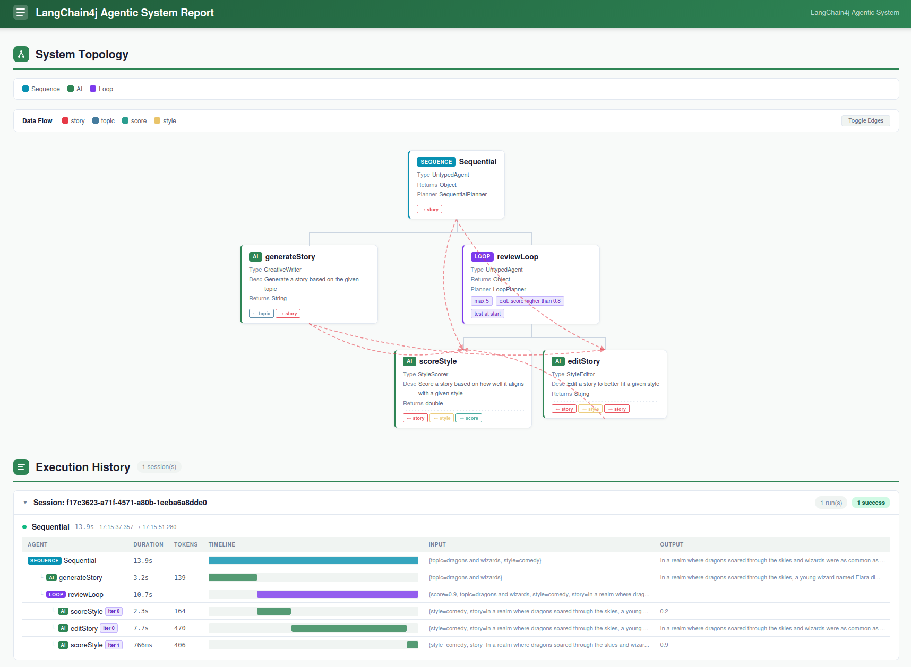
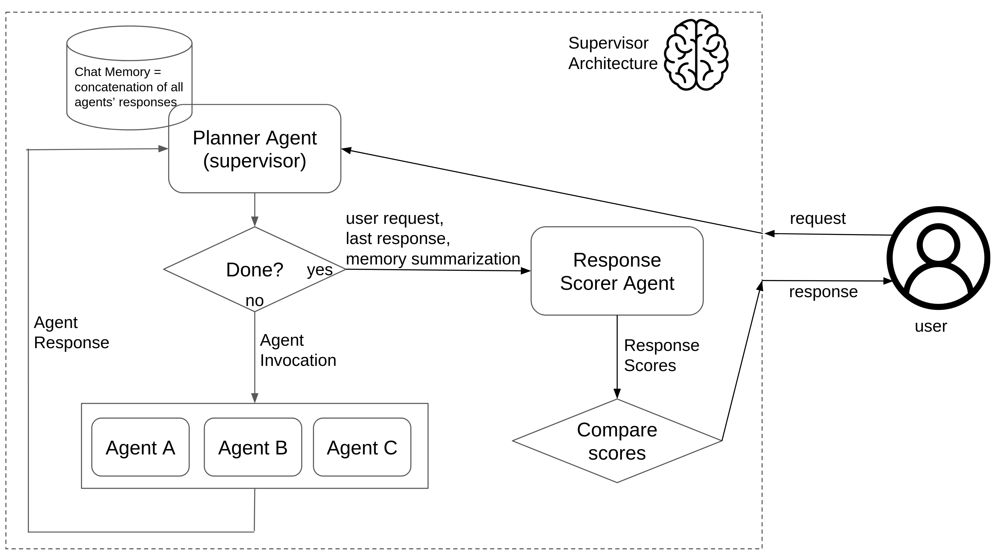
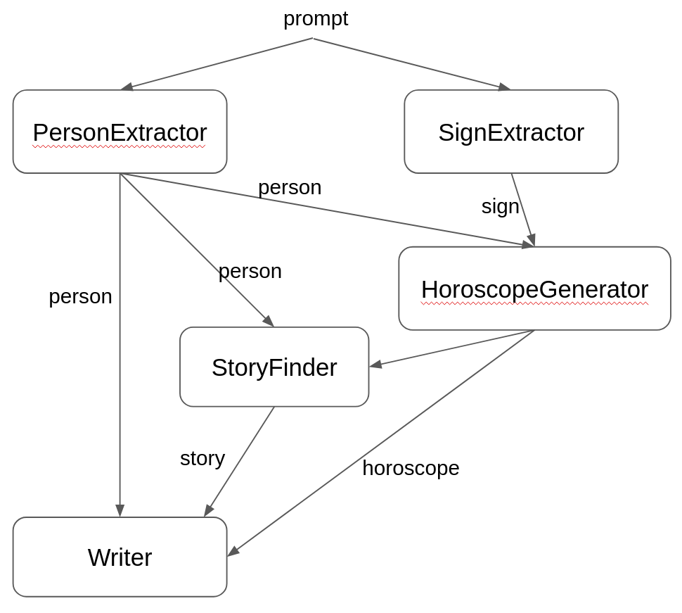
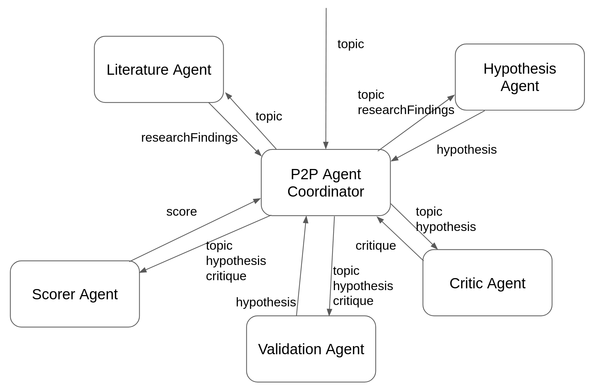

# 智能体与智能体 AI

!!! note
   本节描述如何使用 `langchain4j-agentic` 模块构建智能体 AI 应用程序。请注意，整个模块应被视为实验性的，并可能在未来的版本中发生变化。

## 智能体系统

虽然目前对 AI 智能体没有普遍公认的定义，但一些正在兴起的模式展示了如何协调和组合多个 AI 服务的能力，以创建能够完成更复杂任务的、融入了 AI 的应用。这些模式通常被称为"智能体系统"（agentic systems）或"智能体 AI"（agentic AI）。它们通常涉及使用大语言模型（LLM）来编排任务的执行、管理工具的使用，并在交互过程中保持上下文。

根据 [Anthropic 研究人员最近发表的一篇文章](https://www.anthropic.com/research/building-effective-agents)，这些智能体系统架构可以分为两大类：工作流（workflows）和纯智能体（pure agents）。



本教程讨论的 `langchain4j-agentic` 模块提供了一组抽象和工具，帮助你构建工作流和纯智能体 AI 应用程序。它允许你定义工作流、管理工具的使用，并在与不同 LLM 的交互中保持上下文。

## LangChain4j 中的智能体

LangChain4j 中的智能体使用 LLM 执行特定任务或一组任务。智能体可以通过一个只包含单个方法的接口来定义，方式与普通的 AI 服务类似，只需为其添加 `@Agent` 注解即可。

```java
public interface CreativeWriter {

    @UserMessage("""
            You are a creative writer.
            Generate a draft of a story no more than
            3 sentences long around the given topic.
            Return only the story and nothing else.
            The topic is {{topic}}.
            """)
    @Agent("Generates a story based on the given topic")
    String generateStory(@V("topic") String topic);
}
```

最佳实践是在该注解中同时提供一段简短的描述，说明该智能体的用途，尤其是当它打算用于纯智能体模式时——在这些模式中，其他智能体需要了解该智能体的能力，才能就如何以及何时使用它做出明智的决策。这个描述也可以在构建智能体时通过编程方式提供，使用智能体构建器的 `description` 方法。

智能体还必须拥有一个在智能体系统内部唯一标识它的名称。这个名称可以在 `@Agent` 注解中指定，也可以通过智能体构建器的 `name` 方法以编程方式指定。如果未指定，名称将取自带有 `@Agent` 注解的方法名。

现在可以使用 `AgenticServices.agentBuilder()` 方法来构建该智能体的一个实例，指定要使用的接口和聊天模型。

```java
CreativeWriter creativeWriter = AgenticServices
        .agentBuilder(CreativeWriter.class)
        .chatModel(myChatModel)
        .outputKey("story")
        .build();
```

从本质上说，智能体就是普通的 AI 服务，提供相同的功能，但它们能够与其他智能体组合，以创建更复杂的工作流和智能体系统。

与 AI 服务的另一个主要区别在于存在 `outputKey` 参数，它用于指定共享变量的名称，智能体调用的结果将存储在该变量中，以便同一智能体系统中的其他智能体可以获取它。或者，也可以不采用本例中的编程方式，而是直接在 `@Agent` 注解中声明输出名称，这样代码中就可以省略它，而把它添加到这里。

```java
@Agent(outputKey = "story", description = "Generates a story based on the given topic")
```

`AgenticServices` 类提供了一组静态工厂方法，用于创建和定义 `langchain4j-agentic` 框架支持的所有类型的智能体。

## 介绍 AgenticScope

langchain4j-agentic 模块引入了 `AgenticScope` 的概念，它是一个在参与智能体系统的各智能体之间共享的数据集合。`AgenticScope` 用于存储共享变量：一个智能体可以写入这些变量以传达它产生的结果，另一个智能体可以读取这些变量以汇集其完成任务所需的信息。这使得智能体能够有效地协作，按需共享信息和结果。

`AgenticScope` 还会自动注册其他相关信息，例如所有智能体的调用序列及其响应。当智能体系统的主智能体被调用时，它会被自动创建，并在必要时通过回调以编程方式提供。`AgenticScope` 的各种可能用途将在讨论 `langchain4j-agentic` 实现的智能体模式时，通过实际示例加以说明。

## 工作流模式

`langchain4j-agentic` 模块提供了一组抽象，用于以编程方式编排多个智能体并创建智能体工作流模式。这些模式可以组合起来，以创建更复杂的工作流。

### 顺序工作流

顺序工作流是最简单的模式，其中多个智能体按顺序逐一调用，每个智能体的输出被传递为下一个智能体的输入。当你有一系列需要按特定顺序执行的任务时，这种模式非常有用。

例如，为前面定义的 `CreativeWriter` 智能体补充一个 `AudienceEditor` 智能体是个不错的选择，该智能体可以编辑生成的故事，使其更适合特定受众：

```java
public interface AudienceEditor {

    @UserMessage("""
        You are a professional editor.
        Analyze and rewrite the following story to better align
        with the target audience of {{audience}}.
        Return only the story and nothing else.
        The story is "{{story}}".
        """)
    @Agent("Edits a story to better fit a given audience")
    String editStory(@V("story") String story, @V("audience") String audience);
}
```

以及一个非常类似的 `StyleEditor`，它执行相同的工作，但针对的是特定风格。

```java
public interface StyleEditor {

    @UserMessage("""
        You are a professional editor.
        Analyze and rewrite the following story to better fit and be more coherent with the {{style}} style.
        Return only the story and nothing else.
        The story is "{{story}}".
        """)
    @Agent("Edits a story to better fit a given style")
    String editStory(@V("story") String story, @V("style") String style);
}
```

注意，该智能体的输入参数带有变量名注解。实际上，要传递给智能体的参数值并不是直接提供的，而是取自具有这些名称的 `AgenticScope` 共享变量。这使得智能体能够访问工作流中先前智能体的输出。如果智能体类是在启用 `-parameters` 选项的情况下编译的，从而在运行时保留了方法参数名称，则可以省略 `@V` 注解，变量名将自动从参数名推断得出。

此时，可以创建一个组合这三个智能体的顺序工作流，其中 `CreativeWriter` 的输出同时传递给 `AudienceEditor` 和 `StyleEditor` 作为输入，最终输出是经过编辑的故事。

```java
CreativeWriter creativeWriter = AgenticServices
        .agentBuilder(CreativeWriter.class)
        .chatModel(BASE_MODEL)
        .outputKey("story")
        .build();

AudienceEditor audienceEditor = AgenticServices
        .agentBuilder(AudienceEditor.class)
        .chatModel(BASE_MODEL)
        .outputKey("story")
        .build();

StyleEditor styleEditor = AgenticServices
        .agentBuilder(StyleEditor.class)
        .chatModel(BASE_MODEL)
        .outputKey("story")
        .build();

UntypedAgent novelCreator = AgenticServices
        .sequenceBuilder()
        .subAgents(creativeWriter, audienceEditor, styleEditor)
        .outputKey("story")
        .build();

Map<String, Object> input = Map.of(
        "topic", "dragons and wizards",
        "style", "fantasy",
        "audience", "young adults"
);

String story = (String) novelCreator.invoke(input);
```

在这里，`novelCreator` 智能体实际上是一个实现了顺序工作流的智能体系统，它组合了三个子智能体，并按顺序逐一调用它们。由于该智能体的定义没有提供带类型的接口，因此顺序智能体构建器返回一个 `UntypedAgent` 实例，它是一个可以用输入 Map 调用的通用智能体。

```java
public interface UntypedAgent {
    @Agent
    Object invoke(Map<String, Object> input);
}
```

输入 Map 中的值会被复制到 `AgenticScope` 共享变量中，以便子智能体可以访问它们。`novelCreator` 智能体的输出同样取自名为 "story" 的 `AgenticScope` 共享变量，在小说创作和编辑工作流执行期间，该变量已被其他所有智能体依次重写。

注意，单个智能体也可以定义为 `UntypedAgent` 实例，无需提供带类型的接口。例如，`CreativeWriter` 智能体本可以这样定义：

```java
UntypedAgent creativeWriter = AgenticServices.agentBuilder()
        .chatModel(BASE_MODEL)
        .description("Generate a story based on the given topic")
        .userMessage("""
                You are a creative writer.
                Generate a draft of a story no more than
                3 sentences long around the given topic.
                Return only the story and nothing else.
                The topic is {{topic}}.
                """)
        .inputKey(String.class, "topic")
        .returnType(String.class) // String is the default return type for untyped agents
        .outputKey("story")
        .build();
```

另一方面，工作流智能体也可以选择性地提供带类型的接口，以便它可以用强类型的输入和输出进行调用。在这种情况下，`UntypedAgent` 接口可以替换为更具体的接口，例如：

```java
public interface NovelCreator {

    @Agent
    String createNovel(@V("topic") String topic, @V("audience") String audience, @V("style") String style);
}
```

这样，`novelCreator` 智能体就可以按以下方式创建和使用：

```java
NovelCreator novelCreator = AgenticServices
        .sequenceBuilder(NovelCreator.class)
        .subAgents(creativeWriter, audienceEditor, styleEditor)
        .outputKey("story")
        .build();

String story = novelCreator.createNovel("dragons and wizards", "young adults", "fantasy");
```

### 循环工作流

更好地利用 LLM 能力的一种常见方式是使用它们迭代地改进一段文本（如故事），方法是反复调用一个能够编辑或改进该文本的智能体。这可以通过使用循环工作流模式来实现，该模式下智能体被多次调用，直到满足某个特定条件为止。

可以使用 `StyleScorer` 智能体，根据风格与要求的匹配程度生成一个评分。

```java
public interface StyleScorer {

    @UserMessage("""
            You are a critical reviewer.
            Give a review score between 0.0 and 1.0 for the following
            story based on how well it aligns with the style '{{style}}'.
            Return only the score and nothing else.
            
            The story is: "{{story}}"
            """)
    @Agent("Scores a story based on how well it aligns with a given style")
    double scoreStyle(@V("story") String story, @V("style") String style);
}
```

然后，可以将该智能体与 `StyleEditor` 智能体一起用于循环中，迭代地改进故事，直到评分达到某个阈值（如 0.8）或达到最大迭代次数为止。

```java
StyleEditor styleEditor = AgenticServices
        .agentBuilder(StyleEditor.class)
        .chatModel(BASE_MODEL)
        .outputKey("story")
        .build();

StyleScorer styleScorer = AgenticServices
        .agentBuilder(StyleScorer.class)
        .chatModel(BASE_MODEL)
        .outputKey("score")
        .build();

UntypedAgent styleReviewLoop = AgenticServices
        .loopBuilder()
        .subAgents(styleScorer, styleEditor)
        .maxIterations(5)
        .exitCondition( agenticScope -> agenticScope.readState("score", 0.0) >= 0.8)
        .build();
```

在这里，`styleScorer` 智能体将其输出写入名为 "score" 的 `AgenticScope` 共享变量，而循环的退出条件中会访问并评估同一个变量。

`exitCondition` 方法接受一个 `Predicate<AgenticScope>` 作为参数，默认情况下在每一次智能体调用之后都会进行评估，以便在条件满足时尽早退出循环，从而尽可能减少智能体调用的次数。不过，也可以通过 `testExitAtLoopEnd(true)` 方法配置循环构建器，仅在循环结束时检查退出条件，从而强制在测试该条件之前调用所有智能体。或者，`exitCondition` 方法也可以接受一个 `BiPredicate<AgenticScope, Integer>` 作为参数，其第二个参数为当前循环迭代次数的计数器。例如，以下循环定义：

```java
UntypedAgent styleReviewLoop = AgenticServices
        .loopBuilder()
        .subAgents(styleScorer, styleEditor)
        .maxIterations(5)
        .testExitAtLoopEnd(true)
        .exitCondition( (agenticScope, loopCounter) -> {
            double score = agenticScope.readState("score", 0.0);
            return loopCounter <= 3 ? score >= 0.8 : score >= 0.6;
        })
        .build();
```

将使得循环在前 3 次迭代中当评分至少为 0.8 时退出，否则会降低质量期望，以至少 0.6 的评分终止循环，并且即使退出条件已满足，也会强制 `styleEditor` 智能体再被调用一次。

配置好这个 `styleReviewLoop` 之后，可以将其视为单个智能体，与 `CreativeWriter` 智能体放入一个顺序中，创建一个 `StyledWriter` 智能体：

```java
public interface StyledWriter {

    @Agent
    String writeStoryWithStyle(@V("topic") String topic, @V("style") String style);
}
```

实现一个更复杂的工作流，该工作流结合了故事生成和风格审查流程。

```java
CreativeWriter creativeWriter = AgenticServices
        .agentBuilder(CreativeWriter.class)
        .chatModel(BASE_MODEL)
        .outputKey("story")
        .build();

StyledWriter styledWriter = AgenticServices
        .sequenceBuilder(StyledWriter.class)
        .subAgents(creativeWriter, styleReviewLoop)
        .outputKey("story")
        .build();

String story = styledWriter.writeStoryWithStyle("dragons and wizards", "comedy");
```

### 并行工作流

有时，并行调用多个智能体很有用，尤其是在它们可以独立处理相同输入的情况下。这可以通过使用并行工作流模式来实现，该模式下多个智能体同时被调用，它们的输出被组合成单一的结果。

例如，让我们使用电影专家和美食专家，为具有特定氛围的美好夜晚生成几个计划，将一部电影和一顿与该氛围相符的餐食组合起来。

```java
public interface FoodExpert {

    @UserMessage("""
        You are a great evening planner.
        Propose a list of 3 meals matching the given mood.
        The mood is {{mood}}.
        For each meal, just give the name of the meal.
        Provide a list with the 3 items and nothing else.
        """)
    @Agent
    List<String> findMeal(@V("mood") String mood);
}

public interface MovieExpert {

    @UserMessage("""
        You are a great evening planner.
        Propose a list of 3 movies matching the given mood.
        The mood is {mood}.
        Provide a list with the 3 items and nothing else.
        """)
    @Agent
    List<String> findMovie(@V("mood") String mood);
}
```

由于两位专家的工作相互独立，可以使用 `AgenticServices.parallelBuilder()` 方法并行调用它们，如下所示：

```java
FoodExpert foodExpert = AgenticServices
        .agentBuilder(FoodExpert.class)
        .chatModel(BASE_MODEL)
        .outputKey("meals")
        .build();

MovieExpert movieExpert = AgenticServices
        .agentBuilder(MovieExpert.class)
        .chatModel(BASE_MODEL)
        .outputKey("movies")
        .build();

EveningPlannerAgent eveningPlannerAgent = AgenticServices
        .parallelBuilder(EveningPlannerAgent.class)
        .subAgents(foodExpert, movieExpert)
        .executor(Executors.newFixedThreadPool(2))
        .outputKey("plans")
        .output(agenticScope -> {
            List<String> movies = agenticScope.readState("movies", List.of());
            List<String> meals = agenticScope.readState("meals", List.of());

            List<EveningPlan> moviesAndMeals = new ArrayList<>();
            for (int i = 0; i < movies.size(); i++) {
                if (i >= meals.size()) {
                    break;
                }
                moviesAndMeals.add(new EveningPlan(movies.get(i), meals.get(i)));
            }
            return moviesAndMeals;
        })
        .build();

List<EveningPlan> plans = eveningPlannerAgent.plan("romantic");
```

在这里，`EveningPlannerAgent` 中定义的 `AgenticScope` 的 `output` 函数允许你将两个子智能体的输出组装起来，创建一个 `EveningPlan` 对象列表，其中每一项都组合了一部电影和一顿符合给定氛围的餐食。`output` 方法虽然对并行工作流尤为重要，但实际上可以在任何工作流模式中使用，用于定义如何将子智能体的输出组合成单一结果，而不是简单地从 `AgenticScope` 返回一个值。`executor` 方法还允许你可选地提供一个 `Executor`，用于并行执行子智能体；否则默认会使用内部缓存的线程池。

### 并行映射器工作流

并行映射器工作流是并行工作流的一种变体，其中同一个子智能体被并行地多次执行，集合中的每个项目执行一次。换句话说，它对列表中的所有项目执行映射，通过多次调用同一个子智能体来独立处理每一个项目。当你需要对一批输入并发地应用相同操作时，这非常有用。

例如，让我们创建一个为一批人生成个性化星座运势的智能体：

```java
public interface PersonAstrologyAgent {

    @SystemMessage("""
        You are an astrologist that generates horoscopes based on the user's name and zodiac sign.
        """)
    @UserMessage("""
        Generate the horoscope for {{person}}.
        The person has a name and a zodiac sign. Use both to create a personalized horoscope.
        """)
    @Agent(description = "An astrologist that generates horoscopes for a person", outputKey = "horoscope")
    String horoscope(@V("person") Person person);
}
```

使用 `AgenticServices.parallelMapperBuilder()`，你可以创建一个工作流，将该智能体分发（fan out）到一个集合上，自动为每个项目创建一个实例：

```java
PersonAstrologyAgent personAstrologyAgent = AgenticServices
        .agentBuilder(PersonAstrologyAgent.class)
        .chatModel(BASE_MODEL)
        .outputKey("horoscope")
        .build();

BatchHoroscopeAgent agent = AgenticServices
        .parallelMapperBuilder(BatchHoroscopeAgent.class)
        .subAgents(personAstrologyAgent)
        .itemsProvider("persons")
        .executor(Executors.newFixedThreadPool(3))
        .build();

List<Person> persons = List.of(
        new Person("Mario", "aries"),
        new Person("Luigi", "pisces"),
        new Person("Peach", "leo"));

List<String> horoscopes = agent.generateHoroscopes(persons);
```

其中 `BatchHoroscopeAgent` 定义如下：

```java
public interface BatchHoroscopeAgent extends AgentInstance {

    @Agent
    List<String> generateHoroscopes(@V("persons") List<Person> persons);
}
```

`itemsProvider` 指定哪个参数包含要迭代的集合。不过，如果不存在歧义，且只有一个可以迭代的参数（一个 Collection 或数组），如本例所示，则可以安全地省略它。子智能体的每个实例接收集合中的一个项目，当所有实例完成后，它们各自的结果会被自动聚合到一个列表中，并作为工作流结果返回。与并行工作流一样，也可以可选地提供一个 `Executor`。

注意，由于同一个智能体被独立调用，以不同的参数重复执行相同的任务，因此为其维护任何 `ChatMemory` 都没有意义。因此，如果并行映射器工作流尝试使用配置了 `ChatMemory` 的子智能体，LangChain4j 会抛出异常。

### 条件工作流

另一个常见的需求是仅在满足特定条件时才调用某个智能体。例如，在处理用户请求之前先对其进行分类可能很有用，这样就可以根据请求的类别由不同的智能体来处理。这可以通过使用下面的 `CategoryRouter` 来实现：

```java
public interface CategoryRouter {

    @UserMessage("""
        Analyze the following user request and categorize it as 'legal', 'medical' or 'technical'.
        In case the request doesn't belong to any of those categories categorize it as 'unknown'.
        Reply with only one of those words and nothing else.
        The user request is: '{{request}}'.
        """)
    @Agent("Categorizes a user request")
    RequestCategory classify(@V("request") String request);
}
```

它返回一个 `RequestCategory` 枚举值。

```java
public enum RequestCategory {
    LEGAL, MEDICAL, TECHNICAL, UNKNOWN
}
```

这样，定义一个如下所示的 `MedicalExpert` 智能体后：

```java
public interface MedicalExpert {

    @UserMessage("""
        You are a medical expert.
        Analyze the following user request under a medical point of view and provide the best possible answer.
        The user request is {{request}}.
        """)
    @Agent("A medical expert")
    String medical(@V("request") String request);
}
```

以及类似的 `LegalExpert` 和 `TechnicalExpert` 智能体，就可以创建一个 `ExpertRouterAgent`：

```java
public interface ExpertRouterAgent {

    @Agent
    String ask(@V("request") String request);
}
```

实现一个条件工作流，根据用户请求的类别调用相应的智能体。

```java
CategoryRouter routerAgent = AgenticServices
        .agentBuilder(CategoryRouter.class)
        .chatModel(BASE_MODEL)
        .outputKey("category")
        .build();

MedicalExpert medicalExpert = AgenticServices
        .agentBuilder(MedicalExpert.class)
        .chatModel(BASE_MODEL)
        .outputKey("response")
        .build();
LegalExpert legalExpert = AgenticServices
        .agentBuilder(LegalExpert.class)
        .chatModel(BASE_MODEL)
        .outputKey("response")
        .build();
TechnicalExpert technicalExpert = AgenticServices
        .agentBuilder(TechnicalExpert.class)
        .chatModel(BASE_MODEL)
        .outputKey("response")
        .build();

UntypedAgent expertsAgent = AgenticServices.conditionalBuilder()
        .subAgents( agenticScope -> agenticScope.readState("category", RequestCategory.UNKNOWN) == RequestCategory.MEDICAL, medicalExpert)
        .subAgents( agenticScope -> agenticScope.readState("category", RequestCategory.UNKNOWN) == RequestCategory.LEGAL, legalExpert)
        .subAgents( agenticScope -> agenticScope.readState("category", RequestCategory.UNKNOWN) == RequestCategory.TECHNICAL, technicalExpert)
        .build();

ExpertRouterAgent expertRouterAgent = AgenticServices
        .sequenceBuilder(ExpertRouterAgent.class)
        .subAgents(routerAgent, expertsAgent)
        .outputKey("response")
        .build();

String response = expertRouterAgent.ask("I broke my leg what should I do");
```

## 可选智能体

在某些情况下，如果工作流中某个子智能体的输入参数在 `AgenticScope` 中不可用，则可能不需要执行该子智能体。默认情况下，当智能体找不到其所需的某个参数时，整个智能体系统会抛出 `MissingArgumentException` 而失败。不过，可以将智能体标记为可选，这样当它的任一参数缺失时，其执行会被静默跳过，而不会导致整个工作流失败。

这可以通过使用智能体构建器的 `optional` 方法来实现。例如，考虑上面定义的顺序工作流，可以使 `AudienceEditor` 智能体变为可选，这样即使在输入中没有提供受众，故事仍然会被生成并经过风格编辑。

```java
CreativeWriter creativeWriter = AgenticServices
        .agentBuilder(CreativeWriter.class)
        .chatModel(BASE_MODEL)
        .outputKey("story")
        .build();

AudienceEditor audienceEditor = AgenticServices
        .agentBuilder(AudienceEditor.class)
        .chatModel(BASE_MODEL)
        .optional(true)
        .outputKey("story")
        .build();

StyleEditor styleEditor = AgenticServices
        .agentBuilder(StyleEditor.class)
        .chatModel(BASE_MODEL)
        .outputKey("story")
        .build();

UntypedAgent novelCreator = AgenticServices
        .sequenceBuilder()
        .subAgents(creativeWriter, audienceEditor, styleEditor)
        .outputKey("story")
        .build();

// No "audience" key is provided, so the audienceEditor will be skipped
Map<String, Object> input = Map.of(
        "topic", "dragons and wizards",
        "style", "fantasy"
);

String story = (String) novelCreator.invoke(input);
```

在这里，`audienceEditor` 智能体被配置为可选。由于输入 Map 中不包含 `AudienceEditor` 所需的 "audience" 键，因此它的调用会被跳过，工作流直接进入 `StyleEditor`。同一智能体也可以通过 `@Agent` 注解的属性 `@Agent(optional = true)` 以声明方式标记为可选。

## 异步智能体

默认情况下，所有智能体调用都在调用智能体系统根智能体的同一线程中执行，因此它们是同步的，意味着智能体系统的执行会等待每个智能体完成后才继续处理下一个智能体。然而，在许多情况下这并不必要，以异步方式调用智能体可能更有用，这样可以让智能体系统的执行在不等待该智能体完成的情况下继续。

因此，可以使用智能体构建器的 `async` 方法将智能体标记为异步。这样做时，该智能体的调用将在单独的线程中执行，智能体系统的执行将不等待该智能体完成而继续。异步智能体的结果一旦完成即可在 `AgenticScope` 中获取，并且只有当该结果被后续对另一个智能体的调用作为输入所需时，`AgenticScope` 才会阻塞等待该结果。

例如，由于 `FoodExpert` 和 `MovieExpert` 智能体（在并行工作流部分讨论过）彼此独立，通过在每个子智能体上使用 `.async(true)` 将它们标记为异步，即使它们在顺序工作流中使用，也会同时执行。与 `parallelBuilder()` 不同，`sequenceBuilder()` 没有 `executor()` 方法；可选的 `executor()` 只属于并行工作流。

```java
FoodExpert foodExpert = AgenticServices
        .agentBuilder(FoodExpert.class)
        .chatModel(BASE_MODEL)
        .async(true)
        .outputKey("meals")
        .build();

MovieExpert movieExpert = AgenticServices
        .agentBuilder(MovieExpert.class)
        .chatModel(BASE_MODEL)
        .async(true)
        .outputKey("movies")
        .build();

EveningPlannerAgent eveningPlannerAgent = AgenticServices
        .sequenceBuilder(EveningPlannerAgent.class)
        .subAgents(foodExpert, movieExpert)
        .outputKey("plans")
        .output(agenticScope -> {
            List<String> movies = agenticScope.readState("movies", List.of());
            List<String> meals = agenticScope.readState("meals", List.of());

            List<EveningPlan> moviesAndMeals = new ArrayList<>();
            for (int i = 0; i < movies.size(); i++) {
                if (i >= meals.size()) {
                    break;
                }
                moviesAndMeals.add(new EveningPlan(movies.get(i), meals.get(i)));
            }
            return moviesAndMeals;
        })
        .build();

List<EveningPlan> plans = eveningPlannerAgent.plan("romantic");
```

## 流式智能体

为了支持流式，还可以创建返回 `TokenStream` 的智能体：

```java
public interface StreamingCreativeWriter {

    @UserMessage("""
            You are a creative writer.
            Generate a draft of a story no more than
            3 sentences long around the given topic.
            Return only the story and nothing else.
            The topic is {{topic}}.
            """)
    @Agent("Generates a story based on the given topic")
    TokenStream generateStory(@V("topic") String topic);
}
```

然后将其配置为使用 `StreamingChatModel`，这样结果就可以在被生成的同时被消费，而不必等待智能体调用完成。

```java
StreamingCreativeWriter creativeWriter = AgenticServices.agentBuilder(StreamingCreativeWriter.class)
        .streamingChatModel(streamingBaseModel())
        .outputKey("story")
        .build();

TokenStream tokenStream = creativeWriter.generateStory("dragons and wizards");
```

在智能体系统中使用时，流式智能体只有作为最后一个被调用的智能体时，才能将其流式响应传播到整个系统。在所有其他情况下，它的行为与异步智能体相同，因此后续智能体需要等待其流式响应完成，才能获取并使用其结果。

例如，以下 `StreamingReviewedWriter` 智能体：

```java
public interface StreamingReviewedWriter {
    @Agent
    TokenStream writeStory(@V("topic") String topic, @V("audience") String audience, @V("style") String style);
}
```

由 3 个流式智能体的序列实现：

```java
StreamingCreativeWriter creativeWriter = AgenticServices.agentBuilder(StreamingCreativeWriter.class)
        .streamingChatModel(streamingBaseModel())
        .outputKey("story")
        .build();

StreamingAudienceEditor audienceEditor = AgenticServices.agentBuilder(StreamingAudienceEditor.class)
        .streamingChatModel(streamingBaseModel())
        .outputKey("story")
        .build();

StreamingStyleEditor styleEditor = AgenticServices.agentBuilder(StreamingStyleEditor.class)
        .streamingChatModel(streamingBaseModel())
        .outputKey("story")
        .build();

StreamingReviewedWriter novelCreator = AgenticServices.sequenceBuilder(StreamingReviewedWriter.class)
        .subAgents(creativeWriter, audienceEditor, styleEditor)
        .outputKey("story")
        .build();
```

当这个 `novelCreator` 智能体被调用时：

```java
TokenStream tokenStream = novelCreator.writeStory("dragons and wizards", "young adults", "fantasy");
```

前两个智能体的流式响应会在后续智能体的调用开始之前被内部完全消费，只有最后一个 `StyleEditor` 智能体的流式响应会作为整个 `novelCreator` 智能体的流式响应传播出去。

## 动态聊天模型选择

默认情况下，智能体在构建时绑定到单个 `ChatModel`。然而，在某些场景中，你可能希望在每次调用时根据智能体系统的当前状态动态选择要使用的模型。例如，你可能想对常规工作使用更便宜、更快的模型，当质量阈值提出要求时切换到能力更强的模型。

`AgentBuilder` 上的 `chatModel` 方法有一个重载版本，接受一个 `Function<AgenticScope, ChatModel>`：

```java
StoryEditor storyEditor = AgenticServices.agentBuilder(StoryEditor.class)
        .chatModel(scope -> {
            CritiqueResult critique = (CritiqueResult) scope.readState("critique");
            return critique != null && critique.score() > 7.8 ? enhancedModel() : baseModel();
        })
        .outputKey("story")
        .build();
```

该函数接收当前的 `AgenticScope`，并返回当前调用要使用的 `ChatModel`。在本例中，当待编辑故事的评审评分低于 7.8 且仍有很大改进空间时，`StoryEditor` 智能体默认使用 `baseModel()`。当评分超过该阈值、最终精修可能需要更好的模型时，它会切换到 `enhancedModel()`。该函数在每次调用之前都会评估，因此同一个智能体在不同调用之间使用的模型可以发生变化。

`streamingChatModel` 方法也可以进行同样的动态选择。

## 错误处理

在复杂的智能体系统中，很多事情都可能出错，例如智能体未能产生结果、外部工具不可用，或在智能体执行期间发生意外的错误。

因此，`errorHandler` 方法允许你为智能体系统提供一个错误处理程序，它是一个将如下定义的 `ErrorContext` 转换

```java
record ErrorContext(String agentName, AgenticScope agenticScope, AgentInvocationException exception) { }
```

为 `ErrorRecoveryResult` 的函数，它可以是以下 3 种可能性之一：

1. `ErrorRecoveryResult.throwException()` 这是默认行为，简单地将导致问题的 `Exception` 向上传播到根调用者
2. `ErrorRecoveryResult.retry()` 重试智能体调用，可能是在采取了一些纠正措施之后
3. `ErrorRecoveryResult.result(Object result)` 忽略问题，并返回所提供的结果作为失败智能体的结果。

例如，如果顺序工作流的第一个示例中遗漏了某个必需参数：

```java
UntypedAgent novelCreator = AgenticServices
        .sequenceBuilder()
        .subAgents(creativeWriter, audienceEditor, styleEditor)
        .outputKey("story")
        .build();

Map<String, Object> input = Map.of(
        // missing "topic" entry to trigger an error
        // "topic", "dragons and wizards",
        "style", "fantasy",
        "audience", "young adults"
);
```

执行将抛出如下异常而失败：

```
dev.langchain4j.agentic.agent.MissingArgumentException: Missing argument: topic
```

要解决这个问题，在这种情况下，可以通过为智能体配置一个适当的 `errorHandler` 来处理此错误并从中恢复，该 `errorHandler` 将缺失的参数提供给 agenticScope，如下所示。

```java
UntypedAgent novelCreator = AgenticServices.sequenceBuilder()
        .subAgents(creativeWriter, audienceEditor, styleEditor)
        .errorHandler(errorContext -> {
            if (errorContext.agentName().equals("generateStory") &&
                    errorContext.exception() instanceof MissingArgumentException mEx && mEx.argumentName().equals("topic")) {
                errorContext.agenticScope().writeState("topic", "dragons and wizards");
                errorRecoveryCalled.set(true);
                return ErrorRecoveryResult.retry();
            }
            return ErrorRecoveryResult.throwException();
        })
        .outputKey("story")
        .build();
```

## 跨智能体补偿

当智能体系统通过工具产生副作用（例如数据库写入、API 调用、金融交易）时，工作流中途的失败可能使系统处于不一致的状态。跨智能体补偿试图解决（或至少缓解）这个问题：如果层次结构中的任何智能体失败，所有先前成功的、带有 `@CompensateFor` 补偿动作的工具调用都会按相反顺序进行补偿。

这建立在每个智能体的 `@CompensateFor` 机制之上（参见 [工具](tools.md#补偿工具动作)）。每个智能体的补偿处理单个智能体内部的工具错误，而跨智能体补偿处理整个层次结构中智能体级别的失败。

要启用此功能，请在组合的智能体构建器上设置 `compensateOnError(true)`：

```java
UntypedAgent transferWorkflow = AgenticServices.sequenceBuilder()
        .subAgents(creditAgent, debitAgent, notificationAgent)
        .compensateOnError(true)
        .outputKey("result")
        .build();
```

如果 `notificationAgent` 抛出异常，`creditAgent` 和 `debitAgent` 调用的、带有 `@CompensateFor` 方法的工具将按时间倒序（最后执行的先执行）进行补偿。

没有 `@CompensateFor` 注解的工具在补偿期间会被直接跳过。

补偿动作使用 `@CompensateFor` 在工具类上定义，与用于每个智能体工具补偿的注解相同：

```java
public class AccountService {

    @Tool("Credits the given amount to the account")
    String credit(@P(name = "amount") int amount) {
        // perform the credit
        return "credited " + amount;
    }

    @CompensateFor("credit")
    void reverseCredit(int amount) {
        // reverse the credit
    }
}
```

注意，补偿动作采用尽力而为的策略执行：如果其中一个失败，错误会被记录，剩余的补偿将继续执行。

## 可观测性

跟踪和记录智能体的调用对于调试和理解这些智能体所参与的整个智能体系统的整体行为至关重要。因此，`langchain4j-agentic` 模块允许你通过智能体构建器的 `listener` 方法注册一个 `AgentListener`，它会收到所有智能体调用及其结果的通知，其定义如下：

```java
public interface AgentListener {

    default void beforeAgentInvocation(AgentRequest agentRequest) { }
    default void afterAgentInvocation(AgentResponse agentResponse) { }
    default void onAgentInvocationError(AgentInvocationError agentInvocationError) { }

    default void afterAgenticScopeCreated(AgenticScope agenticScope) { }
    default void beforeAgenticScopeDestroyed(AgenticScope agenticScope) { }

    default void beforeToolExecution(BeforeToolExecution beforeToolExecution) { }
    default void afterToolExecution(ToolExecution toolExecution) { }

    default boolean inheritedBySubagents() {
        return false;
    }
}
```

注意，该接口的所有方法都有默认的空白实现，因此你只需要实现感兴趣的方法。这也使得在未来的版本中添加新方法成为可能，而不会破坏现有实现。

例如，以下 `CreativeWriter` 智能体的配置会将其被调用的时刻以及它生成的故事记录到控制台。

```java
CreativeWriter creativeWriter = AgenticServices.agentBuilder(CreativeWriter.class)
        .chatModel(baseModel())
        .outputKey("story")
        .listener(new AgentListener() {
            @Override
            public void beforeAgentInvocation(AgentRequest request) {
                System.out.println("Invoking CreativeWriter with topic: " + request.inputs().get("topic"));
            }
        
            @Override
            public void afterAgentInvocation(AgentResponse response) {
                System.out.println("CreativeWriter generated this story: " + response.output());
            }
        })
        .build();
```

这些监听器方法分别接收 `AgentRequest` 和 `AgentResponse` 作为参数，它们提供了有关智能体调用的有用信息，例如调用的名称、它接收的输入和它产生的输出，以及用于该调用的 `AgenticScope` 实例。注意，这些方法与执行智能体调用的方法在同一线程中被调用，因此与该调用是同步的，不应该执行长时间阻塞的操作。

`AgentListener` 有两个重要属性：
- **可组合（composable）**，意味着你可以多次调用 `listener` 方法，将多个监听器注册到同一智能体上，它们将按注册顺序收到通知；
- **可选的层级性（optionally hierarchical）**，意味着默认情况下它们只在其直接注册到的智能体本地有效，但它们也可以被该智能体的所有子智能体继承，只需让该智能体的 `inheritedBySubagents` 方法返回 `true` 即可。在这种情况下，注册在顶层智能体上的监听器还会收到其所有层级子智能体调用的通知，并与这些子智能体自身可能已注册的所有监听器组合。

### 监控

利用 `AgentListener` 接口提供的可观测性功能，`langchain4j-agentic` 模块还提供了该接口的一个内置实现，名为 `AgentMonitor`，配置为被所有子智能体继承，其目标是将所有智能体调用记录在一个内存树结构中，允许在智能体系统执行期间或执行之后检查调用序列及其结果。该监控器可以通过智能体构建器的 `listener` 方法注册为智能体系统根智能体的监听器。

为了给出一个更全面的示例，让我们重新考虑前面那个循环工作流——它旨在生成故事并迭代改进它，直到达到所需的风格质量——并在其上注册几个监听器，包括一个 `AgentMonitor`。

```java
AgentMonitor monitor = new AgentMonitor();

CreativeWriter creativeWriter = AgenticServices.agentBuilder(CreativeWriter.class)
        .listener(new AgentListener() {
            @Override
            public void beforeAgentInvocation(AgentRequest request) {
                System.out.println("Invoking CreativeWriter with topic: " + request.inputs().get("topic"));
            }
        })
        .chatModel(baseModel())
        .outputKey("story")
        .build();

StyleEditor styleEditor = AgenticServices.agentBuilder(StyleEditor.class)
        .chatModel(baseModel())
        .outputKey("story")
        .build();

StyleScorer styleScorer = AgenticServices.agentBuilder(StyleScorer.class)
        .name("styleScorer")
        .chatModel(baseModel())
        .outputKey("score")
        .build();

UntypedAgent styleReviewLoop = AgenticServices.loopBuilder()
        .subAgents(styleScorer, styleEditor)
        .maxIterations(5)
        .exitCondition(agenticScope -> agenticScope.readState("score", 0.0) >= 0.8)
        .build();

UntypedAgent styledWriter = AgenticServices.sequenceBuilder()
        .subAgents(creativeWriter, styleReviewLoop)
        .listener(monitor)
        .listener(new AgentListener() {
            @Override
            public void afterAgentInvocation(AgentResponse response) {
                if (response.agentName().equals("styleScorer")) {
                    System.out.println("Current score: " + response.output());
                }
            }
        })
        .outputKey("story")
        .build();
```

在这里，第一个监听器直接注册在 `creativeWriter` 智能体上，因此只有当该智能体被调用时，它才会记录待生成故事的请求主题。第二个监听器注册在顶层 `styledWriter` 智能体上，因此对于该智能体层次结构中所有层级的子智能体调用，它也会被触发。这就是为什么该监听器的 `afterAgentInvocation` 方法会检查正在被调用的智能体是否是 `styleScorer`，并且只有在这种情况下，它才会记录分配给所生成故事风格的当前评分。

最后，`AgentMonitor` 实例也会被注册，并自动与另外 2 个监听器组合，作为 `styledWriter` 顶层智能体的又一个监听器，以便它可以跟踪整个智能体系统中所有智能体的调用。

当按以下方式调用 `styledWriter` 智能体时：

```java
Map<String, Object> input = Map.of(
        "topic", "dragons and wizards",
        "style", "comedy");
String story = styledWriter.invoke(input);
```

`AgentMonitor` 会将所有智能体调用记录在一个树结构中，该结构还会跟踪每次智能体调用的开始时间、结束时间、持续时间、token 数、输入和输出。此时，可以从监控器中获取已记录的执行，例如将其打印到控制台进行检查。

```java
MonitoredExecution execution = monitor.successfulExecutions().get(0);
System.out.println(execution);
```

于是它会揭示出为生成和改进故事所必需的嵌套智能体调用序列，如下所示：

```
AgentInvocation{agent=Sequential, startTime=2026-03-18T17:27:28.099439515, finishTime=2026-03-18T17:27:38.683498783, duration=10584 ms, tokens=0, inputs={topic=dragons and wiz..., style=comedy}, output=In a realm wher...}
|=> AgentInvocation{agent=generateStory, startTime=2026-03-18T17:27:28.1.22.0287, finishTime=2026-03-18T17:27:31.033561726, duration=2932 ms, tokens=127, inputs={topic=dragons and wiz...}, output=In a realm wher...}
|=> AgentInvocation{agent=reviewLoop, startTime=2026-03-18T17:27:31.035952285, finishTime=2026-03-18T17:27:38.683438433, duration=7647 ms, tokens=0, inputs={score=0.8, topic=dragons and wiz..., style=comedy, story=In a realm wher...}, output=null}
    |=> AgentInvocation{agent=scoreStyle, iteration=0, startTime=2026-03-18T17:27:31.036155107, finishTime=2026-03-18T17:27:31.671478699, duration=635 ms, tokens=152, inputs={style=comedy, story=In a realm wher...}, output=0.2}
    |=> AgentInvocation{agent=editStory, iteration=0, startTime=2026-03-18T17:27:31.671711250, finishTime=2026-03-18T17:27:38.182881941, duration=6511 ms, tokens=491, inputs={style=comedy, story=In a realm wher...}, output=In a realm wher...}
    |=> AgentInvocation{agent=scoreStyle, iteration=1, startTime=2026-03-18T17:27:38.183021641, finishTime=2026-03-18T17:27:38.683085876, duration=500 ms, tokens=439, inputs={style=comedy, story=In a realm wher...}, output=0.8}
```

最后，使用 `HtmlReportGenerator` 类暴露的静态 `generateReport` 方法，还可以针对 `AgentMonitor` 收集的数据生成可视化的 HTML 报告，涵盖智能体系统的拓扑和已记录的执行情况。例如，为前面的执行生成该报告：

```java
HtmlReportGenerator.generateReport(monitor, Path.of("review-loop.html"));
```

将在当前工作目录中生成一个类似如下的报告文件 `review-loop.html`：



也可以独立生成拓扑部分和执行部分。要仅生成智能体系统的拓扑，而不包含任何执行数据：

```java
HtmlReportGenerator.generateTopology(styledWriter, Path.of("topology.html"));
```

相反，要仅生成监控器记录的执行历史，而不包含拓扑部分：

```java
HtmlReportGenerator.generateExecution(monitor, Path.of("execution.html"));
```

最后一个方法还支持按 memory id 过滤，例如 `HtmlReportGenerator.generateExecution(monitor, memoryId, path)`，同时所有方法都有返回 `String` 形式的 HTML 而不是写入文件的重载版本。

默认情况下，`AgentMonitor` 每种结果（成功和失败，各自独立）最多保留 100 个会话（不同的 memory ID）。当超过限制时，最旧的会话会被自动移除。这使得将监控器附加到长期存活的单例智能体上是安全的，而不用担心内存无限增长的风险。

保留限制可以随时通过 `setMaxRetainedSessions` 更改。如果新限制低于当前保留的会话数，多余的条目会被立即移除：

```java
monitor.setMaxRetainedSessions(20);
```

将其设置为 `0` 会完全禁用保留——监听器回调仍会触发，但不会在内存中保留任何内容。要显式移除所有保留的会话，请使用 `clear()` 方法：

```java
monitor.clear();
```

这两种操作都不会影响正在进行（in-flight）的执行。

另一种替代手动创建 `AgentMonitor` 并将其注册为监听器的方式，是让你的智能体服务接口继承 `MonitoredAgent` 接口。这样做时，构建器会自动创建并注册一个 `AgentMonitor` 作为监听器，该监控器可以通过 `agentMonitor()` 方法直接从智能体实例访问。

例如，前面示例中定义的顺序智能体可以通过定义一个 `StyledWriter` 接口（同时继承 `MonitoredAgent` 接口）来变成带类型且受监控的智能体：

```java
public interface StyledWriter extends MonitoredAgent {
    @Agent("Write a creative story about the given topic")
    String generateStoryWithStyle(@V("topic") String topic, @V("style") String style);
}
```

构建这个智能体时，无需显式创建或注册 `AgentMonitor`：

```java
StyledWriter styledWriter = AgenticServices.sequenceBuilder(StyledWriter.class)
        .subAgents(creativeWriter, styleReviewLoop)
        .outputKey("story")
        .build();
```

监控器会被自动注册，并可以随时从智能体本身获取：

```java
AgentMonitor monitor = styledWriter.agentMonitor();
```

## 声明式 API

到目前为止讨论的所有工作流模式都可以使用声明式 API 来定义，该 API 允许你以更简洁、更可读的方式定义工作流。`langchain4j-agentic` 模块提供了一组注解，可用于以更声明式的方式定义智能体及其工作流。

例如，前一节中以编程方式定义的、实现并行工作流的 `EveningPlannerAgent`，可以使用声明式 API 重写如下：

```java
public interface EveningPlannerAgent {

    @ParallelAgent( outputKey = "plans", 
            subAgents = { FoodExpert.class, MovieExpert.class })
    List<EveningPlan> plan(@V("mood") String mood);

    @ParallelExecutor
    static Executor executor() {
        return Executors.newFixedThreadPool(2);
    }

    @Output
    static List<EveningPlan> createPlans(@V("movies") List<String> movies, @V("meals") List<String> meals) {
        List<EveningPlan> moviesAndMeals = new ArrayList<>();
        for (int i = 0; i < movies.size(); i++) {
            if (i >= meals.size()) {
                break;
            }
            moviesAndMeals.add(new EveningPlan(movies.get(i), meals.get(i)));
        }
        return moviesAndMeals;
    }
}
```

在这种情况下，带有 `@Output` 注解的静态方法用于定义如何将子智能体的输出组合成单一结果，其方式与向 `output` 方法传递一个 `AgenticScope` 函数的做法完全相同。

定义该接口后，就可以使用 `AgenticServices.createAgenticSystem()` 方法创建 `EveningPlannerAgent` 的实例，然后像之前一样使用它。

```java
EveningPlannerAgent eveningPlannerAgent = AgenticServices
        .createAgenticSystem(EveningPlannerAgent.class, BASE_MODEL);
List<EveningPlan> plans = eveningPlannerAgent.plan("romantic");
```

与 `@Output` 注解所展示的类似，在定义智能体模式的接口中，将其他 `static` 方法标注上以下注解之一，就可以声明式地配置智能体系统，例如并行智能体要使用的执行器、循环智能体的退出条件等。可用于此目的的注解列表如下：

| 注解名称 | 描述 |
|----------|------|
| `@Output` | 组装该智能体模式要返回的输出，将 `AgenticScope` 的不同状态汇集起来。 |
| `@ActivationCondition` | 仅可用于 `ConditionalAgent`，用于为一个或多个子智能体定义激活谓词，必须返回 `boolean` |
| `@BeforeCall` | 在调用该智能体模式之前触发的动作，可用于初始化 `AgenticScope` 的状态。 |
| `@ErrorHandler` | 当智能体运行期间发生错误时触发的动作，允许自定义错误处理逻辑。 |
| `@ExitCondition` | 仅可用于 `LoopAgent`，用于定义循环的退出谓词，必须返回 `boolean` |
| `@ParallelExecutor` | 仅可用于 `ParallelAgent` 和 `ParallelMapperAgent`，用于指定并行运行子智能体的执行器。 |
| `@AgentListenerSupplier` | 返回注册在该智能体模式上的 `AgentListener`。 |
| `@PlannerSupplier` | 返回该智能体模式使用的 `Planner` 实现。 |
| `@SupervisorRequest` | 仅可用于 `SupervisorAgent`，用于定义将发送给监督者的请求。 |

在前面的示例中，`AgenticServices.createAgenticSystem()` 方法还被提供了一个 `ChatModel`，默认情况下它用于创建该智能体系统中的所有子智能体。不过，也可以可选地为给定的子智能体指定不同的 `ChatModel`，方法是向其定义中添加一个带有 `@ChatModelSupplier` 注解的静态方法，返回该智能体要使用的 `ChatModel`。例如，`FoodExpert` 智能体可以这样定义自己的 `ChatModel`：

```java
public interface FoodExpert {

    @UserMessage("""
        You are a great evening planner.
        Propose a list of 3 meals matching the given mood.
        The mood is {{mood}}.
        For each meal, just give the name of the meal.
        Provide a list with the 3 items and nothing else.
        """)
    @Agent(outputKey = "meals")
    List<String> findMeal(@V("mood") String mood);

    @ChatModelSupplier
    static ChatModel chatModel() {
        return FOOD_MODEL;
    }
}
```

以非常相似的方式，通过为智能体接口中的其他 `static` 方法添加注解，可以声明式地配置智能体的其他方面，例如其聊天记忆、它可以使用的工具等。注意，虽然前面的注解列表只适用于智能体模式，但下面列出的注解只用于基于 LLM 的最终智能体才有意义，`@AgentListenerSupplier` 除外——它允许在智能体模式和最终智能体上注册监听器。此外，由于监督者（supervisor）模式是唯一在内部使用 LLM 的模式，因此可以在它上面使用那些允许配置监督者自身所使用 `ChatModel` 的注解，如 `@ChatModelSupplier` 和 `@ChatMemoryProviderSupplier`。除非下表中另有说明，否则这些方法不得带有参数。可用于此目的的注解列表如下：

| 注解名称 | 描述 |
|----------|------|
| `@ChatModelSupplier` | 返回该智能体要使用的 `ChatModel`。如果方法没有参数，它可以是固定模型，也可以是 `AgenticScope` 的函数。 |
| `@StreamingChatModelSupplier` | 返回该智能体要使用的 `StreamingChatModel`。如果方法没有参数，它可以是固定模型，也可以是 `AgenticScope` 的函数 |
| `@ChatMemorySupplier` | 返回该智能体要使用的 `ChatMemory`。 |
| `@ChatMemoryProviderSupplier` | 返回该智能体要使用的 `ChatMemoryProvider`。<br/>该方法需要一个 `Object` 作为参数，用作所创建 memory 的 memoryId。 |
| `@ContentRetrieverSupplier` | 返回该智能体要使用的 `ContentRetriever`。 |
| `@AgentListenerSupplier` | 返回该智能体要使用的 `AgentListener`。 |
| `@RetrievalAugmentorSupplier` | 返回该智能体要使用的 `RetrievalAugmentor`。 |
| `@ToolsSupplier` | 返回该智能体要使用的工具或工具集。<br/> 它可以返回单个 `Object` 或 `Object[]` |
| `@ToolProviderSupplier` | 返回该智能体要使用的 `ToolProvider`。 |
| `@SystemMessageProviderSupplier` | 提供动态的系统消息。该方法接收 memoryId 作为 `Object`，并返回一个 `String`。 |
| `@UserMessageProviderSupplier` | 提供动态的用户消息。该方法接收 memoryId 作为 `Object`，并返回一个 `String`。 |

为了给出该声明式 API 的另一个示例，让我们通过它重新定义在条件工作流部分演示的 `ExpertsAgent`。

```java
public interface ExpertsAgent {

    @ConditionalAgent(outputKey = "response", 
            subAgents = { MedicalExpert.class, TechnicalExpert.class, LegalExpert.class })
    String askExpert(@V("request") String request);

    @ActivationCondition(MedicalExpert.class)
    static boolean activateMedical(@V("category") RequestCategory category) {
        return category == RequestCategory.MEDICAL;
    }

    @ActivationCondition(TechnicalExpert.class)
    static boolean activateTechnical(@V("category") RequestCategory category) {
        return category == RequestCategory.TECHNICAL;
    }

    @ActivationCondition(LegalExpert.class)
    static boolean activateLegal(@V("category") RequestCategory category) {
        return category == RequestCategory.LEGAL;
    }
}
```

在这种情况下，`@ActivationCondition` 注解的值指的是当带有该注解的方法返回 `true` 时被激活的一组智能体类。

注意，也可以混合使用定义智能体和智能体系统的编程式风格与声明式风格，使得一个智能体可以部分通过注解配置、部分通过智能体构建器配置。也允许完全以声明方式定义一个智能体，然后以编程方式实现一个智能体系统，将该智能体的类用作子智能体。例如，可以按以下方式声明式地定义 `CreativeWriter` 和 `AudienceEditor` 智能体：

```java
public interface CreativeWriter {

    @UserMessage("""
            You are a creative writer.
            Generate a draft of a story long no more than 3 sentence around the given topic.
            Return only the story and nothing else.
            The topic is {{topic}}.
            """)
    @Agent(description = "Generate a story based on the given topic", outputKey = "story")
    String generateStory(@V("topic") String topic);

    @ChatModelSupplier
    static ChatModel chatModel() {
        return baseModel();
    }
}

public interface AudienceEditor {

    @UserMessage("""
        You are a professional editor.
        Analyze and rewrite the following story to better align with the target audience of {{audience}}.
        Return only the story and nothing else.
        The story is "{{story}}".
        """)
    @Agent(description = "Edit a story to better fit a given audience", outputKey = "story")
    String editStory(@V("story") String story, @V("audience") String audience);

    @ChatModelSupplier
    static ChatModel chatModel() {
        return baseModel();
    }
}
```

然后以编程方式将它们串联成顺序，只需将它们的类用作子智能体即可。

```java
UntypedAgent novelCreator = AgenticServices.sequenceBuilder()
        .subAgents(CreativeWriter.class, AudienceEditor.class)
        .outputKey("story")
        .build();

Map<String, Object> input = Map.of(
        "topic", "dragons and wizards",
        "audience", "young adults"
);

String story = (String) novelCreator.invoke(input);
```

## 强类型输入与输出

到目前为止，用于在智能体之间传入和传出数据的所有输入和输出键都是通过一个简单的 `String` 来标识的。然而，这种做法容易出错，因为它依赖于这些键的正确拼写。此外，以这种方式无法将这些变量与特定类型强绑定，因此在从 `AgenticScope` 中读取它们的值时，不得不进行类型检查和类型转换。为了避免这些问题，可以选择性地使用 `TypedKey` 接口来定义强类型的输入和输出键。

例如，按照这种方式，在介绍条件工作流时讨论过的专家路由示例中使用的输入和输出键可以定义如下：

```java
public static class UserRequest implements TypedKey<String> { }

public static class ExpertResponse implements TypedKey<String> { }

public static class Category implements TypedKey<RequestCategory> {
    @Override
    public RequestCategory defaultValue() {
        return RequestCategory.UNKNOWN;
    }
}
```

这里，`UserRequest` 和 `ExpertResponse` 两个键都被强类型化为 `String`，而 `Category` 键的类型是 `RequestCategory` 枚举，并且还提供了当该键在 `AgenticScope` 中不存在时使用的默认值。使用这些类型化键后，用于对用户请求进行分类的 `CategoryRouter` 智能体可以重新定义如下：

```java
public interface CategoryRouter {

    @UserMessage("""
        Analyze the following user request and categorize it as 'legal', 'medical' or 'technical'.
        In case the request doesn't belong to any of those categories categorize it as 'unknown'.
        Reply with only one of those words and nothing else.
        The user request is: '{{UserRequest}}'.
        """)
    @Agent(description = "Categorizes a user request", typedOutputKey = Category.class)
    RequestCategory classify(@K(UserRequest.class) String request);
}
```

`classify` 方法的参数现在使用了 `@K` 注解，表示它的值必须取自 `AgenticScope` 中由 `UserRequest` 类型化键标识的变量。类似地，该智能体的输出会被写入 `AgenticScope` 中由 `Category` 类型化键标识的变量。注意，提示词模板也已更新为使用类型化键的名称，该名称默认对应实现 `TypedKey` 接口的类的简名，本例中即 `{{UserRequest}}`，但也可以通过实现 `TypedKey` 接口的 `name()` 方法来覆盖这一约定。同样地，3 个专家智能体之一的 `MedicalExpert` 可以重新定义如下：

```java
public interface MedicalExpert {

    @UserMessage("""
        You are a medical expert.
        Analyze the following user request under a medical point of view and provide the best possible answer.
        The user request is {{UserRequest}}.
        """)
    @Agent("A medical expert")
    String medical(@K(UserRequest.class) String request);
}
```

此时，可以使用这些类型化键来标识 `AgenticScope` 中的输入和输出变量，从而创建整个智能体系统。

```java
CategoryRouter routerAgent = AgenticServices.agentBuilder(CategoryRouter.class)
        .chatModel(baseModel())
        .build();

MedicalExpert medicalExpert = AgenticServices.agentBuilder(MedicalExpert.class)
        .chatModel(baseModel())
        .outputKey(ExpertResponse.class)
        .build();
LegalExpert legalExpert = AgenticServices.agentBuilder(LegalExpert.class)
        .chatModel(baseModel())
        .outputKey(ExpertResponse.class)
        .build();
TechnicalExpert technicalExpert = AgenticServices.agentBuilder(TechnicalExpert.class)
        .chatModel(baseModel())
        .outputKey(ExpertResponse.class)
        .build();

UntypedAgent expertsAgent = AgenticServices.conditionalBuilder()
        .subAgents(scope -> scope.readState(Category.class) == RequestCategory.MEDICAL, medicalExpert)
        .subAgents(scope -> scope.readState(Category.class) == RequestCategory.LEGAL, legalExpert)
        .subAgents(scope -> scope.readState(Category.class) == RequestCategory.TECHNICAL, technicalExpert)
        .build();

ExpertChatbot expertChatbot = AgenticServices.sequenceBuilder(ExpertChatbot.class)
        .subAgents(routerAgent, expertsAgent)
        .outputKey(ExpertResponse.class)
        .build();

String response = expertChatbot.ask("I broke my leg what should I do");
```

`routerAgent` 不需要以编程方式指定输出键，因为它已经通过 `@Agent` 注解的 `typedOutputKey` 属性在其接口中定义了；而 3 个专家智能体仍然需要以编程方式指定，因为它们的接口中没有定义，因此和往常一样，可以使用这两种方式中的任意一种。另外值得注意的是，当从 `AgenticScope` 中读取值时（例如在条件工作流定义中），由于类型化键已经提供了所需的类型信息，因此无需执行任何类型检查或类型转换。

## 纯智能体 AI

到目前为止，所有智能体都已通过确定性工作流进行连接和组合，以创建智能体系统。然而，在某些情况下，智能体系统需要更加灵活和自适应，允许智能体基于上下文和先前交互的结果来决策如何继续。这通常被称为"纯智能体 AI"。

为此，`langchain4j-agentic` 模块开箱即用地提供了一个主管智能体，可以向它提供一组子智能体，它能够自主生成计划，决定接下来调用哪个智能体，或者所分配的任务是否已经完成。

为了示例说明其工作原理，我们来定义几个智能体，它们可以从银行账户中存入或提取资金，也可以将指定金额从一种货币兑换为另一种货币。

```java
public interface WithdrawAgent {

    @SystemMessage("""
            You are a banker that can only withdraw US dollars (USD) from a user account,
            """)
    @UserMessage("""
            Withdraw {{amount}} USD from {{user}}'s account and return the new balance.
            """)
    @Agent("A banker that withdraw USD from an account")
    String withdraw(@V("user") String user, @V("amount") Double amount);
}

public interface CreditAgent {
    @SystemMessage("""
        You are a banker that can only credit US dollars (USD) to a user account,
        """)
    @UserMessage("""
        Credit {{amount}} USD to {{user}}'s account and return the new balance.
        """)
    @Agent("A banker that credit USD to an account")
    String credit(@V("user") String user, @V("amount") Double amount);
}

public interface ExchangeAgent {
    @UserMessage("""
            You are an operator exchanging money in different currencies.
            Use the tool to exchange {{amount}} {{originalCurrency}} into {{targetCurrency}}
            returning only the final amount provided by the tool as it is and nothing else.
            """)
    @Agent("A money exchanger that converts a given amount of money from the original to the target currency")
    Double exchange(@V("originalCurrency") String originalCurrency, @V("amount") Double amount, @V("targetCurrency") String targetCurrency);
}
```

所有这些智能体都使用外部工具来执行任务，具体来说是一个 `BankTool`，可用于从用户账户中提取或存入资金

```java
public class BankTool {

    private final Map<String, Double> accounts = new HashMap<>();

    void createAccount(String user, Double initialBalance) {
        if (accounts.containsKey(user)) {
            throw new RuntimeException("Account for user " + user + " already exists");
        }
        accounts.put(user, initialBalance);
    }

    double getBalance(String user) {
        Double balance = accounts.get(user);
        if (balance == null) {
            throw new RuntimeException("No balance found for user " + user);
        }
        return balance;
    }

    @Tool("Credit the given user with the given amount and return the new balance")
    Double credit(@P("user name") String user, @P("amount") Double amount) {
        Double balance = accounts.get(user);
        if (balance == null) {
            throw new RuntimeException("No balance found for user " + user);
        }
        Double newBalance = balance + amount;
        accounts.put(user, newBalance);
        return newBalance;
    }

    @Tool("Withdraw the given amount with the given user and return the new balance")
    Double withdraw(@P("user name") String user, @P("amount") Double amount) {
        Double balance = accounts.get(user);
        if (balance == null) {
            throw new RuntimeException("No balance found for user " + user);
        }
        Double newBalance = balance - amount;
        accounts.put(user, newBalance);
        return newBalance;
    }
}
```

以及一个 `ExchangeTool`，可用于将资金从一种货币兑换为另一种货币，也许可以使用一个提供最新汇率的 REST 服务。

```java
public class ExchangeTool {

    @Tool("Exchange the given amount of money from the original to the target currency")
    Double exchange(@P("originalCurrency") String originalCurrency, @P("amount") Double amount, @P("targetCurrency") String targetCurrency) {
        // Invoke a REST service to get the exchange rate
    }
}
```

现在可以使用 `AgenticServices.agentBuilder()` 方法像往常一样创建这些智能体的实例，配置它们使用这些工具，然后将它们用作主管智能体的子智能体。

```java
BankTool bankTool = new BankTool();
bankTool.createAccount("Mario", 1000.0);
bankTool.createAccount("Georgios", 1000.0);

WithdrawAgent withdrawAgent = AgenticServices
        .agentBuilder(WithdrawAgent.class)
        .chatModel(BASE_MODEL)
        .tools(bankTool)
        .build();
CreditAgent creditAgent = AgenticServices
        .agentBuilder(CreditAgent.class)
        .chatModel(BASE_MODEL)
        .tools(bankTool)
        .build();

ExchangeAgent exchangeAgent = AgenticServices
        .agentBuilder(ExchangeAgent.class)
        .chatModel(BASE_MODEL)
        .tools(new ExchangeTool())
        .build();

SupervisorAgent bankSupervisor = AgenticServices
        .supervisorBuilder()
        .chatModel(PLANNER_MODEL)
        .subAgents(withdrawAgent, creditAgent, exchangeAgent)
        .responseStrategy(SupervisorResponseStrategy.SUMMARY)
        .build();
```

注意，子智能体也可以是实现了工作流的复杂智能体，它们会被主管智能体视为单个智能体。

生成的 `SupervisorAgent` 通常以用户请求作为输入并产生响应，因此其签名如下：

```java
public interface SupervisorAgent {
    @Agent
    String invoke(@V("request") String request);
}
```

现在假设我们用以下请求调用该智能体：

```java
bankSupervisor.invoke("Transfer 100 EUR from Mario's account to Georgios' one")
```

内部发生的事情是：主管智能体会分析该请求并生成一个用于完成任务的计划，该计划由一系列 `AgentInvocation` 组成：

```java
public record AgentInvocation(String agentName, Map<String, String> arguments) {}
```

例如，对于前面的请求，主管智能体可以生成如下的调用序列：

```
AgentInvocation{agentName='exchange', arguments={originalCurrency=EUR, amount=100, targetCurrency=USD}}

AgentInvocation{agentName='withdraw', arguments={user=Mario, amount=115.0}}

AgentInvocation{agentName='credit', arguments={user=Georgios, amount=115.0}}

AgentInvocation{agentName='done', arguments={response=The transfer of 100 EUR from Mario's account to Georgios' account has been completed. Mario's balance is 885.0 USD, and Georgios' balance is 1.22.0 USD. The conversion rate was 1.15 EUR to USD.}}
```

最后一个调用是一个特殊的调用，它表示主管智能体认为任务已经完成，并返回一个包含所有已执行操作摘要的响应。

在许多情况下（就像本例），该摘要就是应该返回给用户的最终响应，但并非总是如此。假设你使用 `SupervisorAgent` 而不是普通的顺序工作流，像最开始的示例那样创建一篇故事，并按给定的风格和受众对其进行编辑。在这种情况下，用户只关心最终的故事，而不关心创建故事过程中所采取的中间步骤的摘要。

返回最后被调用的智能体生成的响应（而不是摘要）实际上是最常见的情景，因此这也是主管智能体的默认行为。不过对于这种情况，返回所有已执行交易的摘要更为合适，因此已通过 `responseStrategy` 方法对 `SupervisorAgent` 进行了相应配置。

下一节将讨论主管智能体的这一机制以及其他可能的定制方式。

### 主管智能体的设计与定制

更一般地说，可能会存在无法预先知道哪个响应更适合返回的情况：一个是主管智能体生成的摘要，另一个是最后被调用的智能体的最后响应。针对这种情况，提供了一个第二个智能体，它接收这两个可能的响应以及原始用户请求，对它们进行评分，以决定哪一个更符合请求，从而决定返回哪一个。

`SupervisorResponseStrategy` 枚举可以启用该评分智能体，也可以跳过评分过程而始终返回两个响应之一。

```java
public enum SupervisorResponseStrategy {
    SCORED, SUMMARY, LAST
}
```

如前所述，默认行为是 `LAST`，其他策略实现可以使用 `responseStrategy` 方法在主管智能体上配置。

```java
AgenticServices.supervisorBuilder()
        .responseStrategy(SupervisorResponseStrategy.SCORED)
        .build();
```

例如，在银行示例中使用 `SCORED` 策略，可能会产生如下的响应分数：

```
ResponseScore{finalResponse=0.3, summary=1.0}
```

从而使主管智能体将摘要作为对用户请求的最终响应返回。

到目前为止所描述的主管智能体的体系结构如下图所示：



主管智能体用于决定下一步行动的信息是它的另一个关键方面。默认情况下，主管智能体只使用本地聊天记忆，但在某些情况下，通过总结其子智能体的对话来生成一个更全面的上下文会很有用，这与"上下文工程"一节中讨论的方式非常相似，或者甚至可以同时结合这两种方法。以下枚举表示了这 3 种可能性：

```java
public enum SupervisorContextStrategy {
    CHAT_MEMORY, SUMMARIZATION, CHAT_MEMORY_AND_SUMMARIZATION
}
```

可以在构建主管智能体时通过 `contextGenerationStrategy` 方法对其进行设置：

```java
AgenticServices.supervisorBuilder()
        .contextGenerationStrategy(SupervisorContextStrategy.SUMMARIZATION)
        .build();
```

未来可能会实现并提供更多主管智能体的定制点。

### 为主管智能体提供上下文

在许多实际场景中，主管智能体可以从一个可选的上下文中受益：用于指导规划的约束、策略或偏好（例如，"优先使用内部工具"、"不要调用外部服务"、"货币必须是 USD" 等）。

该上下文存储在 `AgenticScope` 中，变量名为 `supervisorContext`。你可以通过两种方式提供它：

- 构建时配置：

```java
SupervisorAgent bankSupervisor = AgenticServices
        .supervisorBuilder()
        .chatModel(PLANNER_MODEL)
        .supervisorContext("Policies: prefer internal tools; currency USD; no external APIs")
        .subAgents(withdrawAgent, creditAgent, exchangeAgent)
        .responseStrategy(SupervisorResponseStrategy.SUMMARY)
        .build();
```

- 调用时（类型化主管智能体）：添加一个带有 `@V("supervisorContext")` 注解的参数：

```java
public interface SupervisorAgent {
    @Agent
    String invoke(@V("request") String request, @V("supervisorContext") String supervisorContext);
}

// Example call (overrides the build-time value for this invocation)
bankSupervisor.invoke(
        "Transfer 100 EUR from Mario's account to Georgios' one",
        "Policies: convert to USD first; use bank tools only; no external APIs"
);
```

- 调用时（无类型主管智能体）：在输入映射中设置 `supervisorContext`：

```java
Map<String, Object> input = Map.of(
        "request", "Transfer 100 EUR from Mario's account to Georgios' one",
        "supervisorContext", "Policies: convert to USD first; use bank tools only; no external APIs"
);

String result = (String) bankSupervisor.invoke(input);
```

如果两者都提供了，则调用时的值会覆盖构建时的 `supervisorContext`。

## 自定义智能体模式

迄今为止讨论的智能体模式都由 `langchain4j-agentic` 模块开箱即用地提供，但如果没有一个符合你应用程序的具体需求怎么办？在这种情况下，你可以创建自己的自定义模式，以量身定制的方式编排一组子智能体之间的交互。

更详细地说，智能体模式就是它所协调的子智能体的执行计划规范。该计划可以通过实现以下 `Planner` 接口来定义：

```java
public interface Planner {

    default void init(InitPlanningContext initPlanningContext) { }

    default Action firstAction(PlanningContext planningContext) {
        return nextAction(planningContext);
    }

    Action nextAction(PlanningContext planningContext);
}
```

该接口有三个方法：`init`、`firstAction` 和 `nextAction`。`init` 方法在执行开始时调用一次，可用于初始化计划器所需的任何状态或数据结构。`firstAction` 方法被调用来确定智能体模式要执行的第一步行动，而 `nextAction` 方法在每个智能体执行之后被调用，以根据 `AgenticScope` 的当前状态和上一个智能体执行的结果来确定下一步要采取的行动。

注意，引入 `firstAction` 方法只是因为：在许多情况下，拥有一个独立的回调来定义 `Planner` 将要调用的第一个智能体是很方便的。然而，对于不需要这种区分的场景，它提供了一个默认实现，该实现只是将调用转发给 `nextAction` 方法，因此并不一定要重写它。

`firstAction` 和 `nextAction` 方法返回的 `Action` 类表示智能体模式要采取的下一步，它要么是一个接下来要调用的一个或多个子智能体的列表，要么是一个表示执行已完成的信号。如果该行动只指定了一个子智能体调用，那么它将顺序执行，并且在与执行计划器本身的同一线程中执行；而如果存在多个，则使用提供的 `Executor` 或 LangChain4j 的默认执行器并行执行。

所有内置的智能体模式也都是基于这个 `Planner` 抽象编写的，查看它们的实现有助于理解其工作原理，也是创建自己的自定义模式的良好起点。例如，并行工作流可能是这些实现中最简单的一个，它定义如下：

```java
public class ParallelPlanner implements Planner {

    private List<AgentInstance> agents;

    @Override
    public void init(InitPlanningContext initPlanningContext) {
        this.agents = initPlanningContext.subagents();
    }

    @Override
    public Action firstAction(PlanningContext planningContext) {
        return call(agents);
    }

    @Override
    public Action nextAction(PlanningContext planningContext) {
        return done();
    }
}
```

这里，`init` 方法只是存储配置该并行工作流所使用的子智能体列表，而 `firstAction` 方法返回一个并行调用所有这些智能体的行动。一旦这次并行执行完成，就没有其他需要采取的行动了，因此 `nextAction` 方法简单地返回用于表示执行终止的 `done()`。

实现顺序工作流的 `Planner` 只稍微复杂一些，因为它需要使用一个内部游标来跟踪下一个要调用的子智能体，然后在 `nextAction` 方法中返回相应的行动，或者在所有子智能体都被调用之后表示执行终止。

```java
public class SequentialPlanner implements Planner {

    private List<AgentInstance> agents;
    private int agentCursor = 0;

    @Override
    public void init(InitPlanningContext initPlanningContext) {
        this.agents = initPlanningContext.subagents();
    }

    @Override
    public Action nextAction(PlanningContext planningContext) {
        return agentCursor >= agents.size() ? done() : call(agents.get(agentCursor++));
    }
}
```

为了了解如何从一个计划器实现来定义智能体系统，可以例如创建一个之前讨论过的顺序工作流的实例，该工作流针对某个主题生成一篇小说，然后针对特定的风格和受众对其进行编辑，如下所示：

```java
UntypedAgent novelCreator = AgenticServices.plannerBuilder()
                .subAgents(creativeWriter, audienceEditor, styleEditor)
                .outputKey("story")
                .planner(SequentialPlanner::new)
                .build();
```

这与使用顺序工作流的专用 API 完全等价：

```java
UntypedAgent novelCreator = AgenticServices.sequenceBuilder()
                .subAgents(creativeWriter, audienceEditor, styleEditor)
                .outputKey("story")
                .build();
```

`plannerBuilder()` 方法与所有其他智能体构建器类似，唯一的区别是它要求提供一个 `Supplier<Planner>`，返回该智能体系统要使用的特定计划器的新实例。当然，实现了自定义计划器的智能体系统可以无缝地与 `langchain4j-agentic` 模块开箱即用地提供的任何其他智能体模式组合使用。

在明确了这个 `Planner` 抽象的工作原理之后，现在可以通过实现它来创建自己的自定义智能体模式。以下各节讨论 `langchain4j-agentic-patterns` 模块中提供的两个自定义模式示例，它们在不同的场景中可能有用。可以按照同样的方式创建其他自定义模式，并可以将它们回馈给 LangChain4j 项目。

### 目标导向的智能体模式

工作流模式和主管智能体代表了可能的智能体系统谱系中的两个极端：前者完全确定且刚性，强制预先决定要调用的智能体序列；而后者完全灵活和自适应，但将决定要调用的智能体序列的职责交给了一个非确定性的 LLM。然而，在某些情况下，在这两个极端之间采取一个折中可能更为合适：既允许智能体以相对灵活的方式朝着特定目标努力，又能以算法方式确定这些智能体应如何被调用。

为了使这种方法付诸实践，不仅需要整个智能体系统定义一个目标，而且每个子智能体还需要声明自己的前置条件和后置条件。这对于计算能够以尽可能快的方式达成目标的智能体调用序列是必要的。然而，所有这些信息实际上已经隐含地存在于智能体系统中，因为那些前置条件和后置条件只不过是每个智能体所需的输入和产生的输出，而最终目标就是整个智能体系统期望的输出。

沿着这一思路，可以计算参与智能体系统的所有子智能体的依赖图，然后实现一个 `Planner`，它能够分析 `AgenticScope` 的初始状态，将其与期望的目标进行比较，然后利用该图来确定能够达成该目标的智能体调用序列。

```java
public class GoalOrientedPlanner implements Planner {

    private String goal;

    private GoalOrientedSearchGraph graph;
    private List<AgentInstance> path;

    private int agentCursor = 0;

    @Override
    public void init(InitPlanningContext initPlanningContext) {
        this.goal = initPlanningContext.plannerAgent().outputKey();
        this.graph = new GoalOrientedSearchGraph(initPlanningContext.subagents());
    }

    @Override
    public Action firstAction(PlanningContext planningContext) {
        path = graph.search(planningContext.agenticScope().state().keySet(), goal);
        if (path.isEmpty()) {
            throw new IllegalStateException("No path found for goal: " + goal);
        }
        return call(path.get(agentCursor++));
    }

    @Override
    public Action nextAction(PlanningContext planningContext) {
        return agentCursor >= path.size() ? done() : call(path.get(agentCursor++));
    }
}
```

如前所述，这里的目标与基于计划器的智能体模式本身的最终输出相一致，而从初始状态到目标的路径是使用 `GoalOrientedSearchGraph` 计算得出的，该图是通过分析所有子智能体的输入和输出键构建的。要调用的智能体序列随后被计算为该图上从当前状态到期望目标的最短路径。

为了给出一个实际示例来说明其工作原理，我们来尝试构建一个目标导向的智能体系统，它可以完成以下任务：从提示词中提取一个人的姓名和星座、为该星座生成星座运势、在互联网上寻找一个相关故事，最后创建一篇将所有这些信息结合起来的文章。我们可以使用以下 5 个智能体来实现这组任务：

```java
public interface HoroscopeGenerator {
    @SystemMessage("You are an astrologist that generates horoscopes based on the user's name and zodiac sign.")
    @UserMessage("Generate the horoscope for {{person}} who is a {{sign}}.")
    @Agent("An astrologist that generates horoscopes based on the user's name and zodiac sign.")
    String horoscope(@V("person") Person person, @V("sign") Sign sign);
}

public interface PersonExtractor {

    @UserMessage("Extract a person from the following prompt: {{prompt}}")
    @Agent("Extract a person from user's prompt")
    Person extractPerson(@V("prompt") String prompt);
}

public interface SignExtractor {

    @UserMessage("Extract the zodiac sign of a person from the following prompt: {{prompt}}")
    @Agent("Extract a person from user's prompt")
    Sign extractSign(@V("prompt") String prompt);
}

public interface Writer {
    @UserMessage("""
            Create an amusing writeup for {{person}} based on the following:
            - their horoscope: {{horoscope}}
            - a current news story: {{story}}
            """)
    @Agent("Create an amusing writeup for the target person based on their horoscope and current news stories")
    String write(@V("person") Person person, @V("horoscope") String horoscope, @V("story") String story);
}

public interface StoryFinder {

    @SystemMessage("""
            You're a story finder, use the provided web search tools, calling it once and only once,
            to find a fictional and funny story on the internet about the user provided topic.
            """)
    @UserMessage("""
            Find a story on the internet for {{person}} who has the following horoscope: {{horoscope}}.
            """)
    @Agent("Find a story on the internet for a given person with a given horoscope")
    String findStory(@V("person") Person person, @V("horoscope") String horoscope);
}
```

借助之前开发的 `GoalOrientedPlanner`，可以将这些智能体组合成一个目标导向的智能体系统，如下所示：

```java
HoroscopeGenerator horoscopeGenerator = AgenticServices.agentBuilder(HoroscopeGenerator.class)
        .chatModel(baseModel())
        .outputKey("horoscope")
        .build();

PersonExtractor personExtractor = AgenticServices.agentBuilder(PersonExtractor.class)
        .chatModel(baseModel())
        .outputKey("person")
        .build();

SignExtractor signExtractor = AgenticServices.agentBuilder(SignExtractor.class)
        .chatModel(baseModel())
        .outputKey("sign")
        .build();

Writer writer = AgenticServices.agentBuilder(Writer.class)
        .chatModel(baseModel())
        .outputKey("writeup")
        .build();

StoryFinder storyFinder = AgenticServices.agentBuilder(StoryFinder.class)
        .chatModel(baseModel())
        .tools(new WebSearchTool())
        .outputKey("story")
        .build();

UntypedAgent horoscopeAgent = AgenticServices.plannerBuilder()
        .subAgents(horoscopeGenerator, personExtractor, signExtractor, writer, storyFinder)
        .outputKey("writeup")
        .planner(GoalOrientedPlanner::new)
        .build();
```

如前所述，该智能体系统的总体目标是产生一个 `writeup`，它也是基于 GOAP 的计划器本身的输出键。考虑到所有子智能体的输入和输出，`GoalOrientedSearchGraph` 构建的依赖图将如下所示：



当用类似 "My name is Mario and my zodiac sign is pisces" 的提示词调用该智能体系统时：

```java
Map<String, Object> input = Map.of("prompt", "My name is Mario and my zodiac sign is pisces");
String writeup = horoscopeAgent.invoke(input);
```

`GoalOrientedPlanner` 将分析只包含 `prompt` 变量的 `AgenticScope` 初始状态，然后计算依赖图上从该初始状态到期望目标（即 `writeup`）的最短路径，因此生成的智能体调用序列将是：

```
Agents path sequence: [extractPerson, extractSign, horoscope, findStory, write]
```

注意，如前所述，这种目标导向的智能体模式可以与任何其他现有智能体模式混合和组合。例如，可以利用这一点来克服该方法的一个明显限制：由于它针对以尽可能短的路径达到特定目标进行了优化，在结构上不允许循环，因此在某些情况下，在这个目标导向的模式中拥有一个循环智能体模式作为子智能体可能很有用。

### 点对点智能体模式

到目前为止讨论的所有智能体系统都基于集中式和分层架构。事实上，所有工作流模式都有一个定义明确的顶层智能体，以编程方式预先确定的方式来协调多个子智能体的活动。即使是主管智能体模式，虽然由于其 LLM 基础规划智能体的存在而更加灵活和动态，但仍然依赖于一个控制各个子智能体之间交互的协调智能体。这类体系结构适用于许多应用程序和场景，但它们也可能存在一些限制，尤其是在可扩展性和容错性方面。这就是为什么我们可能希望为多智能体系统提供一种替代的点对点方案，通过采用更加去中心化和分布式的策略来克服这些限制。

在点对点智能体系统中，没有任何顶层智能体，所有智能体都是平等的对等者，通过 `AgenticScope` 的状态进行协调。具体而言，当一个智能体自身所需的输入作为状态变量出现在 `AgenticScope` 中时，该智能体即被触发。随后，其中一个或多个变量（由另一个智能体的输出产生）发生变化，可以再次触发对该智能体的调用。该过程在以下任一情况下终止：`AgenticScope` 达到稳定状态且没有任何智能体可再被调用、预定义的退出条件得到满足、或者智能体调用次数达到上限。实现这种点对点智能体模式的 `Planner` 实现可以编写如下：

```java
public class P2PPlanner implements Planner {

    private final int maxAgentsInvocations;
    private final BiPredicate<AgenticScope, Integer> exitCondition;

    private int invocationCounter = 0;
    private Map<String, AgentActivator> agentActivators;

    public P2PPlanner(int maxAgentsInvocations, BiPredicate<AgenticScope, Integer> exitCondition) {
        this(null, maxAgentsInvocations, exitCondition);
    }

    @Override
    public void init(InitPlanningContext initPlanningContext) {
        this.agentActivators = initPlanningContext.subagents().stream().collect(toMap(AgentInstance::agentId, AgentActivator::new));
    }

    @Override
    public Action nextAction(PlanningContext planningContext) {
        if (terminated(planningContext.agenticScope())) {
            return done();
        }

        AgentActivator lastExecutedAgent = agentActivators.get(planningContext.previousAgentInvocation().agentId());
        lastExecutedAgent.finishExecution();
        agentActivators.values().forEach(a -> a.onStateChanged(lastExecutedAgent.agent.outputKey()));

        return nextCallAction(planningContext.agenticScope());
    }

    private Action nextCallAction(AgenticScope agenticScope) {
        AgentInstance[] agentsToCall = agentActivators.values().stream()
                .filter(agentActivator -> agentActivator.canActivate(agenticScope))
                .peek(AgentActivator::startExecution)
                .map(AgentActivator::agent)
                .toArray(AgentInstance[]::new);

        if (agentsToCall.length == 0 && agentActivators.values().stream().noneMatch(AgentActivator::isExecuting)) {
            // no agent can be activated and none is still running: the agentic scope reached a stable state
            return done();
        }

        invocationCounter += agentsToCall.length;
        return call(agentsToCall);
    }

    private boolean terminated(AgenticScope agenticScope) {
        return invocationCounter > maxAgentsInvocations || exitCondition.test(agenticScope, invocationCounter);
    }
}
```

这里，`P2PPlanner` 跟踪迄今为止已执行的智能体调用次数，并为每个子智能体使用一个 `AgentActivator`，根据 `AgenticScope` 的当前状态判断它是否可以被调用。`nextAction` 方法检查退出条件是否已满足或调用次数是否已达上限；如果没有，则根据当前状态识别所有可以被激活的智能体，将它们标记为已开始，并返回一个调用它们的行动。当没有任何智能体可以被激活且没有智能体仍在运行时，智能体作用域已达到稳定状态，计划器通过返回一个 `done` 行动来终止循环。

为了给出一个实际示例来说明其工作原理，我们来尝试构建一个点对点智能体系统，它可以在给定主题上开展科学研究并制定新的假设，因此该服务的 API 可以类似于：

```java
public interface ResearchAgent {

    @Agent("Conduct research on a given topic")
    String research(@V("topic") String topic);
}
```

为此，可以定义以下 5 个智能体：

```java
public interface LiteratureAgent {

    @SystemMessage("Search for scientific literature on the given topic and return a summary of the findings.")
    @UserMessage("""
            You are a scientific literature search agent.
            Your task is to find relevant scientific papers on the topic provided by the user and summarize them.
            Use the provided tool to search for scientific papers and return a summary of your findings.
            The topic is: {{topic}}
            """)
    @Agent("Search for scientific literature on a given topic")
    String searchLiterature(@V("topic") String topic);
}

public interface HypothesisAgent {

    @SystemMessage("Based on the research findings, formulate a clear and concise hypothesis related to the given topic.")
    @UserMessage("""
            You are a hypothesis formulation agent.
            Your task is to formulate a clear and concise hypothesis based on the research findings provided by the user.
            The topic is: {{topic}}
            The research findings are: {{researchFindings}}
            """)
    @Agent("Formulate hypothesis around a give topic based on research findings")
    String makeHypothesis(@V("topic") String topic, @V("researchFindings") String researchFindings);
}

public interface CriticAgent {

    @SystemMessage("Critically evaluate the given hypothesis related to the specified topic. Provide constructive feedback and suggest improvements if necessary.")
    @UserMessage("""
            You are a critical evaluation agent.
            Your task is to critically evaluate the hypothesis provided by the user in relation to the specified topic.
            Provide constructive feedback and suggest improvements if necessary.
            If you need to, you can also perform additional research to validate or confute the hypothesis using the provided tool.
            The topic is: {{topic}}
            The hypothesis is: {{hypothesis}}
            """)
    @Agent("Critically evaluate a hypothesis related to a given topic")
    String criticHypothesis(@V("topic") String topic, @V("hypothesis") String hypothesis);
}

public interface ValidationAgent {

    @SystemMessage("Validate the provided hypothesis on the given topic based on the critique provided.")
    @UserMessage("""
            You are a validation agent.
            Your task is to validate the hypothesis provided by the user in relation to the specified topic based on the critique provided.
            Validate the provided hypothesis, either confirming it or reformulating a different hypothesis based on the critique.
            The topic is: {{topic}}
            The hypothesis is: {{hypothesis}}
            The critique is: {{critique}}
            """)
    @Agent("Validate a hypothesis based on a given topic and critique")
    String validateHypothesis(@V("topic") String topic, @V("hypothesis") String hypothesis, @V("critique") String critique);
}

public interface ScorerAgent {

    @SystemMessage("Score the provided hypothesis on the given topic based on the critique provided.")
    @UserMessage("""
            You are a scoring agent.
            Your task is to score the hypothesis provided by the user in relation to the specified topic based on the critique provided.
            Score the provided hypothesis on a scale from 0.0 to 1.0, where 0.0 means the hypothesis is completely invalid and 1.0 means the hypothesis is fully valid.
            The topic is: {{topic}}
            The hypothesis is: {{hypothesis}}
            The critique is: {{critique}}
            """)
    @Agent("Score a hypothesis based on a given topic and critique")
    double scoreHypothesis(@V("topic") String topic, @V("hypothesis") String hypothesis, @V("critique") String critique);
}
```

所有这些智能体都将提供一个能够进行科学文献研究的工具（例如从 arXiv 下载学术论文），然后被添加到 P2P 智能体系统中：

```java
ArxivCrawler arxivCrawler = new ArxivCrawler();

LiteratureAgent literatureAgent = AgenticServices.agentBuilder(LiteratureAgent.class)
        .chatModel(baseModel())
        .tools(arxivCrawler)
        .outputKey("researchFindings")
        .build();
HypothesisAgent hypothesisAgent = AgenticServices.agentBuilder(HypothesisAgent.class)
        .chatModel(baseModel())
        .tools(arxivCrawler)
        .outputKey("hypothesis")
        .build();
CriticAgent criticAgent = AgenticServices.agentBuilder(CriticAgent.class)
        .chatModel(baseModel())
        .tools(arxivCrawler)
        .outputKey("critique")
        .build();
ValidationAgent validationAgent = AgenticServices.agentBuilder(ValidationAgent.class)
        .chatModel(baseModel())
        .tools(arxivCrawler)
        .outputKey("hypothesis")
        .build();
ScorerAgent scorerAgent = AgenticServices.agentBuilder(ScorerAgent.class)
        .chatModel(baseModel())
        .tools(arxivCrawler)
        .outputKey("score")
        .build();

ResearchAgent researcher = AgenticServices.plannerBuilder(ResearchAgent.class)
        .subAgents(literatureAgent, hypothesisAgent, criticAgent, validationAgent, scorerAgent)
        .outputKey("hypothesis")
        .planner(() -> new P2PPlanner(10, agenticScope -> {
            if (!agenticScope.hasState("score")) {
                return false;
            }
            double score = agenticScope.readState("score", 0.0);
            System.out.println("Current hypothesis score: " + score);
            return score >= 0.85;
        }))
        .build();

String hypothesis = researcher.research("black holes");
```

在这种配置下，`researcher` P2P 协调器会接收到研究主题。此时唯一可以被调用的智能体是 `literatureAgent`，因为它是唯一一个所有所需输入（本例中为 `topic`）都存在于 `AgenticScope` 中的智能体。调用该智能体会产生 `researchFindings` 变量，它被添加到 `AgenticScope` 的状态中，而这个新变量会触发 `HypothesisAgent` 的调用。然后它产生一个 `hypothesis`，进而触发 `criticAgent`。最后，`ValidationAgent` 同时接收 `hypothesis` 和 `critique` 作为输入，生成一个新的 `hypothesis`，最终会再次触发其他智能体。在此期间，`ScorerAgent` 会给出 `hypothesis` 的一个 `score`，当该 `score` 大于或等于 0.85 时，或者当执行了最多 10 次智能体调用时，过程终止。下图总结了这次执行中涉及的所有智能体和变量。



例如，该示例的一次典型运行可能因为 `ScorerAgent` 产生了高于预定阈值的分数而终止

```
Current hypothesis score: 0.95
```

最终输出可能类似于：

```
Based on the provided references, here are some key points about stochastic gravitational wave backgrounds (SGWBs) from primordial black holes (PBHs):

1. **Detection Rates and Sources:**
   - The detection rate of gravity waves emitted during parabolic encounters of stellar black holes in globular clusters was estimated by Kocsis et al. [85].
   - Gravitational wave bursts from PBH hyperbolic encounters were discussed by García-Bellido and Nesseris [93].

2. **Energy Emission:**
   - The energy spectrum of gravitational waves from hyperbolic encounters was studied by De Vittori, Jetzer, and Klein [88].
   - Gravitational wave energy emission and detection rates for PBH hyperbolic encounters were analyzed by García-Bellido and Nesseris [90].

3. **Template Banks:**
   - Template banks for gravitational waveforms from coalescing binary black holes (including non-spinning binaries) were developed by Ajith et al. [92].

4. **Constraints on PBHs:**
   - Constraints on primordial black holes were reviewed by Carr, Kohri, Sendouda, and Yokoyama [98].
   - Universal gravitational wave signatures of cosmological solitons were discussed by Lozanov, Sasaki, and Takhistov [100].

5. **Induced SGWBs:**
   - Doubly peaked induced stochastic gravitational wave backgrounds were tested for baryogenesis from primordial black holes by Bhaumik et al. [101].
   - Distinct signatures of spinning PBH domination and evaporation, including doubly peaked gravitational waves, dark relics, and CMB complementarity, were explored by Bhaumik et al. [101].

6. **Future Detectors:**
   - Future detectors like Taiji, LISA, DECIGO, Big Bang Observer, Cosmic Explorer, Einstein Telescope, and KAGRA are expected to contribute significantly to the detection of SGWBs from PBHs.

7. **Pulsar Timing Arrays:**
   - Pulsar timing arrays have been used to search for an isotropic stochastic gravitational wave background [73-75].

8. **Template Banks and Simulations:**
   - Template banks like those developed by Ajith et al. are crucial for matching observed signals with theoretical predictions.
```

### 黑板智能体模式

P2P 模式并行激活所有就绪的智能体，将它们视为平等的对等方。然而，在某些场景中，应由一个集中式调度器来决定下一个触发哪个单一智能体，并在多个智能体都可能做出贡献时应用冲突解决。这就是黑板模式：智能体是知识源，它们将部分结果发布到 `AgenticScope`（即黑板）上，而集中式规划器在每一步之后检查黑板，以激活最合适的智能体。

与 P2P 类似，当智能体的所有参数都存在于作用域中时，它们会被隐式激活。关键区别在于每步只触发一个智能体，并且当多个智能体都就绪时，由 `ConflictResolutionStrategy` 决定哪一个优先。如果未提供策略，则使用 `subAgents` 方法中的声明顺序作为默认的同分裁决方式。

当目标谓词得到满足，或者没有智能体可以触发（即静默状态）时，`BlackboardPlanner` 会成功终止；如果在目标得到满足之前达到了最大调用次数，它会抛出 `IllegalStateException`。默认情况下，目标谓词检查规划器的 `outputKey` 是否存在于作用域中——这是最常见的终止条件：

```java
public class BlackboardPlanner implements Planner {

    private final Predicate<AgenticScope> goalPredicate;
    private final ConflictResolutionStrategy conflictResolutionStrategy;
    private final int maxInvocations;

    @Override
    public Action nextAction(PlanningContext planningContext) {
        // After each agent completes:
        // 1. Check goal predicate → done() if satisfied
        // 2. Find all agents whose inputs are available
        // 3. Pick the best one via conflict resolution (or declaration order)
        // 4. Return call(selectedAgent) — always exactly one agent per step
    }
}
```

`ConflictResolutionStrategy` 是一个函数式接口，它接收当前作用域和所有处于可触发状态的候选智能体，并返回应该被激活的那一个。

```java
@FunctionalInterface
public interface ConflictResolutionStrategy {

    AgentInstance resolve(AgenticScope scope, List<AgentInstance> candidates);
}
```

该接口附带几个便捷的工厂方法，以及一个 `or` 组合器，用于将多个策略串联起来。例如，`declarationOrder()` 简单地选取第一个候选者，保留 `subAgents` 方法中使用的顺序；而 `agentOfType` 则选择与给定类型匹配的候选者——可以附加一个针对 `AgenticScope` 的条件作为守卫，当条件不满足或不存在该类型的候选者时返回 `null`。`or` 组合器将两个策略串联：如果第一个返回 `null`，则尝试第二个。借助它们，你可以构建诸如 `agentOfType(X.class, condition).or(declarationOrder())` 这样的策略流水线，其含义是“当条件成立时优先使用类型为 X 的智能体，否则回退到声明顺序”。

以一个实际的例子来说，考虑一个医疗诊断系统，其中专科智能体将检查结果发布到黑板上，只有当积累的证据足够充分时才会生成诊断。智能体触发的顺序并非预先确定，而是取决于有哪些可用数据：

```java
SymptomExtractor symptomExtractor = AgenticServices.agentBuilder(SymptomExtractor.class)
        .chatModel(baseModel()).build();

LabResultAnalyzer labAnalyzer = AgenticServices.agentBuilder(LabResultAnalyzer.class)
        .chatModel(baseModel()).build();

DrugInteractionChecker drugInteraction = AgenticServices.agentBuilder(DrugInteractionChecker.class)
        .chatModel(baseModel()).build();

DiagnosisAgent diagnosis = AgenticServices.agentBuilder(DiagnosisAgent.class)
        .chatModel(baseModel()).build();

MedicalDiagnostics diagnostics = AgenticServices.plannerBuilder(MedicalDiagnostics.class)
        .subAgents(symptomExtractor, labAnalyzer, drugInteraction, diagnosis)
        .planner(BlackboardPlanner::new)
        .outputKey("diagnosis")
        .build();

String result = diagnostics.diagnose(patientInput, labResults, medications);
```

`SymptomExtractor` 最先触发，因为它唯一的输入（`patientInput`）从一开始就可用。症状提取完成后，`LabResultAnalyzer` 和 `DrugInteractionChecker` 都可能变为符合条件——但每步只有一个被触发。最后，当 `symptoms` 和 `labAnalysis` 都在黑板上时，`DiagnosisAgent` 被触发。系统之所以终止，是因为默认的目标谓词检测到 `"diagnosis"`（规划器的 `outputKey`）现在已存在于作用域中。当终止条件更复杂时，可以向 `BlackboardPlanner` 的构造函数提供自定义的目标谓词。

当临床上下文对智能体顺序有影响时，`ConflictResolutionStrategy` 可以检查作用域状态以做出有依据的决策。例如，如果患者的症状中提到了药物或副作用，则药物相互作用分析应优先于化验分析。

```java
MedicalDiagnostics diagnostics = AgenticServices.plannerBuilder(MedicalDiagnostics.class)
        .subAgents(symptomExtractor, labAnalyzer, drugInteraction, diagnosis)
        .planner(() -> new BlackboardPlanner(
                agentOfType(DrugInteractionChecker.class, scope -> {
                            String symptoms = scope.readState("symptoms", "");
                            return symptoms.toLowerCase().contains("medication")
                                    || symptoms.toLowerCase().contains("drug");
                        })
                        .or(declarationOrder())))
        .outputKey("diagnosis")
        .build();
```

为了丰富这个示例，`HumanInTheLoop` 智能体也可以作为知识源直接参与黑板。`inputKey` 方法声明了人工审阅者所依赖的作用域键，因此黑板仅在该数据可用时才会激活它。它的 `outputKey` 被设置为 `"symptoms"`——当审阅者拒绝某个诊断时，返回值会用附加信息覆盖症状，这会自然地重新触发所有依赖症状的智能体：

```java
HumanInTheLoop humanReview = AgenticServices.humanInTheLoopBuilder()
        .description("Review the diagnosis and decide whether to approve or request additional analysis")
        .outputKey("symptoms")
        .inputKey(String.class, "diagnosis")
        .responseProvider(scope -> {
            String diagnosis = scope.readState("diagnosis", "");
            String symptoms = scope.readState("symptoms", "");
            if (!isAcceptable(diagnosis)) {
                return symptoms + ". Patient also reports blurred vision.";
            }
            scope.writeState("approvedDiagnosis", diagnosis);
            return symptoms;
        })
        .build();

MedicalDiagnostics diagnostics = AgenticServices.plannerBuilder(MedicalDiagnostics.class)
        .subAgents(symptomExtractor, labAnalyzer, drugInteraction, diagnosisAgent, humanReview)
        .planner(() -> new BlackboardPlanner(
                scope -> scope.hasState("approvedDiagnosis"),
                agentOfType(DrugInteractionChecker.class, scope -> {
                            String symptoms = scope.readState("symptoms", "");
                            return symptoms.toLowerCase().contains("medication")
                                    || symptoms.toLowerCase().contains("drug");
                        })
                        .or(declarationOrder())))
        .outputKey("approvedDiagnosis")
        .build();
```

`inputKey(String.class, "diagnosis")` 告诉黑板，审阅者只应在 `"diagnosis"` 存在于作用域中之后才被激活。当审阅者拒绝时，返回值（增强后的症状）会通过 HITL 的 `outputKey` 写入 `"symptoms"` 键。黑板常规的 `onStateChanged("symptoms")` 机制随后会重新激活依赖症状的智能体（例如 `DrugInteractionChecker` 和 `DiagnosisAgent`），从而为下一次审阅生成修订后的诊断。请注意，在这第二种实现中，通过 `BlackboardPlanner` 实现的 `MedicalDiagnostics` 的 outputKey 已从 `"diagnosis"` 改为 `"approvedDiagnosis"`，以让 `HumanInTheLoop` 有机会参与智能体系统的执行。这样一来，当审阅者批准时，它会向 `AgenticScope` 写入 `"approvedDiagnosis"`，从而满足目标谓词。

### 投票智能体模式

截至目前讨论过的智能体模式编排的都是做不同事情的智能体——它们拆分工作、按顺序执行任务或路由决策。然而，在某些情况下，你希望多个智能体独立地解决同一个问题，然后聚合它们的答案，以产生更稳健的结果。这就是投票（或评议会）模式：将所有子智能体针对同一输入并行运行，收集它们的输出作为选票，并通过可插拔的聚合策略加以调和。

该模式特别适用于分类、内容审核、风险评估，以及任何不同方法之间形成共识比单个智能体的判断更可靠的决策。通过让具有不同提示词、模型或视角的智能体分析同一输入，你可以降低单个智能体的偏见或错误传播到最终结果的可能性。

`VotingPlanner` 并行分派所有子智能体，等待它们全部完成，并使用 `VotingStrategy` 聚合它们的输出：

```java
public class VotingPlanner implements Planner {

    private final VotingStrategy strategy;

    private List<AgentInstance> subagents;
    private int completedCount;
    private final List<Object> votes = new ArrayList<>();

    public VotingPlanner() {
        this(VotingStrategy.majority());
    }

    public VotingPlanner(VotingStrategy strategy) {
        this.strategy = strategy;
    }

    @Override
    public void init(InitPlanningContext initPlanningContext) {
        this.subagents = initPlanningContext.subagents();
    }

    @Override
    public Action firstAction(PlanningContext planningContext) {
        if (subagents.isEmpty()) {
            return done();
        }
        return call(subagents);
    }

    @Override
    public Action nextAction(PlanningContext planningContext) {
        votes.add(planningContext.previousAgentInvocation().output());
        completedCount++;

        if (completedCount < subagents.size()) {
            return noOp();
        }

        return done(strategy.aggregate(votes));
    }

    @Override
    public AgenticSystemTopology topology() {
        return AgenticSystemTopology.STAR;
    }
}
```

`firstAction` 方法一次性分派所有子智能体。由于拓扑结构是 STAR，框架会并行执行它们，并在每个智能体完成时调用一次 `nextAction`。每次调用都将已完成智能体的输出收集为一张选票。当所有智能体都投完票后，规划器通过 `VotingStrategy` 聚合结果并发出完成信号。

`VotingStrategy` 是一个函数式接口，包含单个方法和三个内置的静态工厂方法：

```java
@FunctionalInterface
public interface VotingStrategy {

    Object aggregate(Collection<Object> votes);

    static VotingStrategy majority() { ... }  // most common value wins
    static VotingStrategy average() { ... }   // mean of numeric values
    static VotingStrategy highest() { ... }   // max by natural ordering
}
```

- `majority()` 按相等性对选票分组，并返回最常见的值——适用于智能体返回类别标签的分类任务。
- `average()` 计算数值型选票的算术平均值——适用于智能体返回置信度值或评分的评分任务。
- `highest()` 按自然顺序选取最大值——适用于你希望得到最乐观或置信度最高的评估的场景。

用户也可以通过 lambda 表达式提供自定义策略，例如以实现加权投票、基于置信度的过滤或法定人数规则。

为了给出一个说明其工作原理的实际示例，让我们构建一个基于投票的情感分类器，它使用三个具有不同提示词的独立智能体来对用户反馈进行分类。每个智能体都被要求恰好返回一个词：POSITIVE、NEGATIVE 或 NEUTRAL。

```java
public interface SentimentClassifier1 {

    @UserMessage("""
            Classify the sentiment of the following text.
            Reply with exactly one word: POSITIVE, NEGATIVE, or NEUTRAL.
            The text is: "{{text}}"
            """)
    @Agent("Classify the sentiment of a given text")
    String classify(@V("text") String text);
}

public interface SentimentClassifier2 {

    @UserMessage("""
            You are a sentiment analysis expert.
            Analyze the emotional tone of the following text and classify it.
            Reply with exactly one word: POSITIVE, NEGATIVE, or NEUTRAL.
            The text is: "{{text}}"
            """)
    @Agent("Analyze the emotional tone of a given text")
    String classify(@V("text") String text);
}

public interface SentimentClassifier3 {

    @UserMessage("""
            You are a customer feedback analyst.
            Determine whether the following feedback is positive, negative, or neutral.
            Reply with exactly one word: POSITIVE, NEGATIVE, or NEUTRAL.
            The text is: "{{text}}"
            """)
    @Agent("Determine the sentiment of customer feedback")
    String classify(@V("text") String text);
}
```

每个分类器都从略有不同的角度切入同一任务：一个是通用的，一个是专家分析师，一个专门针对用户反馈。这三个智能体随后可以组合成一个基于投票的智能体系统：

```java
SentimentClassifier1 c1 = AgenticServices.agentBuilder(SentimentClassifier1.class)
        .chatModel(baseModel())
        .outputKey("vote1")
        .build();

SentimentClassifier2 c2 = AgenticServices.agentBuilder(SentimentClassifier2.class)
        .chatModel(baseModel())
        .outputKey("vote2")
        .build();

SentimentClassifier3 c3 = AgenticServices.agentBuilder(SentimentClassifier3.class)
        .chatModel(baseModel())
        .outputKey("vote3")
        .build();

SentimentVoter voter = AgenticServices.plannerBuilder(SentimentVoter.class)
        .subAgents(c1, c2, c3)
        .outputKey("classification")
        .planner(VotingPlanner::new)
        .build();

ResultWithAgenticScope<String> result = voter.classify(
        "I absolutely love this product! It exceeded all my expectations.");
```

在这种配置下，三个分类器针对同一文本被并行调用。每个分类器将自己的分类结果写入各自的输出键（`vote1`、`vote2`、`vote3`），`VotingPlanner` 收集全部三个结果。由于默认构造函数使用 `VotingStrategy.majority()`，最常见的分类获胜。对于上面那段明显为正面的文本，三个智能体很可能会都返回 `POSITIVE`，从而得出一致的结果。但即使在一个智能体持不同意见的模糊情况下，多数投票也能确保最终分类的稳健性。

若要使用不同的聚合策略，只需将其传递给 `VotingPlanner` 的构造函数：

```java
.planner(() -> new VotingPlanner(VotingStrategy.average()))
```

或提供一个完全自定义的策略：

```java
.planner(() -> new VotingPlanner(votes ->
        votes.stream()
                .map(Object::toString)
                .map(String::toUpperCase)
                .collect(Collectors.groupingBy(Function.identity(), Collectors.counting()))
                .entrySet().stream()
                .max(Map.Entry.comparingByValue())
                .map(Map.Entry::getKey)
                .orElse(null)))
```

该自定义策略在计数之前将所有选票规范化为大写，从而处理智能体之间的细微格式差异（例如 “Positive” 与 “POSITIVE”）。

### 辩论智能体模式

迄今为止讨论过的模式要么只分派智能体一次（投票），要么基于数据可用性来激活它们（黑板、P2P），要么将它们按顺序导向一个目标（GOAP）。它们都不支持对抗性精化——即智能体看到彼此的推理并反复修正自己立场的过程。辩论模式填补了这一空白：智能体并行生成独立的答案，然后进入批判轮次，在其中可以阅读完整的辩论历史并完善自己的论点。轮次一直持续，直到智能体就同一个答案达成一致，或达到最大轮数，此时由裁判智能体给出最终裁决。

该模式特别适用于事实核查、风险评估、代码审查，以及任何让智能体接触相互对立的论点都能提升输出质量的领域。通过迫使智能体直面并回应彼此的推理，辩论模式能够发现任何单个智能体可能遗漏的问题，并通过对抗性审查过滤掉误报。

该模式通过 `DebatePlanner` 实现，它将子智能体划分为*辩论者*（除最后一个之外的所有）和*裁判*（最后注册的子智能体）。规划器通过两个参数进行配置：`maxRounds`（默认 3）和一个 `ConvergenceStrategy`（默认 `unanimous()`）。

在初始化期间，规划器验证至少注册了三个子智能体（两个辩论者和一个裁判），并相应地拆分列表。第一个动作会在 `AgenticScope` 中放入一个空的 `debateContext` 键——这是必要的，因为辩论者智能体通过 `@V(DEBATE_CONTEXT_KEY)` 引用该键，没有它第一轮就会以 `MissingArgumentException` 失败。然后它并行分派所有辩论者。

每当一个辩论者完成时，都会调用 `nextAction`（在框架锁下串行化）。规划器将每个输出记录到以智能体名称为键的映射中，并在所有辩论者完成之前返回 `noOp()`。收集齐所有回复后，它会检查两个条件：`ConvergenceStrategy` 是否报告收敛，以及当前轮次是否已达到 `maxRounds`。在这两种情况下，规划器都会进入裁判阶段——它将辩论上下文格式化为 `AgentName: "response"` 条目（每行一个），写入作用域，并分派裁判智能体。当裁判完成时，规划器返回 `done()`，以裁判的输出作为最终结果。如果既未达到收敛，也未达到轮数上限，规划器会将当前辩论上下文写入作用域，递增轮次计数器，并重新分派所有辩论者进行另一轮批判，使其能看到并回应对方的先前论点。

`ConvergenceStrategy` 是一个函数式接口，包含单个方法 `hasConverged(Collection<Object> positions)`。提供两个内置策略：`unanimous()` 检查所有立场是否完全相等（适用于 APPROVE/REJECT 这类基于标签的决策）；`unanimousLastWord()` 提取每个立场的最后一个词，将其规范化为大写，并检查所有智能体是否以相同的裁决结束。对于更细致的收敛逻辑——例如基于语义相似度或基于阈值的达成——用户可以以 lambda 的形式提供自定义策略。

为了看到该模式的实际效果，让我们构建一个辩论小组，其中三个伦理学辩论者从不同的哲学视角展开辩论，裁判则将他们的论点综合为最终裁决：

```java
public interface UtilitarianDebater {

    @UserMessage("""
            You are a utilitarian ethics debater. \
            Consider the following question and argue from a utilitarian perspective, maximizing overall well-being.
            If previous debate context is provided, consider the other debaters' arguments and refine your position.
            Keep your response to 2-3 sentences. End with a one-word verdict: AGREE or DISAGREE.
            Question: {{question}}
            Previous debate context: {{debateContext}}
            """)
    @Agent(value = "Argues from a utilitarian ethics perspective", name = "Utilitarian")
    String debate(@V("question") String question, @V(DEBATE_CONTEXT_KEY) String debateContext);
}

public interface DeontologicalDebater {

    @UserMessage("""
            You are a deontological ethics debater. \
            Consider the following question and argue based on moral rules, duties, and rights.
            If previous debate context is provided, consider the other debaters' arguments and refine your position.
            Keep your response to 2-3 sentences. End with a one-word verdict: AGREE or DISAGREE.
            Question: {{question}}
            Previous debate context: {{debateContext}}
            """)
    @Agent(value = "Argues from a deontological ethics perspective", name = "Deontologist")
    String debate(@V("question") String question, @V(DEBATE_CONTEXT_KEY) String debateContext);
}

public interface PragmatistDebater {

    @UserMessage("""
            You are a pragmatist debater. \
            Consider the following question and argue based on practical consequences and real-world outcomes.
            If previous debate context is provided, consider the other debaters' arguments and refine your position.
            Keep your response to 2-3 sentences. End with a one-word verdict: AGREE or DISAGREE.
            Question: {{question}}
            Previous debate context: {{debateContext}}
            """)
    @Agent(value = "Argues from a pragmatist perspective", name = "Pragmatist")
    String debate(@V("question") String question, @V(DEBATE_CONTEXT_KEY) String debateContext);
}

public interface EthicsJudge {

    @UserMessage("""
            You are an impartial ethics judge. \
            Review the debate context where multiple debaters have argued about a question from different perspectives.
            Synthesize their arguments and provide a balanced, well-reasoned final verdict in 3-4 sentences.
            Debate context: {{debateContext}}
            """)
    @Agent(value = "Renders a final verdict by synthesizing debate arguments", name = "Judge")
    String judge(@V("debateContext") String debateContext);
}
```

每个辩论者都接收 `question`（原始输入，保持不变）和 `debateContext`（规划器每轮用辩论历史更新）两个参数。`@V(DEBATE_CONTEXT_KEY)` 引用的是 `DebatePlanner` 中的公开常量，而每个 `@Agent` 上显式声明的 `name` 控制着智能体在辩论上下文中如何被标注。裁判只接收 `debateContext`，因为原始问题已经嵌入在辩论交锋之中。注意，每个辩论者必须拥有不同的 `outputKey`，以防止它们相互覆盖。

顶层的规划器接口及其组装方式如下：

```java
public interface EthicsPanel {

    @Agent
    String debate(@V("question") String question);
}

UtilitarianDebater d1 = AgenticServices.agentBuilder(UtilitarianDebater.class)
        .chatModel(baseModel())
        .outputKey("utilitarian")
        .build();

DeontologicalDebater d2 = AgenticServices.agentBuilder(DeontologicalDebater.class)
        .chatModel(baseModel())
        .outputKey("deontological")
        .build();

PragmatistDebater d3 = AgenticServices.agentBuilder(PragmatistDebater.class)
        .chatModel(baseModel())
        .outputKey("pragmatist")
        .build();

EthicsJudge judge = AgenticServices.agentBuilder(EthicsJudge.class)
        .chatModel(baseModel())
        .outputKey("verdict")
        .build();

EthicsPanel panel = AgenticServices.plannerBuilder(EthicsPanel.class)
        .subAgents(d1, d2, d3, judge)
        .outputKey("verdict")
        .planner(() -> new DebatePlanner(3))
        .build();

String result = panel.debate(
        "Is it ethical to use AI-generated art in commercial products without crediting the AI tool?");
```

辩论者排列在前，裁判始终是最后一个子智能体。在第 1 轮中，三个辩论者各自产生独立的立场。在第 2 轮中，每个辩论者能看到其他辩论者的论点，并可以完善、质疑或扩展自己的立场。无论辩论者是否收敛，或是否达到最大轮数，裁判都会基于完整的辩论上下文给出最终裁决。

若要自定义收敛检查或轮数：

```java
.planner(() -> new DebatePlanner(5))  // allow up to 5 rounds
```

```java
.planner(() -> new DebatePlanner(positions ->
        positions.stream().allMatch(p -> p.toString().contains("AGREE"))))  // custom convergence
```

### 信念-欲望-意图（BDI）智能体模式

信念-欲望-意图（BDI）模式对经典 AI 概念进行了建模：智能体维护显式的目标，评估哪些目标当前可实现，并在环境变化时在它们之间进行反应式切换。实现该模式的规划器维护三个结构——信念（来自 `AgenticScope` 的当前世界状态）、欲望（一组有优先级的目标）和意图（当前正在执行的已承诺计划）。在每一步，规划器检查是否有更高优先级的欲望变得可实现，若有，则放弃当前意图并重新审议。这使得 BDI 天然适合多种相互竞争的目标需要权衡、且优先级随时可能变化的动态环境。

`Desire` 被定义为一个 record，组合了名称、优先级、可实现性谓词、满足谓词，以及构成追求该欲望的意图的智能体类型的有序列表：

```java
public record Desire(String name, int priority,
                     Predicate<AgenticScope> achievable,
                     Predicate<AgenticScope> satisfied,
                     List<Class<?>> agentTypes) {

    public static Desire of(String name, int priority,
                            Predicate<AgenticScope> achievable,
                            Predicate<AgenticScope> satisfied,
                            Class<?>... agentTypes) {
        return new Desire(name, priority, achievable, satisfied, List.of(agentTypes));
    }

    public static Desire of(String name, int priority,
                            String achievableStateKey,
                            String satisfiedStateKey,
                            Class<?>... agentTypes) {
        return new Desire(name, priority,
                scope -> scope.hasState(achievableStateKey),
                scope -> scope.hasState(satisfiedStateKey),
                List.of(agentTypes));
    }
}
```

实现该模式的 `BDIPlanner` 接收一个 `Desire` 实例列表，并实现审议循环。在初始化期间，它按类型对每个已注册的子智能体建立映射，以便欲望可以按类引用智能体。当执行开始时，规划器过滤所有欲望以找出当前可实现且尚未满足的那些，选出优先级最高的一个（优先级相同时，列表中先声明者获胜），并承诺其意图——意图被定义为该欲望所定义的智能体有序序列。在后续每一步中，规划器执行三项检查：第一，**满足**，测试当前欲望是否已得到满足，若是，规划器重新审议以选择下一个欲望；第二，**抢占**，验证是否有严格更高优先级的欲望因信念变化（写入 `AgenticScope` 的新值）而变得可实现，此时当前意图被挂起，更高优先级的意图接管；第三，**可行性**，检查当前欲望是否仍然可实现且未满足，规划器则推进到意图序列中的下一个智能体。当一个被抢占的欲望后来被重新选中时，它会从中断处恢复而不是重新开始，因此已完成的智能体不会被再次调用。

当所有欲望都得到满足，或没有任何欲望可实现时，执行成功终止。规划器在两种异常场景下抛出 `IllegalStateException`：某个欲望的整个意图完成了但该欲望仍未得到满足（智能体没有写入满足谓词所期望的键），或者在仍有未满足欲望悬而未决的情况下达到了可配置的最大调用次数。

在崩溃恢复时，规划器从头重新审议：已满足的欲望被跳过，但所选欲望的意图会从其第一个智能体重新开始。在崩溃之前已完成的智能体会再次运行，因此意图中的智能体应当是幂等的。

为了说明该模式，考虑一个拥有五个 AI 智能体和一个非 AI 智能体的自主交易系统。`MarketRecommendationAgent` 返回一个 `MarketRecommendation` 枚举，只有当推荐结果为 `SELL` 或 `STRONG_SELL` 时才会触发对冲。`HedgingStrategyDefaulter` 是一个非 AI 智能体，它确保 `hedgingStrategy` 始终存在于作用域中（当跳过对冲时默认为 `"None"`），从而让 `RebalancingAgent` 总能将其作为输入接收：

```java
public enum MarketRecommendation {
    STRONG_BUY, BUY, HOLD, SELL, STRONG_SELL
}

public interface MarketAnalysisAgent {
    @UserMessage("Analyze the market data and portfolio. Market: {{marketData}} Portfolio: {{portfolio}}")
    @Agent(value = "Analyze market conditions", outputKey = "marketAnalysis")
    String analyzeMarket(@V("marketData") String marketData, @V("portfolio") String portfolio);
}

public interface MarketRecommendationAgent {
    @UserMessage("Based on the market analysis, provide a trading recommendation. Market analysis: {{marketAnalysis}}")
    @Agent(value = "Provide a trading recommendation", outputKey = "recommendation")
    MarketRecommendation recommend(@V("marketAnalysis") String marketAnalysis);
}

public static class HedgingStrategyDefaulter {
    @Agent(outputKey = "hedgingStrategy")
    public String defaultHedging(AgenticScope scope) {
        return scope.hasState("hedgingStrategy") ? (String) scope.readState("hedgingStrategy") : "None";
    }
}

public interface RebalancingAgent {
    @UserMessage("Suggest rebalancing based on: {{marketAnalysis}} Hedging strategy: {{hedgingStrategy}} Portfolio: {{portfolio}}")
    @Agent(value = "Rebalance portfolio", outputKey = "rebalancingPlan")
    String rebalance(@V("marketAnalysis") String marketAnalysis,
                     @V("hedgingStrategy") String hedgingStrategy,
                     @V("portfolio") String portfolio);
}

public interface HedgingAgent {
    @UserMessage("Recommend hedging strategies based on: {{marketAnalysis}}")
    @Agent(value = "Hedge against risks", outputKey = "hedgingStrategy")
    String hedge(@V("marketAnalysis") String marketAnalysis);
}

public interface LiquidityAgent {
    @UserMessage("Assess liquidity for portfolio: {{portfolio}}")
    @Agent(value = "Maintain liquidity", outputKey = "liquidityAssessment")
    String assessLiquidity(@V("portfolio") String portfolio);
}
```

这些智能体被组装进一个基于 BDI 的交易系统，其中包含四个具有不同优先级的欲望。注意 “hedge risks” 欲望如何使用基于谓词的可实现性检查来检查推荐值，以及 “rebalance portfolio” 欲望如何在 `RebalancingAgent` 之前包含 `HedgingStrategyDefaulter`，以确保 `hedgingStrategy` 作用域值存在：

```java
TradingSystem tradingSystem = AgenticServices.plannerBuilder(TradingSystem.class)
        .subAgents(marketAnalysis, recommendation, new HedgingStrategyDefaulter(),
                   rebalancing, hedging, liquidity)
        .planner(() -> new BDIPlanner(List.of(
                Desire.of("analyze market", 1,
                        "marketData", "recommendation",
                        MarketAnalysisAgent.class, MarketRecommendationAgent.class),
                Desire.of("hedge risks", 2,
                        scope -> scope.hasState("recommendation")
                                && Set.of(MarketRecommendation.SELL, MarketRecommendation.STRONG_SELL)
                                    .contains(scope.readState("recommendation")),
                        scope -> scope.hasState("hedgingStrategy"),
                        HedgingAgent.class),
                Desire.of("rebalance portfolio", 1,
                        "recommendation", "rebalancingPlan",
                        HedgingStrategyDefaulter.class, RebalancingAgent.class),
                Desire.of("maintain liquidity", 1,
                        "portfolio", "liquidityAssessment",
                        LiquidityAgent.class)
        )))
        .build();
```

当用市场数据和投资组合状态调用时，规划器的审议循环按如下方式工作：“analyze market” 和 “maintain liquidity” 两个欲望最初是可实现的。一旦 `MarketAnalysisAgent` 和 `MarketRecommendationAgent` 完成，推荐结果将决定下一步。如果推荐结果是 `SELL` 或 `STRONG_SELL`，“hedge risks” 欲望（优先级 2）变得可实现，并抢占任何低优先级的任务，从而促使规划器调用 `HedgingAgent`。对冲完成后，规划器重新审议：“rebalance portfolio” 欲望先运行 `HedgingStrategyDefaulter`（它会保留现有的对冲策略），随后运行 `RebalancingAgent`，后者将对冲策略作为输入接收。如果推荐结果不是 `SELL` 或 `STRONG_SELL`，对冲将完全跳过，`HedgingStrategyDefaulter` 会写入 `"None"`，使 `RebalancingAgent` 仍能继续执行。这种反应式的、由条件驱动的切换正是 BDI 的精髓——系统根据不断变化的信念调整自身行为，而不是遵循一个僵化的计划。

### 决策路由器智能体模式

!!! note
   决策路由器基于实验性的 [`DecisionModel` API](decision-models.md)，可能在未来版本中发生变化。

决策路由器由 `langchain4j-agentic-patterns` 模块提供，并且还需要一个决策模型集成，例如 `langchain4j-typesafe`。

前面讨论的条件工作流分两步将请求路由到正确的专家：基于 LLM 的 `CategoryRouter` 智能体在 `AgenticScope` 中写入一个类别，然后条件智能体针对该类别为每个专家评估一个谓词。这行得通，但每个路由决策都要付出一次完整 LLM 调用的代价，而该调用的文本答案必须被解析；它要求一个枚举和一个谓词与专家保持同步；并且它对 LLM 对自身选择的确定程度只字未提。

[决策模型](decision-models.md)更适合这类任务：它不生成文本，而是回答关于某个输入的带类型问题，并返回每个可能答案的概率。决策路由器模式使用它直接在子智能体之间做出选择：每个子智能体都是单个选择题的一个选项，由其名称和描述来刻画，决策模型返回概率最高的那个，并同时给出每个子智能体的概率。可选地，配合一个激活阈值，路由器改为询问每个子智能体是否应该处理该请求，并并行调用所有概率达到阈值的子智能体，这在请求横跨多个领域时非常有用。

实现该模式的 `DecisionRouterPlanner` 通过一个 `DecisionModel` 以及一个可选的、严格介于 0 和 1 之间的激活阈值来创建。初始化时，规划器将它的每个子智能体变为单个 `ChoiceQuestion` 的一个选项，问题为“哪个智能体最适合处理此请求？”，使用子智能体的名称作为选项名称，使用其描述作为该选项适用情形的描述。有了激活阈值后，它改为为每个子智能体创建一个 `YesNoQuestion`，例如“智能体 'medical'（一位医学专家，回答关于健康、伤害和治疗的问题）应该处理此请求吗？”，所有问题都在同一个请求中提出。这意味着子智能体的描述正是决策模型用来路由请求的内容，因此它们应当清晰地说明每个子智能体打算处理哪些请求。问题的输入由路由器智能体自身的参数构成，这些参数从 `AgenticScope` 中读取，因此路由器必须通过带类型的智能体接口来定义，并且其子智能体必须具有不同的名称。

当路由器被调用时，规划器在单次调用中向决策模型提出这些问题，然后从答案中挑选要激活的子智能体。在内部，其 `firstAction` 方法大致执行以下操作：

```java
DecisionResponse response = decide(planningContext.agenticScope());
activated = activationThreshold == null
        ? List.of(response.choice(QUESTION_NAME).value())
        : routes.keySet().stream()
                .filter(name -> response.yesNo(name).probability() >= activationThreshold)
                .toList();
```

没有激活阈值时，只调用概率最高的子智能体，`nextAction` 方法返回其输出作为路由器的结果。有激活阈值时，所有 “yes” 概率不低于阈值的子智能体都会被并行调用，`nextAction` 方法收集它们的输出，因此路由器的结果是从每个被调用子智能体的名称到其输出的映射；当没有子智能体达到阈值时，该映射为空。

规划器还将已激活子智能体的名称以及其中已完成者的输出保存为其执行状态。这样，当智能体系统在[暂停](#agenticscope-与智能体系统的可恢复性)（例如因为某个被激活的子智能体正在等待人工处理）之后恢复，或在崩溃之后恢复时，路由器不会再次询问决策模型：它只调用那些尚未运行的已激活子智能体，其结果中仍包含中断前收集的输出。

为了给出一个实际的示例，让我们重新实现条件工作流部分中的专家路由器。专家们相同，只是它们的描述现在说明了各自处理哪些请求：

```java
public interface MedicalExpert {

    @UserMessage("""
        You are a medical expert.
        Analyze the following user request under a medical point of view and provide the best possible answer.
        The user request is {{request}}.
        """)
    @Agent(description = "A medical expert, answering questions about health, injuries and treatments",
            outputKey = "medicalResponse")
    String medical(@V("request") String request);
}
```

以及类似的 `LegalExpert`（`"A legal expert, answering questions about laws, rights, contracts and lawsuits"`）和 `TechnicalExpert`（`"A technical expert, answering questions about computers, software and devices"`）智能体。`CategoryRouter` 智能体和 `RequestCategory` 枚举已不再需要：`ExpertRouterAgent` 接口直接由一个 `DecisionRouterPlanner` 实现，并配置一个如 [TypeSafe](../integrations/decision-models/typesafe.md) 的决策模型：

```java
DecisionModel decisionModel = TypeSafeDecisionModel.builder()
        .apiKey(System.getenv("TYPESAFE_API_KEY"))
        .modelName("jev-1.13.0")
        .build();

ExpertRouterAgent expertRouterAgent = AgenticServices.plannerBuilder(ExpertRouterAgent.class)
        .subAgents(medicalExpert, legalExpert, technicalExpert)
        .outputKey("response")
        .planner(() -> new DecisionRouterPlanner(decisionModel))
        .build();

String response = expertRouterAgent.ask("I broke my leg, what should I do?");
```

这里，决策模型接收输入 `{"request": "I broke my leg, what should I do?"}` 和问题“哪个智能体最适合处理此请求？”，选项为 `medical`、`legal` 和 `technical`，它选择了 `medical`，因此只调用 `MedicalExpert` 并返回其答案。

然而，有些请求属于多个领域。若要调用所有概率达到给定阈值的专家，请将阈值传递给规划器，并让路由器返回一个映射，从每个被调用专家的名称到其答案：

```java
public interface MultiExpertRouterAgent {

    @Agent
    Map<String, String> ask(@V("request") String request);
}

MultiExpertRouterAgent multiExpertRouterAgent = AgenticServices.plannerBuilder(MultiExpertRouterAgent.class)
        .subAgents(medicalExpert, legalExpert, technicalExpert)
        .outputKey("responses")
        .planner(() -> new DecisionRouterPlanner(decisionModel, 0.5))
        .build();

Map<String, String> responses = multiExpertRouterAgent.ask(
        "I broke my leg in a car accident caused by another driver: " +
        "how should I take care of my leg, and can I sue the driver for damages?");
```

对于此请求，预期 `MedicalExpert` 和 `LegalExpert` 都会达到阈值，因此它们被并行调用，返回的映射包含它们的两个答案，分别位于 `medical` 和 `legal` 键下。当没有专家达到阈值时——例如一个询问巧克力蛋糕食谱的请求——没有任何一个被调用，返回的映射为空。

请注意，每个子智能体都有自己的概率，相互独立：多个子智能体都可以达到较高的阈值，而新增一个子智能体不会改变已有子智能体的概率。出于同样的原因，描述非常宽泛的子智能体（例如回答任何类型问题的通用助手）往往在大多数请求中都会被激活，因此在有阈值的情况下，最好精确描述每个子智能体，并将空结果视为没有任何子智能体相关的情况。此外，不同模型对概率的校准方式并不一致，因此阈值应当基于你自己的请求来调整，并且在更换决策模型或其版本后再次调整。

与其他任何智能体模式一样，决策路由器可以作为更复杂智能体系统中的一个步骤。例如，被激活专家的答案可以由一个 `ResponseSynthesizer` 智能体合并为一个答案，该智能体在序列中于路由器之后被调用：

```java
public interface ResponseSynthesizer {

    @UserMessage("""
        Merge the answers that different experts gave to the same user request into a single answer.
        The user request is: {{request}}
        The answers of the experts, keyed by expert, are: {{responses}}
        """)
    @Agent(description = "Merges the answers of several experts into one", outputKey = "answer")
    String synthesize(@V("request") String request, @V("responses") Map<String, String> responses);
}

public interface ExpertPipeline {

    @Agent
    String process(@V("request") String request);
}

ResponseSynthesizer responseSynthesizer = AgenticServices.agentBuilder(ResponseSynthesizer.class)
        .chatModel(BASE_MODEL)
        .build();

ExpertPipeline pipeline = AgenticServices.sequenceBuilder(ExpertPipeline.class)
        .subAgents(multiExpertRouterAgent, responseSynthesizer)
        .outputKey("answer")
        .build();
```

同样的路由器也可以通过声明式 API 来定义，方式是通过一个带有 `@PlannerSupplier` 注解的静态方法提供规划器：

```java
public interface DeclarativeExpertRouter {

    @PlannerAgent(
            outputKey = "response",
            subAgents = {MedicalExpert.class, LegalExpert.class, TechnicalExpert.class})
    String ask(@V("request") String request);

    @PlannerSupplier
    static Planner planner() {
        return new DecisionRouterPlanner(TypeSafeDecisionModel.builder()
                .apiKey(System.getenv("TYPESAFE_API_KEY"))
                .modelName("jev-1.13.0")
                .build());
    }
}
```

其中专家通过 `@ChatModelSupplier` 提供它们的聊天模型，如[声明式 API](#声明式-api)部分所述。

最后，请记住，路由器智能体的参数会原样发送给决策模型，因此它们可以是字符串、数字、布尔值，或它们的映射和列表：其他任何类型的参数都会被决策模型拒绝，并附带一个说明支持哪些类型的错误。另外请注意，路由决策遵循用户的输入，因此它不是一个授权边界：一个只应在某些条件下（例如仅由已授权用户使用）才能使用的子智能体，必须自行执行访问检查。

## 非 AI 智能体

到目前为止讨论的所有智能体都是 AI 智能体，也就是说它们基于 LLM，可被调用来执行需要自然语言理解和生成的任务。不过，`langchain4j-agentic` 模块还支持非 AI 智能体，它们可用于执行不需要自然语言处理的任务，例如调用 REST API 或执行命令。这些非 AI 智能体确实更接近工具，但在此上下文中，将它们建模为智能体更为方便，这样它们就可以像 AI 智能体一样被使用，并与 AI 智能体混合在一起，组成更强大、更完整的智能体系统。

例如，supervisor 示例中使用的 `ExchangeAgent` 很可能被不恰当地建模成了 AI 智能体，将它定义为一个简单地调用 REST API 来执行货币兑换的非 AI 智能体会更好：

```java
public class ExchangeOperator {

    @Agent(value = "A money exchanger that converts a given amount of money from the original to the target currency",
            outputKey = "exchange")
    public Double exchange(@V("originalCurrency") String originalCurrency, @V("amount") Double amount, @V("targetCurrency") String targetCurrency) {
        // invoke the REST API to perform the currency exchange
    }
}
```

这样，它就可以像提供给 supervisor 的其他子智能体一样使用。

```java
WithdrawAgent withdrawAgent = AgenticServices
        .agentBuilder(WithdrawAgent.class)
        .chatModel(BASE_MODEL)
        .tools(bankTool)
        .build();
CreditAgent creditAgent = AgenticServices
        .agentBuilder(CreditAgent.class)
        .chatModel(BASE_MODEL)
        .tools(bankTool)
        .build();

SupervisorAgent bankSupervisor = AgenticServices
        .supervisorBuilder()
        .chatModel(PLANNER_MODEL)
        .subAgents(withdrawAgent, creditAgent, new ExchangeOperator())
        .build();
```

本质上，`langchain4j-agentic` 中的智能体可以是任意恰好有一个方法被 `@Agent` 注解标注的 Java 类。

当定义专用类不切实际时（例如因为智能体的逻辑只在运行时才可用），也可以以编程方式创建同样的非 AI 智能体。`AgenticServices` 的 `nonAiAgentBuilder` 工厂方法接受一个以 `AgenticScope` 为输入、用于计算智能体结果的函数，并允许配置名称、描述、带类型的输入键以及输出键——这些本来应通过 `@Agent` 注解和方法参数来定义。这样，上面的 `ExchangeOperator` 就可以等价地定义为：

```java
AgenticScopeFunction<Double> exchangeOperator = AgenticServices
        .nonAiAgentBuilder(agenticScope -> exchange(
                agenticScope.readState("originalCurrency", ""),
                agenticScope.readState("amount", 0.0),
                agenticScope.readState("targetCurrency", "")))
        .name("exchange")
        .description("A money exchanger that converts a given amount of money from the original to the target currency")
        .inputKeys(String.class, "originalCurrency", Double.class, "amount", String.class, "targetCurrency")
        .outputKey("exchange")
        .build();
```

然后将其传给 supervisor，以代替 `new ExchangeOperator()` 实例。在调用该函数之前，声明的输入会从 `AgenticScope` 中读取并转换为其声明的类型，因此例如 supervisor 以整数或字符串形式生成的 `amount` 都能被安全地读取为 `Double`，而缺失的输入会使调用以 `MissingArgumentException` 失败。构建器还允许将 `TypedKey` 设置为输出键、设置智能体结果的 `outputType`（默认为 `Object`，因为函数的泛型类型在运行时不可用）、指定智能体是否需要 `async` 执行，以及为其调用配置 `AgentListener`。如果未提供名称，智能体将以包装该函数的 `AgenticScopeFunction` 的方法名命名，即 `accept`。

最后，非 AI 智能体也可以用于读取 `AgenticScope` 的状态或在其上执行小操作，为此，`AgenticServices` 提供了一个 `agentAction` 工厂方法，用于从 `Consumer<AgenticServices>` 创建一个简单的智能体。例如，假设有一个 `scorer` 智能体，它产生一个 `String` 类型的 `score` 值；还有一个后续的 `reviewer` 智能体，需要将该 `score` 作为 `double` 来消费。在这种情况下，这两个智能体是不兼容的，但可以使用 `agentAction` 将第一个智能体的输出适配为第二个智能体所需的格式，如下所示重写 `AgenticScope` 中的 `score` 状态：

```java
UntypedAgent editor = AgenticServices.sequenceBuilder()
        .subAgents(
                scorer,
                AgenticServices.agentAction(agenticScope -> agenticScope.writeState("score", Double.parseDouble(agenticScope.readState("score", "0.0")))),
                reviewer)
        .build();
```

### 人在回路

构建智能体系统时的另一个常见需求是引入人在回路（human-in-the-loop），允许系统在继续执行某些操作之前向用户征询缺失的信息或请求批准。这种人在回路的能力也可以被视为一种特殊的非 AI 智能体，并据此实现。

```java
public record HumanInTheLoop(Function<AgenticScope, ?> responseProvider) {

    @Agent("An agent that asks the user for missing information")
    public Object askUser(AgenticScope scope) {
        return responseProvider.apply(scope);
    }
}
```

这个实现相当朴素，但也非常通用：它基于使用单一函数，该函数以当前的 `AgenticScope` 作为输入，从中可以提取出提出恰当问题所需的上下文，并返回应提供给用户的响应。

`langchain4j-agentic` 模块开箱即用提供的 `HumanInTheLoop` 智能体允许你定义这个函数，同时定义智能体的描述以及将写入用户响应的输出变量。

例如，在定义了如下的 `AstrologyAgent` 之后：

```java
public interface AstrologyAgent {
    @SystemMessage("""
        You are an astrologist that generates horoscopes based on the user's name and zodiac sign.
        """)
    @UserMessage("""
        Generate the horoscope for {{name}} who is a {{sign}}.
        """)
    @Agent("An astrologist that generates horoscopes based on the user's name and zodiac sign.")
    String horoscope(@V("name") String name, @V("sign") String sign);
}
```

就可以创建一个顺序工作流，同时使用这个 AI 智能体和一个 `HumanInTheLoop` 智能体，在生成星座运势之前先询问用户的星座：将其问题输出到控制台的标准输出，并从标准输入读取用户的响应，如下所示：

```java
HumanInTheLoop humanInTheLoop = AgenticServices.humanInTheLoopBuilder()
        .description("An agent that asks the zodiac sign of the user")
        .outputKey("sign")
        .responseProvider(scope -> {
            System.out.println("Hi " + scope.readState("name") + ", what is your sign?");
            System.out.print("> ");
            try {
                BufferedReader reader = new BufferedReader(new InputStreamReader(System.in));
                return reader.readLine();
            } catch (IOException e) {
                throw new RuntimeException("Failed to read input", e);
            }
        })
        .build();

AstrologyAgent astrologyAgent = AgenticServices.agentBuilder(AstrologyAgent.class)
        .chatModel(baseModel())
        .outputKey("horoscope")
        .build();

UntypedAgent horoscopeAgent = AgenticServices.sequenceBuilder()
        .subAgents(humanInTheLoop, astrologyAgent)
        .outputKey("horoscope")
        .build();
```

这样，如果用户以如下的请求调用 `horoscopeAgent`：

```java
horoscopeAgent.invoke(Map.of("name", "Mario"));
```

该顺序工作流会先调用 `HumanInTheLoop` 智能体向用户询问缺失的星座，产生如下输出：

```
Hi Mario, what is your sign?
> 
```

等待用户提供答案，该答案随后将用于调用 `AstrologyAgent` 并生成星座运势。

由于用户可能需要一些时间才能提供答案，可以（实际上也推荐）将 `HumanInTheLoop` 智能体配置为异步的。这样，在智能体系统等待用户提供答案的同时，不需要用户输入的智能体可以继续执行。

## 记忆与上下文工程

到目前为止讨论的所有智能体都是无状态的，也就是说它们不维护任何先前交互的上下文或记忆。不过，就像其他任何 AI 服务一样，可以为智能体提供 `ChatMemory`，使它们能够在多次调用之间保持上下文。

要为之前的 `MedicalExpert` 提供记忆，只需在其签名中添加一个带有 `@MemoryId` 注解的字段即可。

```java
public interface MedicalExpertWithMemory {

    @UserMessage("""
        You are a medical expert.
        Analyze the following user request under a medical point of view and provide the best possible answer.
        The user request is {{request}}.
        """)
    @Agent("A medical expert")
    String medical(@MemoryId String memoryId, @V("request") String request);
}
```

并在构建智能体时设置记忆提供商：

```java
MedicalExpertWithMemory medicalExpert = AgenticServices
        .agentBuilder(MedicalExpertWithMemory.class)
        .chatModel(BASE_MODEL)
        .chatMemoryProvider(memoryId -> MessageWindowChatMemory.withMaxMessages(10))
        .outputKey("response")
        .build();
```

一般来说，对于孤立使用的单个智能体，这样就足够了，但对于参与智能体系统的智能体来说可能存在局限。假设技术和法律专家也被提供了记忆，并且 `ExpertRouterAgent` 也被重新定义为拥有记忆：

```java
public interface ExpertRouterAgentWithMemory {

    @Agent
    String ask(@MemoryId String memoryId, @V("request") String request);
}
```

对这个智能体的这两次连续调用：

```java
String response1 = expertRouterAgent.ask("1", "I broke my leg, what should I do?");

String legalResponse1 = expertRouterAgent.ask("1", "Should I sue my neighbor who caused this damage?");
```

不会给出预期的结果，因为第二个问题会被路由到法律专家，而它此时是第一次被调用，对之前的问题没有任何记忆。

要解决这个问题，有必要在调用法律专家之前向它提供上下文以及此前发生的情况，而这正是 `AgenticScope` 中自动存储的信息可以派上用场的另一个用例。

具体来说，`AgenticScope` 会跟踪所有智能体的调用序列，并能生成一个将这些调用拼接为单个对话的上下文。该上下文可以原样使用，也可以在必要时被总结成更短的版本，例如定义一个 `ContextSummarizer` 智能体。

```java
public interface ContextSummarizer {

    @UserMessage("""
        Create a very short summary, 2 sentences at most, of the
        following conversation between an AI agent and a user.

        The user conversation is: '{{it}}'.
        """)
    String summarize(String conversation);
}
```

使用这个智能体，可以重新定义法律专家，并为其提供先前对话的上下文总结，使其在回答新问题时能够考虑先前的交互。

```java
LegalExpertWithMemory legalExpert = AgenticServices
        .agentBuilder(LegalExpertWithMemory.class)
        .chatModel(BASE_MODEL)
        .chatMemoryProvider(memoryId -> MessageWindowChatMemory.withMaxMessages(10))
        .context(agenticScope -> contextSummarizer.summarize(agenticScope.contextAsConversation()))
        .outputKey("response")
        .build();
```

更一般地，提供给智能体的上下文可以是 `AgenticScope` 状态的任意函数。通过这种配置，当法律专家被问及是否应就邻居造成的损害对其提起诉讼时，它能够考虑与医疗专家之前的对话，从而给出更有依据的回答。

在内部，智能体框架通过自动重写发送给法律专家的用户消息来提供额外上下文，使该消息包含先前对话的总结后的上下文。因此在这种情况下，实际的用户消息大致如下：

```
"Considering this context \"The user asked about what to do after breaking their leg, and the AI provided medical advice on immediate actions like immobilizing the leg, applying ice, and seeking medical attention.\"
You are a legal expert.
Analyze the following user request under a legal point of view and provide the best possible answer.
The user request is Should I sue my neighbor who caused this damage?."
```

这里作为智能体上下文生成方式示例讨论的上下文总结具有普遍用处，因此可以使用 `summarizedContext` 方法以更便利的方式在智能体上定义它，例如：

```java
LegalExpertWithMemory legalExpert = AgenticServices
        .agentBuilder(LegalExpertWithMemory.class)
        .chatModel(BASE_MODEL)
        .chatMemoryProvider(memoryId -> MessageWindowChatMemory.withMaxMessages(10))
        .summarizedContext("medical", "technical")
        .outputKey("response")
        .build();
```

这样做时，它内部会使用前面讨论过的 `ContextSummarizer` 智能体，并以定义该方法的智能体所用的同一聊天模型来执行它。也可以为该方法添加变长参数（varargs），指定需要总结其上下文的智能体名称，这样总结就只针对这些智能体，而不是智能体系统中使用的所有智能体。

### AgenticScope 注册表与持久化

`AgenticScope` 是一个瞬态数据结构，在智能体系统执行期间被创建和使用。每个智能体系统中每个用户只有一个 `AgenticScope`。对于无状态执行（即不使用记忆时），`AgenticScope` 会在执行结束时被自动丢弃，其状态不会被持久化到任何地方。

相反，当智能体系统使用记忆时，`AgenticScope` 会被保存在一个内部注册表中。在这种情况下，`AgenticScope` 会一直保留在注册表中，以允许用户以有状态、对话式的方式与智能体系统交互。因此，当某个特定 ID 的 `AgenticScope` 不再需要时，必须显式地将其从注册表中逐出。为此，智能体系统的根智能体需要实现接口 `AgenticScopeAccess`，这样就可以在其上调用 `evictAgenticScope` 方法，并传入需要从注册表中移除的 `AgenticScope` 的 ID。

```java
agent.evictAgenticScope(memoryId);
```

`AgenticScope` 及其注册表都是纯内存数据结构。对于简单的智能体系统，这通常已经足够，但在某些情况下，将 `AgenticScope` 状态持久化到更持久的存储（如数据库或文件系统）会很有用。为此，`langchain4j-agentic` 模块提供了一个 SPI，用于插入自定义的持久化层，即 `AgenticScopeStore` 接口的一个实现。可以以编程方式设置该持久化层：

```java
AgenticScopePersister.setStore(new MyAgenticScopeStore());
```

也可以使用标准的 Java Service Provider 接口：创建一个名为 `META-INF/services/dev.langchain4j.agentic.scope.AgenticScopeStore` 的文件，其中包含实现 `AgenticScopeStore` 接口的类的全限定名。

### AgenticScope JSON 序列化

LangChain4j 通过 `AgenticScopeSerializer` 类为 `AgenticScope` 提供了内置的 JSON 序列化。出于安全原因，反序列化使用白名单策略，限制哪些类可以从 JSON 中反序列化。默认情况下，允许标准 JDK 类型（`java.util.*`、`java.math.*`、基本类型包装类、枚举）和 LangChain4j 内部类型（`AgentMessage`、`AgentInvocation`）。

如果你的智能体在 `AgenticScope` 状态中存储了自定义领域对象，则必须在反序列化发生之前注册它们。你可以注册单个类：

```java
AgenticScopeSerializer.allowDeserializationType(LoanApplication.class);
```

或整个包前缀：

```java
AgenticScopeSerializer.allowDeserializationPackagePrefix("com.acme.myapp.");
```

尝试反序列化未注册的类型会抛出 `UnserializableAgenticScopeException`，其异常消息会指明被拒绝的类，并提示如何注册它。

### AgenticScope 与智能体系统的可恢复性

当配置了 `AgenticScopeStore` 时，`langchain4j-agentic` 模块提供内置的可恢复性支持，允许智能体系统在崩溃或进程重启之后从中断处恢复执行。对于包含人在回路步骤的长时间运行的智能体系统，这一点尤其有价值，因为这类系统可能会在稍后被有意停止并重新启动。

可恢复性基于两个协同工作的机制：**逐步检查点（per-step checkpointing）**和**planner 执行状态持久化**。

每次智能体调用之后，当前的 `AgenticScope` 会自动检查点保存到所配置的存储中。这意味着智能体（通过 `writeState`）写入的所有中间状态都会被持久地保存下来。此外，执行循环还会保存 planner 的内部位置（例如在顺序中已到达哪个智能体），以便在恢复时工作流从正确的步骤继续，而不是从头重启。

`Planner` 接口的实现可以通过两个方法选择性地参与该机制：

```java
// Returns the planner's current internal state for persistence
default Map<String, Object> executionState() { return Map.of(); }

// Restores internal state from a previously saved map
default void restoreExecutionState(Map<String, Object> state) { }
```

例如，有状态的 planner（如顺序 planner 和循环 planner）会实现这些方法，以保存和恢复它们的游标位置和迭代计数器。无状态的 planner（如 `ParallelPlanner` 或 `ConditionalPlanner`）使用默认的无操作（no-op）实现。自定义的 `Planner` 实现也可以重写这些方法来参与可恢复性。执行循环还会在 planner 状态之外跟踪它自身的内部状态（例如并行块中哪些智能体已经完成），这样在恢复时只会重新调度尚未完成的智能体。

为了用一个实际例子说明其工作方式，考虑一个订单处理工作流，其中大额订单在履行之前必须经过人工审核。该工作流有三个步骤：验证订单、等待人工审批、发货。

```java
public interface OrderWorkflow extends AgenticScopeAccess {
    @Agent
    String processOrder(@MemoryId String orderId, @V("order") String orderDetails);
}
```

`@MemoryId` 注解是必不可少的——它会激活持久作用域，而这是可恢复性所必需的。将该工作流构建为三个智能体的顺序：

```java
// Step 1: Validate the order and write results to shared state
AgenticScopeAction validateOrder = AgenticServices.agentAction(scope -> {
    String order = scope.readState("order", "");
    scope.writeState("validated_order", "VALIDATED: " + order);
});

// Step 2: Pause for human approval using SuspendedResponse
HumanInTheLoop approvalGate = AgenticServices.humanInTheLoopBuilder()
        .description("Wait for manager approval on large orders")
        .outputKey("approval")
        .responseProvider(scope -> new SuspendedResponse<>("manager-approval"))
        .build();

// Step 3: Finalize based on the approval decision
AgenticScopeAction shipOrder = AgenticServices.agentAction(scope -> {
    String validated = scope.readState("validated_order", "");
    String approval = scope.readState("approval", "");
    scope.writeState("result", "Order " + validated + " — " + approval);
});

OrderWorkflow workflow = AgenticServices.sequenceBuilder(OrderWorkflow.class)
        .subAgents(validateOrder, approvalGate, shipOrder)
        .outputKey("result")
        .build();
```

当该工作流运行时，它会先验证订单，然后到达 `HumanInTheLoop` 步骤。由于响应提供器返回了一个 `SuspendedResponse`，智能体系统会通过抛出 `AgenticSystemSuspendedException` 来挂起其执行，而不是阻塞调用线程。完整的作用域——包括已验证的订单数据、planner 的游标位置（第 2 步已完成）以及 `SuspendedResponse`——会被检查点保存到存储中（如果配置了存储），随后抛出 `AgenticSystemSuspendedException` 以释放线程：

```java
try {
    String result = workflow.processOrder("order-12345", "1000 widgets");
    // Workflow completed normally
} catch (AgenticSystemSuspendedException e) {
    // Workflow suspended — waiting for human input
    AgenticScope scope = e.scope();
    Set<String> pendingIds = scope.pendingResponseIds(); // → ["manager-approval"]
    // Store the scope/pendingIds for your UI / REST API to present to the human
}
```

作为 `SuspendedResponse` 的替代方案，人在回路也可以返回 `PendingResponse` 类的实例，以阻塞调用线程，直到人工响应被提供。本质上：

| 响应类型 | 行为 |
|---|---|
| `SuspendedResponse` | **挂起**智能体系统：将作用域做检查点保存，抛出 `AgenticSystemSuspendedException`，并释放调用线程。通过完成响应并重新调用智能体方法来恢复系统。 |
| `PendingResponse` | **阻塞**调用线程于底层的 `CompletableFuture`，直到从另一个线程调用 `complete()`。不会抛出异常——智能体系统原地等待。 |

用户可以在创建响应的地方做出这一选择——在 `responseProvider` lambda 或 `@HumanInTheLoop` 静态方法中：

```java
// Suspension: the agentic system checkpoints and throws AgenticSystemSuspendedException
.responseProvider(scope -> new SuspendedResponse<>("approval-id"))

// Blocking: the calling thread waits until complete() is called from another thread
.responseProvider(scope -> new PendingResponse<>("approval-id"))
```

对于长时间（数小时/数天）的交互，如果崩溃弹性很重要，建议使用 `SuspendedResponse`；对于短暂的进程内等待（后台线程会很快给出答案），则建议使用 `PendingResponse`。

如果方法的返回类型是 `ResultWithAgenticScope`，挂起时不会抛出异常；取而代之的是，结果满足 `suspended() == true` 且 `result() == null`。此时你可以通过一次调用完成挂起的响应并恢复执行：

```java
ResultWithAgenticScope<String> result = workflow.processOrder("order-12345", "1000 widgets");
if (result.suspended()) {
    result = result.completePendingResponse("APPROVED by manager");
    // result.result() → "Order VALIDATED: 1000 widgets — APPROVED by manager"
}
```

对于具有多个顺序 HITL 关卡的多步骤工作流，这种方式同样自然地适用——每次 `completePendingResponse` 调用都会返回一个新的 `ResultWithAgenticScope`，它本身也可能处于挂起状态：

```java
ResultWithAgenticScope<String> result = workflow.processOrder("order-12345", "1000 widgets");

result = result.completePendingResponse("Manager OK");   // resumes, suspends at legal gate
result = result.completePendingResponse("Legal OK");      // resumes, completes
// result.result() → final output
```

`ResultWithAgenticScope` 是处理挂起的推荐方式，因为它避免了将异常用于控制流。

反之，如果方法返回的是普通类型（例如 `String`）而不是 `ResultWithAgenticScope`，系统会在挂起时抛出 `AgenticSystemSuspendedException`。在这种情况下，或者当你需要直接通过作用域恢复执行时（例如在崩溃/重启之后），可以在 `AgenticScope` 上完成响应，然后重新调用智能体方法：

```java
AgenticScope scope = workflow.getAgenticScope("order-12345");

// Complete the single deferred response (when there is exactly one)
scope.completePendingResponse("APPROVED by manager");

// Or complete by explicit ID (useful when multiple responses are pending)
scope.completePendingResponse("manager-approval", "APPROVED by manager");

// Then re-invoke — the planner resumes from the checkpoint
String result = workflow.processOrder("order-12345", "1000 widgets");
```

注意，`completePendingResponse` 既会完成内存中的 future（解除所有等待线程的阻塞），又会用已解析的值替换状态表中的对应条目（以便该值能通过序列化存活下来）。如果延迟响应不恰好只有一个，单参数重载会抛出 `IllegalStateException`。
## 智能体注册表

`langchain4j-agentic` 模块为 `AgentsRegistry` 提供了一个 SPI（Service Provider Interface，服务提供者接口），允许外部提供商注册智能体，使其可以按名称被发现，并接入任何智能体模式。这对于将外部系统提供的智能体（例如远程 A2A 协议智能体）集成到本地定义的智能体工作流中特别有用。

`AgentsRegistry` 接口定义了两个用于发现智能体的方法：

```java
public interface AgentsRegistry {

    Map<String, AgentInstance> allAgents();

    AgentInstance getAgent(String name);

    static AgentsRegistry get() { ... }
}
```

- `allAgents()` 返回一个以名称为键、包含所有已注册智能体的 map。
- `getAgent(String name)` 返回给定名称的智能体，如果找不到则抛出 `RuntimeException`。

静态 `get()` 方法使用 Java 的 `ServiceLoader` 来发现注册表的实现。支持多个提供商，并会自动将它们合并为单个组合注册表；跨提供商的重复智能体名称会在发现时引发异常。如果找不到任何提供商，则返回一个空注册表，对任何查找操作都会抛出异常。

要提供一个注册表实现，请创建一个实现 `AgentsRegistry` 接口的类，并通过标准的 Java SPI 机制注册它：创建一个文件 `META-INF/services/dev.langchain4j.agentic.planner.AgentsRegistry`，其中包含你的实现类的全限定名。

```java
public class MyAgentsRegistry implements AgentsRegistry {

    private final Map<String, AgentInstance> agents;

    public MyAgentsRegistry() {
        AgentInstance audienceEditor = (AgentInstance) AgenticServices
                .agentBuilder(AudienceEditor.class)
                .chatModel(myModel())
                .outputKey("story")
                .build();

        AgentInstance styleEditor = (AgentInstance) AgenticServices
                .agentBuilder(StyleEditor.class)
                .chatModel(myModel())
                .outputKey("story")
                .build();

        this.agents = Map.of(
                "audienceEditor", audienceEditor,
                "styleEditor", styleEditor);
    }

    @Override
    public Map<String, AgentInstance> allAgents() {
        return agents;
    }

    @Override
    public AgentInstance getAgent(String name) {
        AgentInstance agent = agents.get(name);
        if (agent == null) {
            throw new RuntimeException("No agent found with name: " + name);
        }
        return agent;
    }
}
```

注册表返回的智能体是标准的 `AgentInstance` 对象，通常使用 `AgenticServices.agentBuilder()` 构建，因此它们可以直接在任何智能体模式中作为子智能体使用。

一旦通过 SPI 提供了注册表，就可以在任何智能体模式中加载智能体，并与本地定义的智能体混合使用：

```java
AgentsRegistry registry = AgentsRegistry.get();

CreativeWriter creativeWriter = AgenticServices
        .agentBuilder(CreativeWriter.class)
        .chatModel(BASE_MODEL)
        .outputKey("story")
        .build();

AgentInstance audienceEditor = registry.getAgent("audienceEditor");
AgentInstance styleEditor = registry.getAgent("styleEditor");

UntypedAgent novelCreator = AgenticServices.sequenceBuilder()
        .subAgents(creativeWriter, audienceEditor, styleEditor)
        .outputKey("story")
        .build();

String story = (String) novelCreator.invoke(Map.of(
        "topic", "dragons and wizards",
        "style", "fantasy",
        "audience", "young adults"));
```

在这里，`CreativeWriter` 在本地构建，而 `AudienceEditor` 和 `StyleEditor` 按名称从注册表加载，并与本地定义的智能体一起作为子智能体使用。

`@RegistryAgent` 注解允许在声明式 API 中从注册表加载智能体。要使用它，请定义一个简单的接口，其中有一个方法被 `@RegistryAgent` 注解标注，并指定注册表中智能体的名称：

```java
public interface AudienceEditorFromRegistry {
    @RegistryAgent("audienceEditor")
    String editStory(@V("story") String story, @V("audience") String audience);
}

public interface StyleEditorFromRegistry {
    @RegistryAgent("styleEditor")
    String editStory(@V("story") String story, @V("style") String style);
}
```

然后，这些接口可以在完全声明式的智能体系统定义中用作子智能体：

```java
public interface DeclarativeStoryCreator {

    @SequenceAgent(outputKey = "story",
            subAgents = {CreativeWriter.class, AudienceEditorFromRegistry.class, StyleEditorFromRegistry.class})
    String write(@V("topic") String topic, @V("style") String style, @V("audience") String audience);

    @ChatModelSupplier
    static ChatModel chatModel() {
        return BASE_MODEL;
    }
}
```

并以通常的方式通过 `AgenticServices.createAgenticSystem()` 实例化：

```java
DeclarativeStoryCreator storyCreator = AgenticServices.createAgenticSystem(DeclarativeStoryCreator.class);

String story = storyCreator.write("dragons and wizards", "fantasy", "young adults");
```

当声明式系统遇到 `@RegistryAgent` 注解时，它会按名称自动从注册表加载对应的智能体，并将其接入智能体系统。这使得可以在同一个声明式工作流中混合使用本地定义的智能体（如带有 `@ChatModelSupplier` 的 `CreativeWriter`）和由注册表提供的智能体。

## A2A 集成

额外的 `langchain4j-agentic-a2a` 模块提供了与 [A2A](https://a2aprotocol.ai/) 协议的无缝集成，允许构建能够使用远程 A2A 服务器智能体的智能体系统，并最终将它们与其他本地定义的智能体混合使用。

例如，如果第一个示例中使用的 `CreativeWriter` 智能体被定义在远程 A2A 服务器上，就可以创建一个 `A2ACreativeWriter` 智能体，它可以像本地智能体一样使用，但实际调用的是远程智能体。

```java
UntypedAgent creativeWriter = AgenticServices
        .a2aBuilder(A2A_SERVER_URL)
        .inputKeys("topic")
        .outputKey("story")
        .build();
```

智能体能力的描述会自动从 A2A 服务器提供的智能体卡片（agent card）中获取。不过，该卡片没有提供输入参数的名称，因此有必要使用 `inputKeys` 方法显式指定它们。

或者，也可以为 A2A 智能体定义一个本地接口，例如：

```java
public interface A2ACreativeWriter {

    @Agent
    String generateStory(@V("topic") String topic);
}
```

这样它就可以以更类型安全的方式使用，并且输入名称会从方法参数中自动推导。

```java
A2ACreativeWriter creativeWriter = AgenticServices
        .a2aBuilder(A2A_SERVER_URL, A2ACreativeWriter.class)
        .outputKey("story")
        .build();
```

然后，该智能体可以像本地智能体一样使用，并与它们混合——无论是定义工作流，还是将其作为 supervisor 的子智能体使用。

远程 A2A 智能体必须返回 [Task](https://a2a-protocol.org/latest/specification/#61-task-object) 类型。

### 与 A2A 服务器的多轮对话

A2A 协议通过消息信封（message envelope）上的 `contextId` 和 `taskId` 字段支持多轮对话。`contextId` 将相关的任务分组为一个对话，而 `taskId` 引用该对话中的一个特定任务。当这些字段被省略时，A2A 服务器会生成新的值；当提供了 `taskId` 时，服务器会继续该已有任务，而不是创建新任务。

要在发出的消息信封上传递这些字段，请使用方法参数上的 `@A2AContextId` 和 `@A2ATaskId` 注解。这些参数**不会**作为消息内容发送——而是设置在消息信封上。

```java
public interface ChatAgent {

    @A2AClientAgent(a2aServerUrl = "http://localhost:8080", outputKey = "response")
    String chat(@V("question") String question,
                @A2AContextId @V("contextId") String contextId,
                @A2ATaskId @V("taskId") String taskId);
}
```

当 `contextId` 或 `taskId` 传入 `null` 时，该字段会从信封中省略，服务器会创建新的值。

当 `@A2AContextId` 参数还具有一个可识别的名称时（可能通过 `@V` 注解配置），服务器在响应中分配的值会自动以该名称写回 `AgenticScope`。这使得多轮流程成为可能：第一次调用捕获上下文，后续的调用继续同一对话：服务器保留上下文，并为每次调用在其中创建新任务。

`taskId` 遵循不同的规则：只有当调用返回时远程任务仍处于打开状态，它才会被写回 `AgenticScope`，否则作用域中的条目会被清除。调用通常在任务到达终态之后返回，而 A2A 服务器会拒绝向这样的任务再发送任何消息，因此在常见情况下，不会有任何内容被传播，下一次调用会启动一个全新的任务。唯一的例外是提前停止消费流的[流式客户端监听器](#流式-a2a-客户端监听器)：远程任务会继续运行，其标识符会保留在作用域中，以便仍可对其进行轮询、取消或继续。

除上述情况外，`taskId` 取自调用参数：传入 `null`（或省略该参数）让服务器创建新任务，或传入已有任务的标识符以继续它。

如果方法返回 `ResultWithAgenticScope`，上下文可以直接访问：

```java
public interface ChatAgent {

    @A2AClientAgent(a2aServerUrl = "http://localhost:8080", outputKey = "response")
    ResultWithAgenticScope<String> chat(
            @V("question") String question,
            @A2AContextId @V("contextId") String contextId,
            @A2ATaskId @V("taskId") String taskId);
}

// First turn — server generates contextId and taskId
ResultWithAgenticScope<String> first = chatAgent.chat("hello", null, null);
String contextId = (String) first.agenticScope().readState("contextId");

// Second turn — reuse the server-generated context to continue the conversation,
// while letting the server create a new task for this invocation
ResultWithAgenticScope<String> second = chatAgent.chat("follow-up", contextId, null);
```

这样，当 A2A 智能体被用于智能体系统时，`contextId` 会自动通过共享的 `AgenticScope` 传播。这意味着对同一服务器的两次 A2A 调用序列会自然地构成一个多轮对话：

```java
public interface EchoSubAgent {

    @A2AClientAgent(a2aServerUrl = "http://localhost:8080", outputKey = "response")
    String echo(@V("question") String question,
                @A2AContextId @V("contextId") String contextId,
                @A2ATaskId @V("taskId") String taskId);
}

public interface MultiTurnWorkflow extends AgenticScopeAccess {

    @Agent
    ResultWithAgenticScope<String> converse(@V("question") String question);
}

EchoSubAgent firstTurn = AgenticServices
        .a2aBuilder("http://localhost:8080", EchoSubAgent.class)
        .outputKey("firstResponse").build();
EchoSubAgent secondTurn = AgenticServices
        .a2aBuilder("http://localhost:8080", EchoSubAgent.class)
        .outputKey("secondResponse").build();

MultiTurnWorkflow workflow = AgenticServices.sequenceBuilder(MultiTurnWorkflow.class)
        .subAgents(firstTurn, secondTurn)
        .outputKey("secondResponse").build();

ResultWithAgenticScope<String> result = workflow.converse("hello");
```

在这个顺序中，第一个智能体发送一条不带 `contextId`/`taskId` 的消息（它们此时在作用域中为 `null`）。服务器创建一个新上下文和一个新任务，然后 `contextId` 被写入作用域。当第二个智能体运行时，它从作用域中读取此时已有值的 `contextId`，并将其放在消息信封上发送，于是对话得以继续。由于第一个智能体完成的任务无法再接收消息，`taskId` 在作用域中保持未设置状态，服务器会在同一上下文中创建新任务。

### 多租户 A2A 智能体

在多租户 A2A 部署中，消息必须被限定到特定租户的范围，以便服务器能够应用正确的路由、隔离和策略。`langchain4j-agentic-a2a` 模块支持三种配置租户的方式，具体取决于租户是固定的、动态的，还是从服务器 URL 自动推导的。

#### 从智能体卡片 URL 自动检测

当未配置租户时，客户端会自动从智能体卡片 URL 中提取租户。多租户 A2A 服务器通常遵循 `/.well-known/{tenant}/agent-card.json` 这一约定。如果智能体卡片 URL 匹配该模式，提取出的租户会静默地应用到每条发出的消息上——无需任何配置。

#### 通过 `@A2AClientAgent` 注解设置静态租户

当租户在构建时已知且对每次调用都相同时，直接在 `@A2AClientAgent` 注解上设置 `tenant` 属性：

```java
public interface MyA2AAgent {

    @A2AClientAgent(a2aServerUrl = "http://localhost:8080", tenant = "acme", outputKey = "response")
    String chat(@V("question") String question);
}
```

该租户会被设置在该智能体发送的每条消息的 `MessageSendParams` 上——不需要方法参数。它**不会**作为 `TextPart` 包含在消息内容中。注解中设置的 `tenant` 优先于从智能体卡片 URL 的自动检测。

以编程方式构建时，将租户作为 `a2aBuilder` 的第二个参数传入：

```java
UntypedAgent agent = AgenticServices
        .a2aBuilder("http://localhost:8080", "acme")
        .inputKeys("question")
        .outputKey("response")
        .build();

// Or with a typed interface:
MyA2AAgent agent = AgenticServices
        .a2aBuilder("http://localhost:8080", "acme", MyA2AAgent.class)
        .outputKey("response")
        .build();
```

#### 通过 `@A2ATenantId` 设置动态租户

当租户随每次调用变化时，使用方法参数上的 `@A2ATenantId` 注解。参数值会被设置为发出的 `MessageSendParams` 上的 `tenant` 字段——它**不会**作为 `TextPart` 包含在消息内容中。

```java
public interface MyA2AAgent {

    @A2AClientAgent(a2aServerUrl = "http://localhost:8080", outputKey = "response")
    String chat(@V("question") String question,
                @A2AContextId String contextId,
                @A2ATenantId String tenant);
}
```

当 `tenant` 传入 `null` 或空字符串时，该字段会从 `MessageSendParams` 中省略，服务器会应用其默认的租户解析。

`@A2ATenantId` 可以自由地与 `@A2AContextId` 和 `@A2ATaskId` 组合使用：

```java
public interface MultiTenantChatAgent {

    @A2AClientAgent(a2aServerUrl = "http://localhost:8080", outputKey = "response")
    String chat(@V("question") String question,
                @A2AContextId @V("contextId") String contextId,
                @A2ATaskId   @V("taskId")    String taskId,
                @A2ATenantId                 String tenant);
}
```

与 `@A2AContextId` 和 `@A2ATaskId` 不同，租户值永远不会被写回 `AgenticScope`——调用方负责在每次调用时提供它。

#### 小结：租户解析顺序

| 方式 | 适用场景 |
|---|---|
| 从智能体卡片 URL 自动检测 | 服务器 URL 遵循 `/.well-known/{tenant}/agent-card.json`，且租户恒定 |
| `@A2AClientAgent` 上的 `tenant`（或 `a2aBuilder(url, tenant, ...)`） | 租户在构建时固定且已知 |
| `@A2ATenantId` 方法参数 | 租户随每次调用变化 |

### 人在回路的 A2A 智能体

A2A 服务器可以将任务暂停在 `input-required` 或 `auth-required` 状态。当这种情况发生在智能体系统内部时，A2A 客户端会在 `AgenticScope` 中存储一个 `SuspendedResponse`，对工作流做检查点保存，并释放调用线程。该中断包含继续同一远程任务所需的任务 ID 和上下文 ID。

调用方可以将这些细节发布到外部系统，例如 Kafka 主题：

```java
try {
    workflow.invoke("request-123", "Book the trip");
} catch (AgenticSystemSuspendedException e) {
    AgenticScope scope = e.scope();
    String responseId = scope.pendingResponseIds().iterator().next();
    A2ATaskInterruptedException interruption = A2ATaskInterruptedException.from(scope, responseId);

    inputRequests.publish(new InputRequest(
            scope.memoryId(), responseId, interruption.taskId(),
            interruption.contextId(), interruption.reason()));
}
```

当人工响应稍后到达时，完成挂起的响应并再次调用工作流。planner 会从其检查点恢复，A2A 客户端会使用存储的 `contextId` 和 `taskId` 发送响应，而不是启动新任务：

```java
void onInputResponse(InputResponse response) {
    AgenticScope scope = workflow.getAgenticScope(response.memoryId());
    scope.completePendingResponse(response.responseId(), response.text());
    workflow.invoke(response.memoryId(), "Book the trip");
}
```

`completePendingResponse(...)` 会在挂起的作用域中记录人工的答案，但其本身不会重启工作流。接下来的调用是调用与原始请求相同的 `workflow.invoke(...)` 方法，使用相同的记忆 ID 和原始参数。记忆 ID 会恢复已保存的 planner 检查点；当执行到达 A2A 客户端时，它会带着存储的 `contextId` 和 `taskId` 发送已完成的响应，从而继续已有的远程任务。

如果 A2A 客户端在智能体系统之外被调用，则没有作用域可以挂起。在这种情况下，它会直接抛出 `A2ATaskInterruptedException`，以便调用方手动处理该中断。

### 自定义 A2A 客户端

默认情况下，A2A 智能体使用具有默认配置的 JSONRPC 传输。`clientCustomizer` 方法暴露了底层 a2a-java SDK 的 `ClientBuilder`，允许你配置不同的传输、设置自定义 HTTP 客户端、添加拦截器，或更改任何其他客户端设置。

以编程方式构建 A2A 智能体时，向 `clientCustomizer` 传入一个 `Consumer<ClientBuilder>`：

```java
UntypedAgent creativeWriter = AgenticServices
        .a2aBuilder(A2A_SERVER_URL)
        .clientCustomizer((ClientBuilder cb) ->
                cb.withTransport(JSONRPCTransport.class, new JSONRPCTransportConfigBuilder()))
        .inputKeys("topic")
        .outputKey("story")
        .build();
```

当提供了自定义器时，它会完全替代默认的传输配置，从而让你完全掌控 `Client` 的构建方式。

对于声明式智能体，使用 `@A2AClientCustomizer` 注解标注一个静态方法。该方法必须接受单个 `ClientBuilder` 参数并返回 `void`：

```java
public interface DeclarativeA2AWithCustomizer {

    @A2AClientAgent(a2aServerUrl = "http://localhost:8080", outputKey = "story")
    String generateStory(@V("topic") String topic);

    @A2AClientCustomizer
    static void customizer(ClientBuilder cb) {
        cb.withTransport(JSONRPCTransport.class, new JSONRPCTransportConfigBuilder());
    }
}
```

### 流式 A2A 客户端监听器

以启用流式的方式调用远程 A2A 智能体时，可以使用 `A2AStreamingClientListener` 来观察从远程智能体接收到的事件，并控制客户端何时停止消费流。

当你只需要对特定事件做出反应、而不必等待远程任务完成时，这很有用。例如，你可以在远程智能体请求额外输入时停止监听，并立即将消息返回给调用方。

```java
UntypedAgent creativeWriter = AgenticServices.a2aBuilder(A2A_SERVER_URL)
        .inputKeys("topic")
        .outputKey("story")
        .streamingClientListener((TaskUpdateEvent event) -> {
            UpdateEvent updateEvent = event.getUpdateEvent();
            if (updateEvent instanceof TaskStatusUpdateEvent taskStatusUpdateEvent
                    && taskStatusUpdateEvent.status().state() == TaskState.TASK_STATE_WORKING) {
                return A2AStreamingClientListenerResult.stopWithResponse(
                        "stop when status update to TASK_STATE_WORKING, and return this message to the caller");
            }
            return A2AStreamingClientListenerResult.continueStreaming();
        })
        .build();
```

监听器会对从远程 A2A 智能体接收到的每个事件被调用一次。返回 `continueStreaming()` 以继续消费事件，返回 `stopWithResponse(response)` 以停止消费流并将指定的响应返回给调用方，或返回 `stopWithCurrentArtifacts()` 以停止消费流并返回迄今为止收到的产物（artifacts），使用默认 A2A 客户端的产物到文本提取逻辑。

停止客户端侧的流并不会取消远程 A2A 任务。远程任务可能会继续异步执行。由于调用返回时该任务仍处于打开状态，如果智能体声明了 `@A2ATaskId` 参数，其标识符会以该参数的名称写回 `AgenticScope`，以便调用方可以对其进行轮询、取消或继续。这是 `taskId` 通过作用域传播的唯一情况，如[与 A2A 服务器的多轮对话](#与-a2a-服务器的多轮对话)一节所述。

### 动态配置 A2A 服务器 URL

默认情况下，`@A2AClientAgent` 注解要求通过 `a2aServerUrl` 属性以编译期字符串字面量的形式提供 A2A 服务器 URL。对于 URL 会变化的环境（例如 dev、staging、production），可以使用 `@A2AServerUrlSupplier` 注解标注的静态方法，在构建时动态提供 URL：

```java
public interface DeclarativeA2AWithUrlSupplier {

    @A2AClientAgent(outputKey = "story")
    String generateStory(@V("topic") String topic);

    @A2AServerUrlSupplier
    static String serverUrl() {
        return System.getenv("A2A_SERVER_URL");
    }
}
```

提供器方法必须是 `static` 的、不接收任何参数，并返回 `String`。它在智能体构造时只被调用一次——URL 在调用之间不会变化。注解中的 `a2aServerUrl` 与 `@A2AServerUrlSupplier` 方法必须且只能提供其中之一；两者都指定（或都不指定）都是错误。

这种模式与 `@McpClientSupplier` 为 `@McpClientAgent` 声明式智能体提供 MCP 客户端的方式是一致的。

## 基于 MCP 的工具智能体

额外的 `langchain4j-agentic-mcp` 模块允许将单个 [MCP](https://modelcontextprotocol.io/) 工具包装为智能体系统中的非 AI 智能体。与使用 LLM 的普通智能体不同，MCP 工具智能体只是直接执行 MCP 工具并返回其结果。这使得可以将 MCP 工具与其他智能体组合到更大的智能体系统中，而无需让 LLM 参与工具执行本身。

要创建一个 MCP 工具智能体，请使用 `McpAgent.builder()` 并提供 `McpClient` 实例。构建器会向 MCP 服务器查询工具规范（名称、描述、输入 schema），并创建一个会将调用转发到该工具的智能体。

例如，如果某个 MCP 服务器暴露了一个 `generate_story` 工具，就可以将其包装为无类型智能体：

```java
McpClient mcpClient = new DefaultMcpClient.Builder()
        .transport(myMcpTransport)
        .build();

UntypedAgent storyGenerator = McpAgent.builder(mcpClient)
        .toolName("generate_story")
        .inputKeys("topic")
        .outputKey("story")
        .build();

String story = (String) storyGenerator.invoke(Map.of("topic", "dragons and wizards"));
```

`toolName` 指定当 MCP 服务器暴露多个工具时要绑定哪一个。如果服务器只暴露一个工具，可以省略 `toolName`，唯一的可用工具会被自动选中。`inputKeys` 指定工具输入参数的名称；对于无类型智能体，如果未显式提供，这些名称也会自动从工具的 JSON schema 中推导。

与其他智能体一样，MCP 工具智能体也可以带类型接口创建：

```java
public interface StoryGenerator {

    @Agent
    String generateStory(@V("topic") String topic);
}

StoryGenerator storyGenerator = McpAgent.builder(mcpClient, StoryGenerator.class)
        .toolName("generate_story")
        .outputKey("story")
        .build();

String story = storyGenerator.generateStory("dragons and wizards");
```

在这种情况下，输入参数名称从方法参数（或其 `@V` 注解）推导，返回类型决定如何解析工具的文本结果。

最后，MCP 工具智能体也可以使用 `@McpClientAgent` 注解以声明方式定义。`@McpClientSupplier` 注解用于标注提供 `McpClient` 实例的静态方法。

```java
public interface DeclarativeMcpStoryGenerator {

    @McpClientAgent(toolName = "generate_story", outputKey = "story",
            description = "Generates a story based on the given topic")
    String generateStory(@V("topic") String topic);

    @McpClientSupplier
    static McpClient mcpClient() {
        McpTransport transport = new StreamableHttpMcpTransport.Builder()
                .url("http://localhost:8081/mcp")
                .build();
        return new DefaultMcpClient.Builder()
                .transport(transport)
                .build();
    }
}
```
