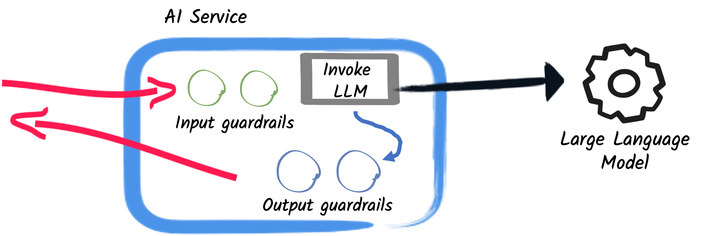

# 护栏

!!! note
    护栏是一个实验性功能。其 API 和行为可能会在未来的版本中发生变化。

护栏是一种机制，让你能够验证 LLM 的输入和输出，以确保它们符合你的预期。你可以使用护栏做以下一些事情：
- 验证用户输入没有超出范围
- 确保输入在调用 LLM 之前满足某些条件（即防范[提示注入攻击](https://genai.owasp.org/llmrisk/llm01-prompt-injection/)）
- 确保输出格式正确（即它是具有正确 schema 的 JSON 文档）
- 确保 LLM 输出与业务规则和约束保持一致（即如果这是公司 X 的聊天机器人，响应不应包含对竞争对手 Y 的任何引用）
- 检测幻觉

这些只是示例。你可以使用护栏做许多其他事情。

!!! note
    护栏仅在使用 [AI 服务](ai-services.md) 时可用。它们是更高层级的构造，不能应用于 `ChatModel` 或 `StreamingChatModel`。



该实现最初在 [Quarkus LangChain4j 扩展](https://docs.quarkiverse.io/quarkus-langchain4j/dev/) 中完成，并被回溯移植到了这里。

## 实现护栏

理想情况下，护栏实现应遵循[单一职责原则](https://en.wikipedia.org/wiki/Single-responsibility_principle)，即每个护栏类只验证一件事。然后，将护栏串联起来以防范多种问题。

链中护栏的顺序很重要。链中第一个失败的护栏将触发整体失败。确保捕获最多失败的护栏位于链的前部，而可能极少失败的更具体护栏则靠近链的末尾。

能够_重写_其验证文本的护栏可以声明在链中的任何位置。为了让重写结果到达调用方，它们无需声明在最后。详情见[链中的重写护栏](#链中的重写护栏)。

也要记住，护栏本身可以调用其他服务，甚至发起其他 LLM 交互。如果这类护栏附带执行开销或金钱成本，请确保将其考虑在内。你可能希望将更昂贵的护栏放在链的末尾。

!!! note
    术语_昂贵_可以指某样东西执行需要花费一些时间，或者与之关联有金钱价值。

### 链中的重写护栏

护栏除了接受或拒绝它收到的文本外，还能做更多事情。通过返回 **_成功并重写_**（`successWith(...)`），它会替换链中其余护栏、并最终由调用方看到的文本。脱敏、掩码和格式修正护栏就是这样工作的。

重写会按照以下规则沿链组合。无论操作是同步还是异步/流式，这些规则都适用于输入护栏和输出护栏：

- 每个位于重写护栏之后的护栏验证的都是_重写后_的文本，而不是原始文本。
- 重写会经受住后续的普通 `success()`。`success()` 意味着_"我收到的文本是可接受的"_，而后续护栏收到的文本已经是重写后的文本，因此批准它不会回退到原始文本。
- 较晚的重写会覆盖较早的重写。重写按链顺序组合，因此最后一个执行重写的护栏胜出。
- 因此，重写护栏无需是链中最后一个护栏，其重写结果就能返回给调用方。

!!! note
    一旦输出护栏链中的任何护栏重写了输出，之后的 **_致命并需重试_** 或 **_致命并需重新提示_** 结果将不被允许，因为 LLM 会被要求为已经重写的文本生成新响应。在那种情况下，执行会以 `OutputGuardrailException` 中止，其消息中包含 `Retry or reprompt is not allowed after a rewritten output`。

## 输入护栏

输入护栏是在调用 LLM 之前被调用的函数。输入护栏失败会阻止调用 LLM。输入护栏是调用 LLM 之前的最后一步。它们在所有 [RAG](rag.md) 操作发生_之后_才被调用。

### 实现输入护栏

输入护栏通过实现 [`InputGuardrail`](https://github.com/langchain4j/langchain4j/blob/main/langchain4j-core/src/main/java/dev/langchain4j/guardrail/InputGuardrail.java) 接口来实现。`InputGuardrail` 接口有两个 `validate` 方法变体，至少需要实现其中一个：

```java
InputGuardrailResult validate(UserMessage userMessage);
InputGuardrailResult validate(InputGuardrailRequest params);
```

第一个变体用于简单的护栏，或者护栏只需要访问 [`UserMessage`](https://github.com/langchain4j/langchain4j/blob/main/langchain4j-core/src/main/java/dev/langchain4j/data/message/UserMessage.java) 的情况。

第二个变体用于需要更多信息的更复杂护栏，例如聊天记忆/历史、用户消息模板、增强结果，或传递给模板的变量。更多信息见 [`InputGuardrailRequest`](https://github.com/langchain4j/langchain4j/blob/main/langchain4j-core/src/main/java/dev/langchain4j/guardrail/InputGuardrailRequest.java)。

一些你可以做的事情的例子：
- 检查增强结果中是否有足够多的文档
- 确保用户没有多次问同一个问题
- 减轻潜在的提示注入攻击
- 使用社区的 [Prompt Repetition](../integrations/prompt-repetition/index.md) 模块重写符合条件的单文本输入

无论操作是同步还是异步/流式，都可以使用输入护栏。

### 输入护栏结果

输入护栏可以有以下几种结果。`InputGuardrail` 接口上有可以提供这些结果的辅助方法：

| Outcome                             | Helper method on `InputGuardrail`                 | Description                                                                                                                                                                |
|:------------------------------------|:--------------------------------------------------|:---------------------------------------------------------------------------------------------------------------------------------------------------------------------------|
| **_成功_**                       | `success()`                                       | - 输入有效。<br/> - 执行链中的下一个护栏。<br/> - 如果最后一个护栏通过，则调用 LLM。<br/> - 如果链中较早的护栏重写了用户消息，**_成功_** 意味着_重写后_的用户消息有效。重写会被保留。见[链中的重写护栏](#链中的重写护栏)。                                           |
| **_成功并带有替代结果_** | `successWith(String)`                             | - 与 **_成功_** 类似，但用户消息在进入下一步（链中的下一个护栏或调用 LLM）之前被修改。<br/> - 护栏所做的重写会覆盖链中较早护栏所做的任何重写。                           |
| **_失败_**                       | `failure(String)` 或 `failure(String, Throwable)` | - 输入无效，但链中的下一个护栏会继续执行，以累积所有可能的验证问题。<br/> - 不会调用 LLM。<br/> - 如果传入了 `Throwable`，使用方可以捕获 `InputGuardrailException` 并检查其 `cause`。它就是这里传入的 `Throwable`。 |
| **_致命_**                         | `fatal(String)` 或 `fatal(String, Throwable)`     | - 输入无效，执行以 `InputGuardrailException` 中止。<br/> - 不会调用 LLM。<br/> - 如果传入了 `Throwable`，使用方可以捕获 `InputGuardrailException` 并检查其 `cause`。它就是这里传入的 `Throwable`。                                                        |

### 声明输入护栏

有几种声明输入护栏的方式，按优先级从高到低列出：
1. 直接设置在 [`AiServices`](https://github.com/langchain4j/langchain4j/blob/main/langchain4j/src/main/java/dev/langchain4j/service/AiServices.java) 构建器上的 [`InputGuardrail`](https://github.com/langchain4j/langchain4j/blob/main/langchain4j-core/src/main/java/dev/langchain4j/guardrail/InputGuardrail.java) 实现类名或实例。
2. 放置在单个 [AI 服务](ai-services.md) 方法上的 [`@InputGuardrails` 注解](https://github.com/langchain4j/langchain4j/blob/main/langchain4j/src/main/java/dev/langchain4j/service/guardrail/InputGuardrails.java)。
3. 放置在 [AI 服务](ai-services.md) 类上的 [`@InputGuardrails` 注解](https://github.com/langchain4j/langchain4j/blob/main/langchain4j/src/main/java/dev/langchain4j/service/guardrail/InputGuardrails.java)。
无论它们如何声明，输入护栏始终按其在列表中出现的顺序执行。列表中的任何护栏重写的用户消息对后续的护栏可见，并且（除非后续护栏再次重写它）对 LLM 也可见。

#### `AiServices` 构建器

直接设置在 [`AiServices`](https://github.com/langchain4j/langchain4j/blob/main/langchain4j/src/main/java/dev/langchain4j/service/AiServices.java) 构建器上的 [`InputGuardrail`](https://github.com/langchain4j/langchain4j/blob/main/langchain4j-core/src/main/java/dev/langchain4j/guardrail/InputGuardrail.java) 实现类名或实例具有最高优先级，这意味着如果以其他方式声明了它们，将使用直接声明在构建器上的那些。

```java
public interface Assistant {
    String chat(String question);
    String doSomethingElse(String question);
}

var assistant = AiServices.builder(Assistant.class)
    .chatModel(chatModel)
    .inputGuardrailClasses(FirstInputGuardrail.class, SecondInputGuardrail.class)
    .build();
```

或者

```java
public interface Assistant {
    String chat(String question);
    String doSomethingElse(String question);
}

var assistant = AiServices.builder(Assistant.class)
    .chatModel(chatModel)
    .inputGuardrails(new FirstInputGuardrail(), new SecondInputGuardrail())
    .build();
```

!!! info
    如果你想要一个现成的实验性输入护栏，它使用提示词重复来重写符合条件的单文本输入，请参见社区的 [Prompt Repetition](../integrations/prompt-repetition/index.md) 模块。

在第一种场景中，传入的是实现 `InputGuardrail` 的类。使用反射动态创建这些类的新实例。

!!! info
    类转换为实例的方式可以定制。例如，使用依赖注入的框架（如 [Quarkus](https://quarkus.io) 或 [Spring](https://spring.io)）可以使用[扩展点](#扩展点)，根据它们管理类实例的方式来提供实例，而不是每次都通过反射创建新实例。

#### 位于单个 AI 服务方法上的注解

放置在单个 [AI 服务](ai-services.md) 方法上的 [`@InputGuardrails` 注解](https://github.com/langchain4j/langchain4j/blob/main/langchain4j/src/main/java/dev/langchain4j/service/guardrail/InputGuardrails.java) 具有次高优先级。

```java
public interface Assistant {
    @InputGuardrails({ FirstInputGuardrail.class, SecondInputGuardrail.class })
    String chat(String question);
    
    String doSomethingElse(String question);
}

var assistant = AiServices.create(Assistant.class, chatModel);
```

在这个例子中，只有 `chat` 方法有护栏。
- 在 `chat` 方法上，首先调用 `FirstInputGuardrail`。
- 只有它成功时，才会调用 LLM。
- 只有当 `FirstInputGuardrail` 的结果不是 **_致命_** 时，才会调用 `SecondInputGuardrail`。
- `FirstInputGuardrail` 或 `SecondInputGuardrail` 都可能重写用户消息。
- 如果 `FirstInputGuardrail` 重写了用户消息，那么 `SecondInputGuardrail` 将接收新的用户消息作为输入。

`doSomethingElse` 方法没有任何护栏。

#### 位于 AI 服务类上的注解

放置在 [AI 服务](ai-services.md) 类上的 [`@InputGuardrails` 注解](https://github.com/langchain4j/langchain4j/blob/main/langchain4j/src/main/java/dev/langchain4j/service/guardrail/InputGuardrails.java) 具有最低优先级。

```java
@InputGuardrails({ FirstInputGuardrail.class, SecondInputGuardrail.class })
public interface Assistant {
    String chat(String question);
    String doSomethingElse(String question);
}

var assistant = AiServices.create(Assistant.class, chatModel);
```

在这个例子中，`chat` 和 `doSomethingElse` 方法都有护栏。
- 与上一个例子一样，首先调用 `FirstInputGuardrail`。
- 只有它成功时，才会调用 LLM。
- 只有当 `FirstInputGuardrail` 的结果不是 **_致命_** 时，才会调用 `SecondInputGuardrail`。
- `FirstInputGuardrail` 或 `SecondInputGuardrail` 都可能重写用户消息。
- 如果 `FirstInputGuardrail` 重写了用户消息，那么 `SecondInputGuardrail` 将接收新的用户消息作为输入。

### 单元测试输入护栏

`langchain4j-test` 模块中有一些基于 [AssertJ](https://assertj.github.io/doc/) 的单元测试工具。

**Maven**：

```xml
<dependency>
  <groupId>dev.langchain4j</groupId>
  <artifactId>langchain4j-test</artifactId>
  <scope>test</scope>
</dependency>
```

**Gradle (Groovy)**：

```groovy
testImplementation 'dev.langchain4j:langchain4j-test'
```

**Gradle (Kotlin)**：

```kotlin
testImplementation("dev.langchain4j:langchain4j-test")
```

有了这个依赖之后，你可以执行以下类型的验证：

```java
import static dev.langchain4j.test.guardrail.GuardrailAssertions.assertThat;

import dev.langchain4j.data.message.UserMessage;
import dev.langchain4j.guardrail.GuardrailResult.Result;

class Tests { 
    MyInputGuardrail inputGuardrail = new MyInputGuardrail();
    
    @Test 
    void test() {
        var userMessage = UserMessage.from("Some user message");
        var result = inputGuardrail.validate(userMessage);
        
        // These are just some examples of what you can do
        assertThat(result)
                .isSuccessful()
                .hasResult(Result.FATAL)
                .hasFailures()
                .hasSingleFailureWithMessage("Prompt injection detected")
                .assertSingleFailureSatisfied(failure -> assertThat(failure)...)
                .withFailures().....
    }
}
```

!!! info
    更多细节见 [`GuardrailAssertions`](https://github.com/langchain4j/langchain4j/blob/main/langchain4j-test/src/main/java/dev/langchain4j/test/guardrail/GuardrailAssertions.java) 和 [`InputGuardrailResultAssert`](https://github.com/langchain4j/langchain4j/blob/main/langchain4j-test/src/main/java/dev/langchain4j/test/guardrail/InputGuardrailResultAssert.java) 类。

### 开箱即用的输入护栏

有几种常见用例，LangChain4j 提供了输入护栏的实现：

| Guardrail class                                                                                                                                                                              | Description                                                                                                                                                                                                                                                                                                                                                                                                                                                                                                                                                                                                                                                                |
|:---------------------------------------------------------------------------------------------------------------------------------------------------------------------------------------------|:---------------------------------------------------------------------------------------------------------------------------------------------------------------------------------------------------------------------------------------------------------------------------------------------------------------------------------------------------------------------------------------------------------------------------------------------------------------------------------------------------------------------------------------------------------------------------------------------------------------------------------------------------------------------------|
| [`MessageModeratorInputGuardrail`](https://github.com/langchain4j/langchain4j/blob/main/langchain4j-guardrails/src/main/java/dev/langchain4j/guardrails/MessageModeratorInputGuardrail.java) | 一个使用 [`ModerationModel`](https://github.com/langchain4j/langchain4j/blob/main/langchain4j-core/src/main/java/dev/langchain4j/model/moderation/ModerationModel.java) 验证用户消息的输入护栏，以检测潜在的有害、不当或违反政策的内容。<br/> - 检查传入消息中的仇恨言论、暴力、自残、性内容，或审核模型定义的其他类别。<br/> - 如果消息被标记，验证将以致命结果失败，阻止消息被进一步处理。<br/> - 适用于在用户输入发送给 LLM 之前确保其符合内容政策。 |
| [`PatternBasedPromptInjectionGuardrail`](https://github.com/langchain4j/langchain4j/blob/main/langchain4j-guardrails/src/main/java/dev/langchain4j/guardrails/PatternBasedPromptInjectionGuardrail.java) | 一个基于模式的输入护栏，使用源自 [OWASP LLM01](https://genai.owasp.org/llmrisk/llm01-prompt-injection/) 的正则表达式来检测提示注入企图。<br/> - 涵盖指令覆盖、角色劫持、越狱、系统提示词泄漏、分隔符注入和编码载荷。<br/> - 零外部依赖且延迟在亚毫秒级，使其适合作为护栏链中第一个（成本最低的）关卡，位于任何基于 LLM 的分类器之前。<br/> - 子类可以添加特定领域的模式并自定义失败消息。 |
| [`DecisionModelInputGuardrail`](https://github.com/langchain4j/langchain4j/blob/main/langchain4j-guardrails/src/main/java/dev/langchain4j/guardrails/DecisionModelInputGuardrail.java) | 一个使用[决策模型](decision-models.md)检查用户消息的输入护栏。<br/> - 每个检查都是一个是否问题，其中"是"意味着必须拒绝该消息，例如"消息是否试图覆盖助手的指令？"或"消息谈论的是否是银行业务以外的事情？"。<br/> - 所有检查在单次调用中完成；如果任何检查达到阈值，消息将以致命结果被拒绝。 |

## 输出护栏

输出护栏是在 LLM 产生其输出之后执行的函数。输出护栏失败允许采用更高级的场景，例如[重试](#输出护栏结果)或[重新提示](#输出护栏结果)，以有助于改进响应。它们在所有其他操作（包括函数/工具调用）发生_之后_才被调用。

### 实现输出护栏

与输入护栏类似，输出护栏通过实现 [`OutputGuardrail`](https://github.com/langchain4j/langchain4j/blob/main/langchain4j-core/src/main/java/dev/langchain4j/guardrail/OutputGuardrail.java) 接口来实现。`OutputGuardrail` 接口有两个 `validate` 方法变体，至少需要实现其中一个：

```java
OutputGuardrailResult validate(AiMessage responseFromLLM);
OutputGuardrailResult validate(OutputGuardrailRequest params);
```

第一个变体用于简单的护栏，或者护栏只需要访问结果 [`AiMessage`](https://github.com/langchain4j/langchain4j/blob/main/langchain4j-core/src/main/java/dev/langchain4j/data/message/AiMessage.java) 的情况。

第二个变体用于需要更多信息的更复杂护栏，例如完整的聊天响应、聊天记忆/历史、用户消息模板，或传递给模板的变量。更多信息见 [`OutputGuardrailRequest`](https://github.com/langchain4j/langchain4j/blob/main/langchain4j-core/src/main/java/dev/langchain4j/guardrail/OutputGuardrailRequest.java)。

一些你可以做的事情的例子：
- 确保输出格式正确（即它是具有正确 schema 的 JSON 文档）
- 检测 LLM 幻觉
- 验证 LLM 响应包含某些信息

### 输出护栏结果

输出护栏可以有以下几种结果。`OutputGuardrail` 接口上有可以提供这些结果的辅助方法：

| Outcome                    | Helper method on `OutputGuardrail`                                  | Description                                                                                                                                                                                                                                                                                                                                                                                                                                                                                                                                                                                                           |
|:---------------------------|:--------------------------------------------------------------------|:----------------------------------------------------------------------------------------------------------------------------------------------------------------------------------------------------------------------------------------------------------------------------------------------------------------------------------------------------------------------------------------------------------------------------------------------------------------------------------------------------------------------------------------------------------------------------------------------------------------------|
| **_成功_**              | `success()`                                                         | - 输出有效。<br/> - 执行链中的下一个护栏。如果最后一个护栏通过，输出将返回给调用方。<br/> - 如果链中较早的护栏重写了输出，**_成功_** 意味着_重写后_的输出有效。重写及其附带的任何结果对象都会被保留。见[链中的重写护栏](#链中的重写护栏)。 |
| **_成功并重写_** | `successWith(String)` 或 `successWith(String, Object)`              | -与 **_成功_** 类似，但输出在其原始形式下无效，已被重写为有效。<br/> - 针对重写后的输出执行下一个护栏。如果最后一个护栏通过，输出将返回给调用方。<br/> - 护栏所做的重写会覆盖链中较早护栏所做的任何重写。<br/> - 对于 `successWith(String, Object)`，结果对象随其派生自的重写文本一起传递。之后仅重写文本（`successWith(String)`）的护栏因此会取代该结果对象并将其丢弃，因为结果对象不再对应当前文本。之后的普通 `success()` 不会丢弃它。 |
| **_失败_**              | `failure(String)` 或 `failure(String, Throwable)`                   | - 输出无效，但链中的下一个护栏会继续执行，以累积所有可能的验证问题。<br/> - 验证失败作为 `OutputGuardrailException` 返回给用户。                                                                                                                                                                                                                                                                                                                                                                                 |
| **_致命_**                | `fatal(String)` 或 `fatal(String, Throwable)`                       | 输出无效，执行以抛出给调用方的 `OutputGuardrailException` 中止。                                                                                                                                                                                                                                                                                                                                                                                                                                                                                                                |
| **_致命并需重试_**     | `retry(String)` 或 `retry(String, Throwable)`                       | - 与 **_致命_** 类似，但 LLM 会以与原始调用相同的提示词和聊天历史被再次调用。<br/> - 如果失败在[可配置的重试次数](#配置)之后仍然存在，则执行以抛出给调用方的 `OutputGuardrailException` 中止。<br/> - 如果护栏在重试后通过，则整个护栏链从头重新执行。                                                                                                                                                                                                        |
| **_致命并需重新提示_**  | `reprompt(String, String)` 或 `reprompt(String, Throwable, String)` | - 与 **_致命并需重试_** 类似，但 LLM 会以护栏提供的新提示词被再次调用。<br/> - 在这种情况下，护栏提供一个附加消息，将其追加到先前的用户消息之后，然后用新的用户消息和原始聊天历史向 LLM 发送新请求。<br/> - 如果失败在[可配置的重试次数](#配置)之后仍然存在，则执行以抛出给调用方的 `OutputGuardrailException` 中止。<br/> - 如果护栏在重新提示后通过，则整个护栏链从头重新执行。 |

### 声明输出护栏

有几种声明输出护栏的方式，按优先级从高到低列出：
1. 直接设置在 [`AiServices`](https://github.com/langchain4j/langchain4j/blob/main/langchain4j/src/main/java/dev/langchain4j/service/AiServices.java) 构建器上的 [`OutputGuardrail`](https://github.com/langchain4j/langchain4j/blob/main/langchain4j-core/src/main/java/dev/langchain4j/guardrail/OutputGuardrail.java) 实现类名或实例。
2. 放置在单个 [AI 服务](ai-services.md) 方法上的 [`@OutputGuardrails` 注解](https://github.com/langchain4j/langchain4j/blob/main/langchain4j/src/main/java/dev/langchain4j/service/guardrail/OutputGuardrails.java)。
3. 放置在 [AI 服务](ai-services.md) 类上的 [`@OutputGuardrails` 注解](https://github.com/langchain4j/langchain4j/blob/main/langchain4j/src/main/java/dev/langchain4j/service/guardrail/OutputGuardrails.java)。

无论它们如何声明，输出护栏始终按其在列表中出现的顺序执行。列表中的任何护栏重写的输出对后续的护栏可见，并且（除非后续护栏再次重写它）对调用方也可见。

#### `AiServices` 构建器

直接设置在 [`AiServices`](https://github.com/langchain4j/langchain4j/blob/main/langchain4j/src/main/java/dev/langchain4j/service/AiServices.java) 构建器上的 [`OutputGuardrail`](https://github.com/langchain4j/langchain4j/blob/main/langchain4j-core/src/main/java/dev/langchain4j/guardrail/OutputGuardrail.java) 实现类名或实例具有最高优先级，这意味着如果以其他方式声明了它们，将使用声明在构建器上的那些。

```java
public interface Assistant {
    String chat(String question);
    String doSomethingElse(String question);
}

var assistant = AiServices.builder(Assistant.class)
    .chatModel(chatModel)
    .outputGuardrailClasses(FirstOutputGuardrail.class, SecondOutputGuardrail.class)
    .build();
```

或者

```java
public interface Assistant {
    String chat(String question);
    String doSomethingElse(String question);
}

var assistant = AiServices.builder(Assistant.class)
    .chatModel(chatModel)
    .outputGuardrails(new FirstOutputGuardrail(), new SecondOutputGuardrail())
    .build();
```

在第一种场景中，传入的是实现 `OutputGuardrail` 的类。使用反射动态创建这些类的新实例。

!!! info
    类转换为实例的方式可以定制。例如，使用依赖注入的框架（如 [Quarkus](https://quarkus.io) 或 [Spring](https://spring.io)）可以使用[扩展点](#扩展点)，根据它们管理类实例的方式来提供实例，而不是每次都通过反射创建新实例。

#### 位于单个 AI 服务方法上的注解

放置在单个 [AI 服务](ai-services.md) 方法上的 [`@OutputGuardrails` 注解](https://github.com/langchain4j/langchain4j/blob/main/langchain4j/src/main/java/dev/langchain4j/service/guardrail/OutputGuardrails.java) 具有次高优先级。

```java
public interface Assistant {
    @OutputGuardrails({ FirstOutputGuardrail.class, SecondOutputGuardrail.class })
    String chat(String question);
    
    String doSomethingElse(String question);
}

var assistant = AiServices.create(Assistant.class, chatModel);
```

在这个例子中，只有 `chat` 方法有护栏。
- 在 `chat` 方法上，首先调用 `FirstOutputGuardrail`。
- 只有它成功时，结果才会返回给调用方。只有当 `FirstOutputGuardrail` 的结果不是 **_致命_**、**_致命并需重试_** 或 **_致命并需重新提示_** 时，才会调用 `SecondOutputGuardrail`。
- `SecondOutputGuardrail` 将接收 `FirstOutputGuardrail` 的输出。
- 如果 `SecondOutputGuardrail` 在重试或重新提示后成功，那么 `FirstOutputGuardrail` 和 `SecondOutputGuardrail` 都会重新执行。

`doSomethingElse` 方法没有任何护栏。

#### 位于 AI 服务类上的注解

放置在 [AI 服务](ai-services.md) 类上的 [`@OutputGuardrails` 注解](https://github.com/langchain4j/langchain4j/blob/main/langchain4j/src/main/java/dev/langchain4j/service/guardrail/OutputGuardrails.java) 具有最低优先级。

```java
@OutputGuardrails({ FirstOutputGuardrail.class, SecondOutputGuardrail.class })
public interface Assistant {
    String chat(String question);
    String doSomethingElse(String question);
}

var assistant = AiServices.create(Assistant.class, chatModel);
```

在这个例子中，`chat` 和 `doSomethingElse` 方法都有护栏。
- 与上一个例子一样，首先调用 `FirstOutputGuardrail`。
- 只有它成功时，结果才会返回给调用方。只有当 `FirstOutputGuardrail` 的结果不是 **_致命_**、**_致命并需重试_** 或 **_致命并需重新提示_** 时，才会调用 `SecondOutputGuardrail`。
- `SecondOutputGuardrail` 将接收 `FirstOutputGuardrail` 的输出。
- 如果 `SecondOutputGuardrail` 在重试或重新提示后成功，那么 `FirstOutputGuardrail` 和 `SecondOutputGuardrail` 都会重新执行。

#### 配置

输出护栏可以有以下可提供的额外配置：

| Configuration | Description                                                                                                                                                |
|:--------------|:-----------------------------------------------------------------------------------------------------------------------------------------------------------|
| `maxRetries`  | - 执行重试或重新提示时输出护栏的最大重试次数。<br/> - 默认为 `2`。<br/> - 设置为 `0` 以禁用重试。 |

##### 位于单个 AI 服务方法上的注解

```java
public interface MethodLevelAssistant {
    @OutputGuardrails(
            value = { FirstOutputGuardrail.class, SecondOutputGuardrail.class },
            maxRetries = 10
    )
    String chat(String question);
}

var assistant = AiServices.create(MethodLevelAssistant.class, chatModel);
```

##### 位于 AI 服务类上的注解

```java
@OutputGuardrails(
        value = { FirstOutputGuardrail.class, SecondOutputGuardrail.class },
        maxRetries = 10
)
public interface ClassLevelAssistant {
    String chat(String question);
}

var assistant = AiServices.create(ClassLevelAssistant.class, chatModel);
```

##### `AiServices` 构建器

```java
public interface Assistant {
    String chat(String message);
}

var outputGuardrailsConfig = OutputGuardrailsConfig.builder()
        .maxRetries(10)
        .build();

var assistant = AiServices.builder(Assistant.class)
        .chatModel(chatModel)
        .outputGuardrailsConfig(outputGuardrailsConfig)
        .outputGuardrailClasss(FirstOutputGuardrail.class, SecondOutputGuardrail.class)
        .build();
```

### 流式响应上的输出护栏

输出护栏也可以用于具有流式响应的操作：

```java
public interface StreamingAssistant {
    @OutputGuardrails({ FirstOutputGuardrail.class, SecondOutputGuardrail.class })
    TokenStream streamingChat(String message);
}
```

在这种场景中，输出护栏将在整个流完成后执行，更具体地说，是在调用 `TokenStream.onCompleteResponse` 时执行。`onPartialResponse` 会被缓冲，并在护栏成功后重放。

在链中的 **_重试_** 或 **_重新提示_** 最终成功的情况下，整个链会被_同步地_重新执行。每个护栏会按原始顺序一个接一个地重新执行。一旦链完成，结果会被传入 `TokenStream.onCompleteResponse`。

### 开箱即用的输出护栏

有几种常见用例，LangChain4j 提供了输出护栏的实现：

| Guardrail class                                                                                                                                                                         | Description                                                                                                                                                                                                                                                                                                                                                                                                                                                                                                        |
|:----------------------------------------------------------------------------------------------------------------------------------------------------------------------------------------|:-------------------------------------------------------------------------------------------------------------------------------------------------------------------------------------------------------------------------------------------------------------------------------------------------------------------------------------------------------------------------------------------------------------------------------------------------------------------------------------------------------------------|
| [`JsonExtractorOutputGuardrail`](https://github.com/langchain4j/langchain4j/blob/main/langchain4j-guardrails/src/main/java/dev/langchain4j/guardrails/JsonExtractorOutputGuardrail.java) | 一个检查响应能否成功从 JSON 反序列化为某种类型的对象的输出护栏。<br/> - 使用 [Jackson ObjectMapper](https://github.com/FasterXML/jackson-databind) 尝试反序列化对象。<br/> - 如果响应无法反序列化为预期的对象类型，LLM 会被重新提示。<br/> - 可以按原样使用，也可以扩展和自定义（有几个 `protected` 方法可以重写以自定义行为）。 |
| [`DecisionModelOutputGuardrail`](https://github.com/langchain4j/langchain4j/blob/main/langchain4j-guardrails/src/main/java/dev/langchain4j/guardrails/DecisionModelOutputGuardrail.java) | 一个使用[决策模型](decision-models.md)检查模型响应的输出护栏。<br/> - 每个检查都是一个是否问题，其中"是"意味着必须拒绝该响应，例如"响应是否透露了个人数据？"。决策模型还会接收最后一条用户消息。<br/> - 被拒绝的响应将以致命结果失败，或者（如果已配置）模型会被重新提示。 |

### 单元测试输出护栏

`langchain4j-test` 模块中有一些基于 [AssertJ](https://assertj.github.io/doc/) 的单元测试工具。

**Maven**：

```xml
<dependency>
  <groupId>dev.langchain4j</groupId>
  <artifactId>langchain4j-test</artifactId>
  <scope>test</scope>
</dependency>
```

**Gradle (Groovy)**：

```groovy
testImplementation 'dev.langchain4j:langchain4j-test'
```

**Gradle (Kotlin)**：

```kotlin
testImplementation("dev.langchain4j:langchain4j-test")
```

有了这个依赖之后，你可以执行以下类型的验证：

```java
import static dev.langchain4j.test.guardrail.GuardrailAssertions.assertThat;

import dev.langchain4j.data.message.AiMessage;
import dev.langchain4j.guardrail.GuardrailResult.Result;

class Tests { 
    MyOutputGuardrail outputGuardrail = new MyOutputGuardrail();
    
    @Test 
    void test() {
        var aiMessage = AiMessage.from("Some output");
        var result = outputGuardrail.validate(aiMessage);
        
        // These are just some examples of what you can do
        assertThat(result)
                .isSuccessful()
                .hasResult(Result.FATAL)
                .hasFailures()
                .hasSingleFailureWithMessage("Hallucination detected!")
                .hasSingleFailureWithMessageAndReprompt("Hallucination detected!", "Please LLM don't hallucinate!")
                .assertSingleFailureSatisfied(failure -> assertThat(failure)...)
                .withFailures().....
    }
}
```

!!! info
    更多细节见 [`GuardrailAssertions`](https://github.com/langchain4j/langchain4j/blob/main/langchain4j-test/src/main/java/dev/langchain4j/test/guardrail/GuardrailAssertions.java) 和 [`OutputGuardrailResultAssert`](https://github.com/langchain4j/langchain4j/blob/main/langchain4j-test/src/main/java/dev/langchain4j/test/guardrail/OutputGuardrailResultAssert.java) 类。

!!! note
    执行 I/O 的护栏可以实现 `validateAsync(...)`，以便在 AI 服务以非阻塞模式使用时不阻塞线程。输入护栏和输出护栏（包括感知工具的重新提示）都支持在异步和响应式模式下使用。
    参见[非阻塞与响应式](non-blocking.md)。

## 混合使用

你可以按任意方式混合使用输入护栏和输出护栏！

```java
public class MyObjectJsonOutputGuardrail extends JsonExtractorOutputGuardrail<MyObject> {
    public MyObjectJsonOutputGuardrail() {
        super(MyObject.class);
    }
}

@InputGuardrails({ FirstInputGuardrail.class, SecondInputGuardrail.class })
@OutputGuardrails(value = SomeOutputGuardrail.class, maxRetries = 5)
public interface Assistant {
    String chat(String message);
    
    @InputGuardrails(PatternBasedPromptInjectionGuardrail.class)
    @OutputGuardrails(MyObjectJsonOutputGuardrail.class)
    MyObject chatAndReturnJson(String message);
}

var outputGuardrailsConfig = OutputGuardrailsConfig.builder()
        .maxRetries(10)
        .build();

var assistant = AiServices.builder(Assistant.class)
        .chatModel(chatModel)
        .inputGuardrails(new AnotherInputGuardrail())
        .outputGuardrailsConfig(outputGuardrailsConfig)
        .build();
```

在这个例子中，`Assistant` 上的所有方法都有一个输入护栏 `AnotherInputGuardrail`，因为它设置在 `AiServices` 构建器上。此外，所有输出护栏的 `maxRetries` 值都 == `10`，因为配置也设置在 `AiServices` 构建器上。

`chat` 方法有一个输出护栏 `SomeOutputGuardrail`，其 `maxRetries` 值 == `10`。

`chatAndReturnJson` 方法有一个输出护栏 `MyObjectJsonOutputGuardrail`，其 `maxRetries` 值 == `10`。

## 扩展点

护栏系统以可组合的方式构建，以便可以在其他下游框架（如 [Quarkus](https://quarkus.io) 或 [Spring Boot](https://spring.io/projects/spring-boot)）中扩展和复用。本节描述了一些所提供的扩展点或"钩子"。

所有这些扩展点都利用了 [Java 服务提供者接口（Java SPI）](https://www.baeldung.com/java-spi)。

| Extension point interface                                                                                                                                                                                    | Purpose                                                                                                                                                                                                                                                                                                                                                                                                                                                                                                                                                                        |
|--------------------------------------------------------------------------------------------------------------------------------------------------------------------------------------------------------------|-------------------------------------------------------------------------------------------------------------------------------------------------------------------------------------------------------------------------------------------------------------------------------------------------------------------------------------------------------------------------------------------------------------------------------------------------------------------------------------------------------------------|
| [`ClassInstanceFactory`](https://github.com/langchain4j/langchain4j/blob/main/langchain4j-core/src/main/java/dev/langchain4j/spi/classloading/ClassInstanceFactory.java)                                     | 提供类的实例。<br/> - 旨在将实例创建/获取委托给其他某种机制。<br/> - 如果未提供，则使用反射通过默认构造函数创建实例。<br/> - 其他框架（如 Quarkus 或 Spring）可以使用它们自己的 bean 容器来提供类的实例。这些框架将提供一个实现。<br/> - Quarkus 的实现可能类似于 [`CDIClassInstanceFactory`](https://github.com/langchain4j/langchain4j/blob/main/integration-tests/integration-tests-class-instance-loader/integration-tests-class-instance-loader-quarkus/src/main/java/com/example/CDIClassInstanceFactory.java)<br/> - Spring 的实现可能类似于 [`ApplicationContextClassInstanceFactory`](https://github.com/langchain4j/langchain4j/blob/main/integration-tests/integration-tests-class-instance-loader/integration-tests-class-instance-loader-spring/src/main/java/com/example/classes/ApplicationContextClassInstanceFactory.java) |
| [`ClassMetadataProviderFactory`](https://github.com/langchain4j/langchain4j/blob/main/langchain4j-core/src/main/java/dev/langchain4j/spi/classloading/ClassMetadataProviderFactory.java)                     | 提供对类元数据的访问。<br/> - 用于扫描 `AiService` 接口上的方法，并查找和处理 `@InputGuardrails`/`@OutputGuardrails` 注解。<br/> - [`ReflectionBasedClassMetadataProviderFactory`](https://github.com/langchain4j/langchain4j/blob/main/langchain4j/src/main/java/dev/langchain4j/classloading/ReflectionBasedClassMetadataProviderFactory.java) 是在未找到其他实现时的默认实现，使用反射提供类元数据。                                                                               |
 | [`GuardrailServiceBuilderFactory`](https://github.com/langchain4j/langchain4j/blob/main/langchain4j/src/main/java/dev/langchain4j/service/guardrail/spi/GuardrailServiceBuilderFactory.java)                 | 提供用于构建 [`GuardrailService`](https://github.com/langchain4j/langchain4j/blob/main/langchain4j/src/main/java/dev/langchain4j/service/guardrail/GuardrailService.java) 实例的构建器实例。如果应用程序或框架需要定制构建 `GuardrailService` 实例的方式，它们将实现此接口。                                                                                                                                                                                                                                 |
 | [`InputGuardrailsConfigBuilderFactory`](https://github.com/langchain4j/langchain4j/blob/main/langchain4j-core/src/main/java/dev/langchain4j/spi/guardrail/config/InputGuardrailsConfigBuilderFactory.java)   | - 用于覆盖和/或扩展默认 [`InputGuardrailsConfigBuilder`](https://github.com/langchain4j/langchain4j/blob/main/langchain4j-core/src/main/java/dev/langchain4j/guardrail/config/InputGuardrailsConfig.java) 的 SPI<br/> - 其他框架可以提供自己的实现，为输入护栏增加额外配置。<br/> - 还可以让其他框架通过其他某种机制（即属性文件）来驱动输入护栏配置。                                                                                 |
| [`OutputGuardrailsConfigBuilderFactory`](https://github.com/langchain4j/langchain4j/blob/main/langchain4j-core/src/main/java/dev/langchain4j/spi/guardrail/config/OutputGuardrailsConfigBuilderFactory.java) | - 用于覆盖和/或扩展默认 [`OutputGuardrailsConfigBuilder`](https://github.com/langchain4j/langchain4j/blob/main/langchain4j-core/src/main/java/dev/langchain4j/guardrail/config/OutputGuardrailsConfig.java) 的 SPI<br/> - 其他框架可以提供自己的实现，为输出护栏增加额外配置。<br/> - 还可以让其他框架通过其他某种机制（即属性文件）来驱动输出护栏配置。                                                                              |
| [`InputGuardrailExecutorBuilderFactory`](https://github.com/langchain4j/langchain4j/blob/main/langchain4j-core/src/main/java/dev/langchain4j/spi/guardrail/InputGuardrailExecutorBuilderFactory.java)        | - 用于覆盖和/或扩展默认的 `InputGuardrailExecutorBuilder` 的 SPI，它负责构建 [`InputGuardrailExecutor`](https://github.com/langchain4j/langchain4j/blob/main/langchain4j-core/src/main/java/dev/langchain4j/guardrail/InputGuardrailExecutor.java) 实例。                                                                                                                                                                                                                                                                                     |
| [`OutputGuardrailExecutorBuilderFactory`](https://github.com/langchain4j/langchain4j/blob/main/langchain4j-core/src/main/java/dev/langchain4j/spi/guardrail/OutputGuardrailExecutorBuilderFactory.java)      | - 用于覆盖和/或扩展默认的 `OutputGuardrailExecutorBuilder` 的 SPI，它负责构建 [`OutputGuardrailExecutor`](https://github.com/langchain4j/langchain4j/blob/main/langchain4j-core/src/main/java/dev/langchain4j/guardrail/OutputGuardrailExecutor.java) 实例。                                                                                                                                                                                                                                                                                  |
