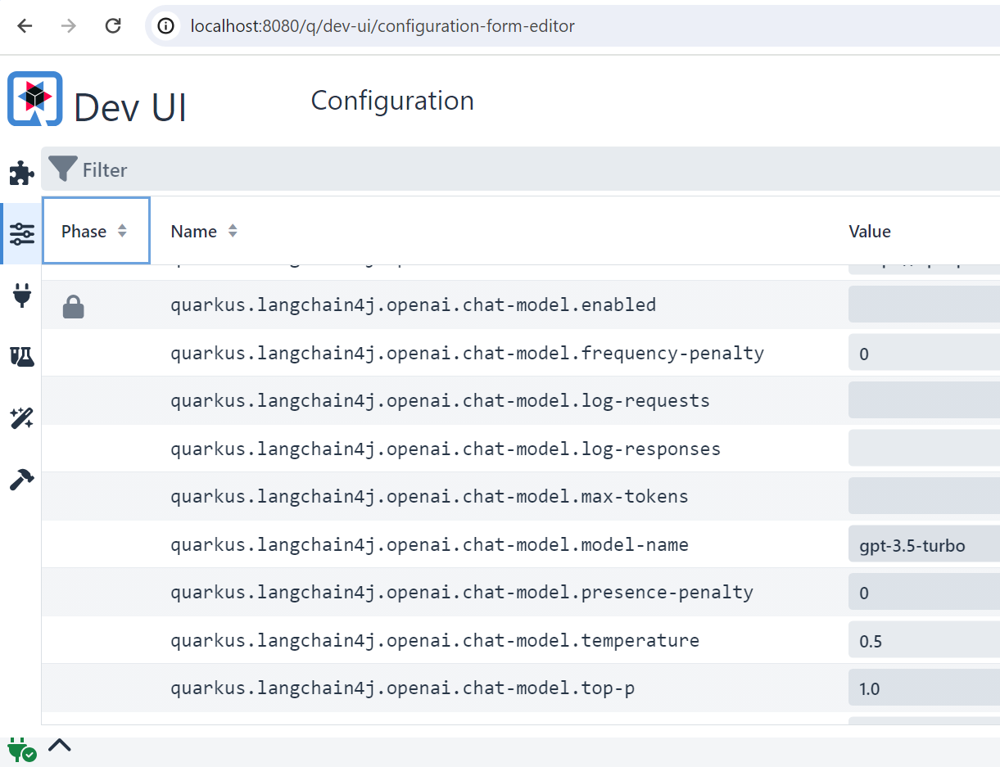

# 模型参数

根据你选择的模型和提供商，你可以调整大量参数来定义：
- 模型的输出：生成内容（文本、图像）的创意程度或确定性、
生成的内容量等。
- 连接：基础 URL、授权密钥、超时、重试、日志记录等。

通常，你可以在模型提供商的网站上找到所有参数及其含义。
例如，OpenAI API 的参数可在 https://platform.openai.com/docs/api-reference/chat
（最新版本）找到，包括以下选项：

| 参数               | 描述                                                                                                                                                                             | 类型        |
|--------------------|--------------------------------------------------------------------------------------------------------------------------------------------------------------------------------------|-------------|
| `modelName`        | 要使用的模型名称（例如 gpt-4o、gpt-4o-mini 等）                                                                                                                              | `String`    |
| `temperature`      | 要使用的采样温度，介于 0 和 2 之间。较高的值（如 0.8）会使输出更随机，较低的值（如 0.2）会使输出更聚焦、更确定。                                                              | `Double`    |
| `maxTokens`        | 聊天补全中可生成的最大 token 数。                                                                                                                             | `Integer`   |
| `frequencyPenalty` | -2.0 到 2.0 之间的数值。正值会根据新 token 在现有文本中出现的频率对其进行惩罚，从而降低模型逐字重复相同句子的可能性。                                        | `Double`    |
| `...`              | ...                                                                                                                                                                                        | `...`       |

OpenAI 语言模型参数的完整列表，请参见[OpenAI 语言模型页面](../integrations/language-models/open-ai.md)。
每个模型的参数和默认值完整列表可以在各自的模型页面（位于 Integration、Language Model 和 Image Model 下）找到。

你可以通过两种方式创建 `*Model`：
- 一个只接受必填参数（如 API 密钥）的静态工厂，
其他必填参数均设置为合理的默认值。
- 构建器模式：在这里，你可以为每个参数指定值。


## 模型构建器
我们可以使用构建器模式设置模型的所有可用参数，如下所示：
```java
OpenAiChatModel model = OpenAiChatModel.builder()
        .apiKey(System.getenv("OPENAI_API_KEY"))
        .modelName("gpt-4o-mini")
        .temperature(0.3)
        .timeout(ofSeconds(60))
        .logRequests(true)
        .logResponses(true)
        .build();
```

## 在 Quarkus 中设置参数
在 Quarkus 应用中，可以通过 `application.properties` 文件按如下方式设置 LangChain4j 参数：
```
quarkus.langchain4j.openai.api-key=${OPENAI_API_KEY}
quarkus.langchain4j.openai.chat-model.temperature=0.5
quarkus.langchain4j.openai.timeout=60s
```

有意思的是，无论是调试、微调还是仅仅了解所有可用参数，
都可以查看 Quarkus DEV UI。
在这个仪表板中，你可以做出更改，这些更改会立即反映到正在运行的实例中，
并且你的更改会自动移植到代码中。
通过命令 `quarkus dev` 运行你的 Quarkus 应用即可访问 DEV UI，
然后你可以在 localhost:8080/q/dev-ui（或你部署应用的位置）找到它。



有关 Quarkus 集成的更多信息，请参见[此处](quarkus-integration.md)。

## 在 Spring Boot 中设置参数
如果你使用了我们的某个 [Spring Boot starter](https://github.com/langchain4j/langchain4j-spring)，
可以在 `application.properties` 文件中按如下方式配置模型参数：
```
langchain4j.open-ai.chat-model.api-key=${OPENAI_API_KEY}
langchain4j.open-ai.chat-model.model-name=gpt-5.4-mini
...
```
支持的属性完整列表可在
[此处](https://github.com/langchain4j/langchain4j-spring/blob/main/langchain4j-open-ai-spring-boot-starter/src/main/java/dev/langchain4j/openai/spring/AutoConfig.java)找到。

有关 Spring Boot 集成的更多信息，请参见[此处](spring-boot-integration.md)。