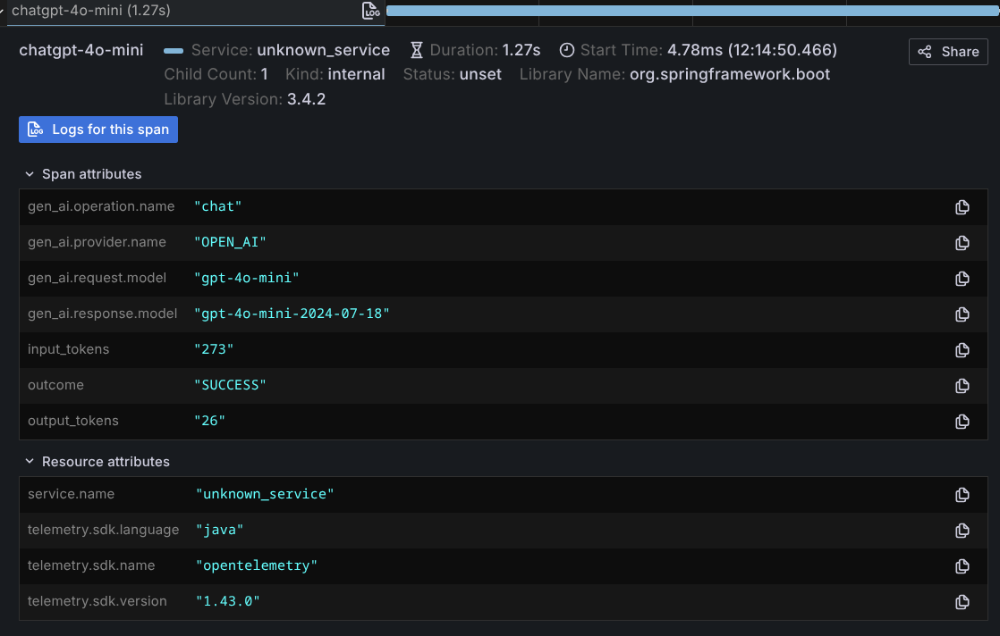

# 可观测性

## AI 服务的可观测性

!!! note
    AI 服务的可观测性是一个实验性功能，其 API 和行为在未来版本中可能发生变化。

AI 服务的可观测性机制允许用户跟踪一次 `AiService` 调用期间发生的事情。一次调用可能涉及多次 LLM 调用，其中任何一次都可能成功或失败。AI 服务的可观测性允许用户跟踪完整的调用序列及其结果。

!!! note
    AI 服务的可观测性能力仅在使用 [AI 服务](ai-services.md) 时可用。它是一种更高层次的结构，不能应用于 `ChatModel` 或 `StreamingChatModel`。

该实现最初实现在 [Quarkus LangChain4j 扩展](https://docs.quarkiverse.io/quarkus-langchain4j/dev/) 中，并被移植回这里。

### 事件类型

每种事件都有一个唯一的标识符，可用于在多次调用之间关联事件。
每种事件都包含封装在一个
[`InvocationContext`](https://github.com/langchain4j/langchain4j/blob/main/langchain4j-core/src/main/java/dev/langchain4j/invocation/InvocationContext.java) 中的信息。

当前可用的事件类型如下：

| 事件名称 | 描述 |
|---|---|
| [`AiServiceStartedEvent`](https://github.com/langchain4j/langchain4j/blob/main/langchain4j-core/src/main/java/dev/langchain4j/observability/api/event/AiServiceStartedEvent.java) | 当一次 LLM 调用开始时触发。 |
| [`AiServiceRequestIssuedEvent`](https://github.com/langchain4j/langchain4j/blob/main/langchain4j-core/src/main/java/dev/langchain4j/observability/api/event/AiServiceRequestIssuedEvent.java) | 在向 LLM 发送请求之前触发。包含正在发出的请求的详细信息。需要注意的是，当存在工具或护栏时，在单次 AiService 调用期间该事件可能被触发多次。<br/><br/>包含系统消息和用户消息等信息。 |
| [`AiServiceResponseReceivedEvent`](https://github.com/langchain4j/langchain4j/blob/main/langchain4j-core/src/main/java/dev/langchain4j/observability/api/event/AiServiceResponseReceivedEvent.java) | 在收到 LLM 的响应时触发。包含 LLM 的响应及其对应的请求。需要注意的是，当存在工具或护栏时，在单次 AiService 调用期间该事件可能被触发多次。<br/><br/>包含系统消息和用户消息等信息。<br/><br/>并非每次调用都会收到此事件。如果调用失败，则会收到 [`AiServiceErrorEvent`](https://github.com/langchain4j/langchain4j/blob/main/langchain4j-core/src/main/java/dev/langchain4j/observability/api/event/AiServiceErrorEvent.java)。 |
| [`AiServiceErrorEvent`](https://github.com/langchain4j/langchain4j/blob/main/langchain4j-core/src/main/java/dev/langchain4j/observability/api/event/AiServiceErrorEvent.java) | 当与 LLM 的调用失败时触发。失败可能由网络故障、AiService 不可用、输入/输出护栏阻止请求，或许多其他原因造成。<br/><br/>包含关于所发生失败的信息。 |
| [`AiServiceCompletedEvent`](https://github.com/langchain4j/langchain4j/blob/main/langchain4j-core/src/main/java/dev/langchain4j/observability/api/event/AiServiceCompletedEvent.java) | 当一次 LLM 调用成功完成时触发。<br/><br/>并非每次调用都会收到此事件。如果调用失败，则会收到 [`AiServiceErrorEvent`](https://github.com/langchain4j/langchain4j/blob/main/langchain4j-core/src/main/java/dev/langchain4j/observability/api/event/AiServiceErrorEvent.java)。<br/><br/>包含关于调用结果的信息。 |
| [`ToolExecutedEvent`](https://github.com/langchain4j/langchain4j/blob/main/langchain4j-core/src/main/java/dev/langchain4j/observability/api/event/ToolExecutedEvent.java) | 当一次工具调用完成时触发。需要注意的是，在单次 LLM 调用期间该事件可能被触发多次。<br/><br/>包含关于工具请求和结果的信息。 |
| [`ToolCompensatedEvent`](https://github.com/langchain4j/langchain4j/blob/main/langchain4j-core/src/main/java/dev/langchain4j/observability/api/event/ToolCompensatedEvent.java) | 当某个已经完成的工具被补偿时触发，因为后续交互被取消或失败。实验性功能；由非阻塞 AI 服务模式发出。<br/><br/>包含工具请求、其结果以及补偿原因。 |
| [`InputGuardrailExecutedEvent`](https://github.com/langchain4j/langchain4j/blob/main/langchain4j-core/src/main/java/dev/langchain4j/observability/api/event/InputGuardrailExecutedEvent.java) | 当一次 [输入护栏](https://docs.langchain4j.dev/tutorials/guardrails#input-guardrails) 校验执行时触发。每次护栏调用都会触发其中一个此类事件。<br/><br/>包含针对单个输入护栏的输入、其输出（即成功还是失败？）以及执行时长等信息。 |
| [`OutputGuardrailExecutedEvent`](https://github.com/langchain4j/langchain4j/blob/main/langchain4j-core/src/main/java/dev/langchain4j/observability/api/event/OutputGuardrailExecutedEvent.java) | 当一次 [输出护栏](https://docs.langchain4j.dev/tutorials/guardrails#output-guardrails) 校验执行时触发。每次护栏调用都会触发其中一个此类事件。<br/><br/>包含针对单个输出护栏的输入、其输出（即成功？失败？重试？重新提示？）以及执行时长等信息。 |

### 监听事件

每种 [事件类型](#事件类型) 都有自己的监听器，可以实现该监听器以接收事件。你可以自行选择想要监听哪些事件。

要监听某个事件，请创建一个实现了你希望监听的监听器接口的类。可用的监听器接口如下：

| 监听器名称 | 事件 |
|---|---|
| [`AiServiceStartedListener`](https://github.com/langchain4j/langchain4j/blob/main/langchain4j-core/src/main/java/dev/langchain4j/observability/api/listener/AiServiceStartedListener.java) | [`AiServiceStartedEvent`](https://github.com/langchain4j/langchain4j/blob/main/langchain4j-core/src/main/java/dev/langchain4j/observability/api/event/AiServiceStartedEvent.java) |
| [`AiServiceRequestIssuedListener`](https://github.com/langchain4j/langchain4j/blob/main/langchain4j-core/src/main/java/dev/langchain4j/observability/api/listener/AiServiceRequestIssuedListener.java) | [`AiServiceRequestIssuedEvent`](https://github.com/langchain4j/langchain4j/blob/main/langchain4j-core/src/main/java/dev/langchain4j/observability/api/event/AiServiceRequestIssuedEvent.java) |
| [`AiServiceResponseReceivedListener`](https://github.com/langchain4j/langchain4j/blob/main/langchain4j-core/src/main/java/dev/langchain4j/observability/api/listener/AiServiceResponseReceivedListener.java) | [`AiServiceResponseReceivedEvent`](https://github.com/langchain4j/langchain4j/blob/main/langchain4j-core/src/main/java/dev/langchain4j/observability/api/event/AiServiceResponseReceivedEvent.java) |
| [`AiServiceErrorListener`](https://github.com/langchain4j/langchain4j/blob/main/langchain4j-core/src/main/java/dev/langchain4j/observability/api/listener/AiServiceErrorListener.java) | [`AiServiceErrorEvent`](https://github.com/langchain4j/langchain4j/blob/main/langchain4j-core/src/main/java/dev/langchain4j/observability/api/event/AiServiceErrorEvent.java) |
| [`AiServiceCompletedListener`](https://github.com/langchain4j/langchain4j/blob/main/langchain4j-core/src/main/java/dev/langchain4j/observability/api/listener/AiServiceCompletedListener.java) | [`AiServiceCompletedEvent`](https://github.com/langchain4j/langchain4j/blob/main/langchain4j-core/src/main/java/dev/langchain4j/observability/api/event/AiServiceCompletedEvent.java) |
| [`ToolExecutedEventListener`](https://github.com/langchain4j/langchain4j/blob/main/langchain4j-core/src/main/java/dev/langchain4j/observability/api/listener/ToolExecutedEventListener.java) | [`ToolExecutedEvent`](https://github.com/langchain4j/langchain4j/blob/main/langchain4j-core/src/main/java/dev/langchain4j/observability/api/event/ToolExecutedEvent.java) |
| [`ToolCompensatedEventListener`](https://github.com/langchain4j/langchain4j/blob/main/langchain4j-core/src/main/java/dev/langchain4j/observability/api/listener/ToolCompensatedEventListener.java) | [`ToolCompensatedEvent`](https://github.com/langchain4j/langchain4j/blob/main/langchain4j-core/src/main/java/dev/langchain4j/observability/api/event/ToolCompensatedEvent.java) |
| [`InputGuardrailExecutedListener`](https://github.com/langchain4j/langchain4j/blob/main/langchain4j-core/src/main/java/dev/langchain4j/observability/api/listener/InputGuardrailExecutedListener.java) | [`InputGuardrailExecutedEvent`](https://github.com/langchain4j/langchain4j/blob/main/langchain4j-core/src/main/java/dev/langchain4j/observability/api/event/InputGuardrailExecutedEvent.java) |
| [`OutputGuardrailExecutedListener`](https://github.com/langchain4j/langchain4j/blob/main/langchain4j-core/src/main/java/dev/langchain4j/observability/api/listener/OutputGuardrailExecutedListener.java) | [`OutputGuardrailExecutedEvent`](https://github.com/langchain4j/langchain4j/blob/main/langchain4j-core/src/main/java/dev/langchain4j/observability/api/event/OutputGuardrailExecutedEvent.java) |

定义好监听器后，在创建 [AI 服务](ai-services.md) 时将其注册。[`AiServices` 类](https://github.com/langchain4j/langchain4j/blob/main/langchain4j/src/main/java/dev/langchain4j/service/AiServices.java) 上有多种 `registerListener` 方法变体。

例如，你可以执行以下操作来为 `AiServiceCompletedEvent` 创建并注册一个监听器：

```java
import java.time.Instant;
import java.util.List;
import java.util.Optional;
import java.util.UUID;

import dev.langchain4j.observability.api.AiServiceListenerRegistrar;
import dev.langchain4j.observability.api.event.AiServiceCompletedEvent;
import dev.langchain4j.observability.api.listener.AiServiceCompletedListener;
import dev.langchain4j.invocation.InvocationContext;

public class MyAiServiceCompletedListener implements AiServiceCompletedListener {
    @Override
    public void onEvent(AiServiceCompletedEvent event) {
        InvocationContext invocationContext = event.invocationContext();
        Optional<Object> result = event.result();

        // The invocationId will be the same for all events related to the same LLM invocation
        UUID invocationId = invocationContext.invocationId();
        String aiServiceInterfaceName = invocationContext.interfaceName();
        String aiServiceMethodName = invocationContext.methodName();
        List<Object> aiServiceMethodArgs = invocationContext.methodArguments();
        Object chatMemoryId = invocationContext.chatMemoryId();
        Instant eventTimestamp = invocationContext.timestamp();

        // Do something with the data
    }
}

// When creating your AI Service
MyAiServiceCompletedListener myListener = new MyAiServiceCompletedListener();

var myService = AiServices.builder(MyAiService.class)
        .chatModel(chatModel)  // Could also be .streamingChatModel(...)
        .registerListener(myListener)
        .build();
```

### 创建自己的事件和监听器

AI 服务的可观测性能力在设计上是可扩展的。如果你想创建自己的事件，可以通过实现 [`AiServiceEvent`](https://github.com/langchain4j/langchain4j/blob/main/langchain4j-core/src/main/java/dev/langchain4j/observability/api/event/AiServiceEvent.java) 接口来定义自己的事件。

然后，通过实现 [`AiServiceListener`](https://github.com/langchain4j/langchain4j/blob/main/langchain4j-core/src/main/java/dev/langchain4j/observability/api/listener/AiServiceListener.java) 接口来创建自己的事件监听器。

有了事件和监听器之后，你需要通过获取/管理一个 `AiServiceListenerRegistrar` 实例并调用 `fireEvent(event)` 方法来触发事件。

事件开始触发后，你就可以像处理内置事件一样创建监听器并注册你的监听器。

### 扩展点

你还可以通过实现 [`AiServiceListenerRegistrarFactory`](https://github.com/langchain4j/langchain4j/blob/main/langchain4j-core/src/main/java/dev/langchain4j/spi/observability/AiServiceListenerRegistrarFactory.java) 并使用 [Java Service Provider Interface（Java SPI）](https://www.baeldung.com/java-spi) 注册它，来创建自己的自定义 [`AiServiceListenerRegistrar`](https://github.com/langchain4j/langchain4j/blob/main/langchain4j-core/src/main/java/dev/langchain4j/observability/api/AiServiceListenerRegistrar.java)。

如果你想管理监听器的注册/注销方式，和/或事件的触发方式，这会很有用。

## 聊天模型的可观测性

`ChatModel` 和 `StreamingChatModel` 的 [某些](../integrations/language-models/index.md) 实现（参见"可观测性"列）允许配置 `ChatModelListener` 来监听以下事件：
- 发往 LLM 的请求
- 来自 LLM 的响应
- 错误

这些事件包含各种属性，如 [OpenTelemetry 生成式 AI 语义约定](https://opentelemetry.io/docs/specs/semconv/gen-ai/) 中所述，例如：
- 请求：
  - 消息
  - 模型
  - 温度
  - Top P
  - 最大 token 数
  - 工具
  - 响应格式
  - 等等
- 响应：
  - 助手消息
  - ID
  - 模型
  - token 用量
  - 结束原因
  - 等等

下面是使用 `ChatModelListener` 的示例：
```java
ChatModelListener listener = new ChatModelListener() {

    @Override
    public void onRequest(ChatModelRequestContext requestContext) {
        ChatRequest chatRequest = requestContext.chatRequest();

        List<ChatMessage> messages = chatRequest.messages();
        System.out.println(messages);

        ChatRequestParameters parameters = chatRequest.parameters();
        System.out.println(parameters.modelName());
        System.out.println(parameters.temperature());
        System.out.println(parameters.topP());
        System.out.println(parameters.topK());
        System.out.println(parameters.frequencyPenalty());
        System.out.println(parameters.presencePenalty());
        System.out.println(parameters.maxOutputTokens());
        System.out.println(parameters.stopSequences());
        System.out.println(parameters.toolSpecifications());
        System.out.println(parameters.toolChoice());
        System.out.println(parameters.responseFormat());

        if (parameters instanceof OpenAiChatRequestParameters openAiParameters) {
            System.out.println(openAiParameters.maxCompletionTokens());
            System.out.println(openAiParameters.logitBias());
            System.out.println(openAiParameters.parallelToolCalls());
            System.out.println(openAiParameters.seed());
            System.out.println(openAiParameters.user());
            System.out.println(openAiParameters.store());
            System.out.println(openAiParameters.metadata());
            System.out.println(openAiParameters.serviceTier());
            System.out.println(openAiParameters.reasoningEffort());
        }

        System.out.println(requestContext.modelProvider());

        Map<Object, Object> attributes = requestContext.attributes();
        attributes.put("my-attribute", "my-value");
    }

    @Override
    public void onResponse(ChatModelResponseContext responseContext) {
        ChatResponse chatResponse = responseContext.chatResponse();

        AiMessage aiMessage = chatResponse.aiMessage();
        System.out.println(aiMessage);

        ChatResponseMetadata metadata = chatResponse.metadata();
        System.out.println(metadata.id());
        System.out.println(metadata.modelName());
        System.out.println(metadata.finishReason());

        if (metadata instanceof OpenAiChatResponseMetadata openAiMetadata) {
            System.out.println(openAiMetadata.created());
            System.out.println(openAiMetadata.serviceTier());
            System.out.println(openAiMetadata.systemFingerprint());
        }

        TokenUsage tokenUsage = metadata.tokenUsage();
        System.out.println(tokenUsage.inputTokenCount());
        System.out.println(tokenUsage.outputTokenCount());
        System.out.println(tokenUsage.totalTokenCount());
        if (tokenUsage instanceof OpenAiTokenUsage openAiTokenUsage) {
            System.out.println(openAiTokenUsage.inputTokensDetails().cachedTokens());
            System.out.println(openAiTokenUsage.outputTokensDetails().reasoningTokens());
        }

        ChatRequest chatRequest = responseContext.chatRequest();
        System.out.println(chatRequest);

        System.out.println(responseContext.modelProvider());

        Map<Object, Object> attributes = responseContext.attributes();
        System.out.println(attributes.get("my-attribute"));
    }

    @Override
    public void onError(ChatModelErrorContext errorContext) {
        Throwable error = errorContext.error();
        error.printStackTrace();

        ChatRequest chatRequest = errorContext.chatRequest();
        System.out.println(chatRequest);

        System.out.println(errorContext.modelProvider());

        Map<Object, Object> attributes = errorContext.attributes();
        System.out.println(attributes.get("my-attribute"));
    }
};

ChatModel model = OpenAiChatModel.builder()
        .apiKey(System.getenv("OPENAI_API_KEY"))
        .modelName(GPT_4_O_MINI)
        .listeners(List.of(listener))
        .build();

model.chat("Tell me a joke about Java");
```

`attributes` 映射允许在同一个 `ChatModelListener` 的 `onRequest`、`onResponse` 和 `onError` 方法之间传递信息，
也允许在多个 `ChatModelListener` 之间传递。
如果你需要向监听器提供每次调用的元数据，请使用 `ChatRequestOptions`。
例如，你可以通过 `listenerAttributes` 向 `ChatModelListener` 传递租户或关联标识符。
这些选项仅在 LangChain4j 调用链内部使用；
它们不会发送到 LLM 提供商。

```java
ChatRequest chatRequest = ChatRequest.builder()
        .messages(UserMessage.from("Tell me a joke about Java"))
        .build();

ChatRequestOptions options = ChatRequestOptions.builder()
        .addListenerAttribute("tenantId", "tenant-123")
        .addListenerAttribute("correlationId", "corr-456")
        .build();

model.chat(chatRequest, options);
```

`StreamingChatModel.chat(chatRequest, options, handler)` 同样适用。

### 监听器的工作方式

- 监听器以 `List<ChatModelListener>` 的形式指定，并按迭代顺序调用。
- 监听器同步调用，且在同一个线程中。关于流式情况的更多细节见下文。
  第一个监听器返回之前，第二个监听器不会被调用。
- `ChatModelListener.onRequest()` 方法在调用 LLM 提供商 API 之前立即调用。
- `ChatModelListener.onRequest()` 方法每个请求只调用一次。
  如果调用 LLM 提供商 API 时发生错误并进行了重试，
  `ChatModelListener.onRequest()` 将**_不会_**为每次重试而调用。
- `ChatModelListener.onResponse()` 方法只调用一次，
  在收到来自 LLM 提供商的成功响应后立即调用。
- `ChatModelListener.onError()` 方法只调用一次。
  如果调用 LLM 提供商 API 时发生错误并进行了重试，
  `ChatModelListener.onError()` 将**_不会_**为每次重试而调用。
- 如果某个 `ChatModelListener` 方法抛出了异常，
  该异常将记录在 `WARN` 级别。后续监听器的执行照常继续。
- 通过 `ChatModelRequestContext`、`ChatModelResponseContext` 和 `ChatModelErrorContext` 提供的
  `ChatRequest` 是最终请求，其中包含了配置在 `ChatModel` 上的默认 `ChatRequestParameters`
  与请求特定的 `ChatRequestParameters` 合并后的结果。
- 对于 `StreamingChatModel`，`ChatModelListener.onResponse()` 和 `ChatModelListener.onError()`
  在与 `ChatModelListener.onRequest()` 不同的线程上调用。
  线程上下文目前不会自动传播，因此你可能希望使用 `attributes` 映射
  来传播从 `ChatModelListener.onRequest()` 到 `ChatModelListener.onResponse()` 或 `ChatModelListener.onError()` 所需的任何数据。
- 对于 `StreamingChatModel`，`ChatModelListener.onResponse()` 在
  `StreamingChatResponseHandler.onCompleteResponse()` 之前调用。`ChatModelListener.onError()` 在
  `StreamingChatResponseHandler.onError()` 之前调用。

## 内容审核模型的可观测性

支持监听器的 `ModerationModel` 实现（例如 `OpenAiModerationModel`、`MistralAiModerationModel`
和 `WatsonxModerationModel`）允许配置 `ModerationModelListener` 来监听以下事件：
- 发往内容审核 API 的请求
- 来自内容审核 API 的响应
- 错误

下面是使用 `ModerationModelListener` 的示例：
```java
ModerationModelListener listener = new ModerationModelListener() {

    @Override
    public void onRequest(ModerationModelRequestContext requestContext) {
        ModerationRequest moderationRequest = requestContext.moderationRequest();

        // Access texts being moderated
        System.out.println("Moderating texts: " + moderationRequest.texts());

        System.out.println(requestContext.modelProvider());
        System.out.println(moderationRequest.modelName());

        Map<Object, Object> attributes = requestContext.attributes();
        attributes.put("startTime", System.currentTimeMillis());
    }

    @Override
    public void onResponse(ModerationModelResponseContext responseContext) {
        ModerationResponse moderationResponse = responseContext.moderationResponse();

        Moderation moderation = moderationResponse.moderation();
        System.out.println("Flagged: " + moderation.flagged());
        if (moderation.flagged()) {
            System.out.println("Flagged text: " + moderation.flaggedText());
        }

        ModerationRequest moderationRequest = responseContext.moderationRequest();
        System.out.println(moderationRequest);

        System.out.println(responseContext.modelProvider());
        System.out.println(moderationRequest.modelName());

        Map<Object, Object> attributes = responseContext.attributes();
        Long startTime = (Long) attributes.get("startTime");
        if (startTime != null) {
            System.out.println("Duration: " + (System.currentTimeMillis() - startTime) + "ms");
        }
    }

    @Override
    public void onError(ModerationModelErrorContext errorContext) {
        Throwable error = errorContext.error();
        error.printStackTrace();

        ModerationRequest moderationRequest = errorContext.moderationRequest();
        System.out.println(moderationRequest);

        System.out.println(errorContext.modelProvider());
        System.out.println(moderationRequest.modelName());

        Map<Object, Object> attributes = errorContext.attributes();
        System.out.println(attributes.get("startTime"));
    }
};

ModerationModel model = OpenAiModerationModel.builder()
        .apiKey(System.getenv("OPENAI_API_KEY"))
        .listeners(List.of(listener))
        .build();

model.moderate("Text to check for policy violations");
```

`attributes` 映射允许在同一个 `ModerationModelListener` 的 `onRequest`、`onResponse` 和 `onError` 方法之间传递信息，
也允许在多个 `ModerationModelListener` 之间传递。

### 监听器的工作方式

- 监听器以 `List<ModerationModelListener>` 的形式指定，并按迭代顺序调用。
- 监听器同步调用，且在同一个线程中。
- `ModerationModelListener.onRequest()` 方法在调用内容审核 API 之前立即调用。
- `ModerationModelListener.onRequest()` 方法每个请求只调用一次。
  如果调用内容审核 API 时发生错误并进行了重试，
  `ModerationModelListener.onRequest()` 将**_不会_**为每次重试而调用。
- `ModerationModelListener.onResponse()` 方法只调用一次，
  在收到成功响应后立即调用。
- `ModerationModelListener.onError()` 方法只调用一次。
  如果调用内容审核 API 时发生错误并进行了重试，
  `ModerationModelListener.onError()` 将**_不会_**为每次重试而调用。
- 如果某个 `ModerationModelListener` 方法抛出了异常，
  该异常将记录在 `WARN` 级别。后续监听器的执行照常继续。

## RAG 可观测性（EmbeddingModel、EmbeddingStore 和 ContentRetriever）

`EmbeddingModel`、`EmbeddingStore` 和 `ContentRetriever` 可以通过监听器进行插桩（instrumentation）以观察以下内容：
- 延迟（使用 `attributes` 测量时长）
- 负载（例如 `EmbeddingSearchRequest.queryEmbedding()` 以及检索到的匹配项/内容）
- 错误

### EmbeddingModel 监听器

实现 `EmbeddingModelListener`：

```java
import dev.langchain4j.model.embedding.listener.EmbeddingModelListener;
import dev.langchain4j.model.embedding.listener.EmbeddingModelRequestContext;
import dev.langchain4j.model.embedding.listener.EmbeddingModelResponseContext;
import dev.langchain4j.model.embedding.listener.EmbeddingModelErrorContext;

public class MyEmbeddingModelListener implements EmbeddingModelListener {

    @Override
    public void onRequest(EmbeddingModelRequestContext requestContext) {
        requestContext.attributes().put("startNanos", System.nanoTime());
        // requestContext.embeddingRequest() exposes the inputs, per-call parameters (input_type, dimensions, ...)
        // and multimodal content. requestContext.modelProvider() identifies the provider.
    }

    @Override
    public void onResponse(EmbeddingModelResponseContext responseContext) {
        long startNanos = (long) responseContext.attributes().get("startNanos");
        long durationNanos = System.nanoTime() - startNanos;
        // Do something with duration and/or responseContext.embeddingResponse() (embeddings + metadata)
    }

    @Override
    public void onError(EmbeddingModelErrorContext errorContext) {
        // Do something with errorContext.error()
    }
}
```

通过模型构建器的 `listeners(...)` 方法附加监听器（推荐）：

```java
EmbeddingModel model = OpenAiEmbeddingModel.builder()
        .apiKey(System.getenv("OPENAI_API_KEY"))
        .modelName("text-embedding-3-small")
        .listeners(List.of(new MyEmbeddingModelListener()))
        .build();

model.embed("hello");
```

当调用 `embed(EmbeddingRequest)` 以及 `embed(String)` / `embed(TextSegment)`
便捷方法时，都会通知该监听器。

!!! note
    你还可以通过 `EmbeddingModel#addListener(s)` 包装已构建好的模型来附加监听器：

    ```java
    EmbeddingModel observedModel = embeddingModel.addListener(new MyEmbeddingModelListener());

    observedModel.embed("hello");
    ```

    这对于向已构建好的模型、或其构建器未公开 `listeners(...)` 的模型添加监听器非常方便。当构建器公开了 `listeners(...)` 时，
    请优先采用那种方式，因为它不需要包装。

### EmbeddingStore 监听器

实现 `EmbeddingStoreListener`：

```java
import dev.langchain4j.store.embedding.listener.EmbeddingStoreListener;
import dev.langchain4j.store.embedding.listener.EmbeddingStoreRequestContext;
import dev.langchain4j.store.embedding.listener.EmbeddingStoreResponseContext;
import dev.langchain4j.store.embedding.listener.EmbeddingStoreErrorContext;

public class MyEmbeddingStoreListener implements EmbeddingStoreListener {

    @Override
    public void onRequest(EmbeddingStoreRequestContext<?> requestContext) {
        requestContext.attributes().put("startNanos", System.nanoTime());
    }

    @Override
    public void onResponse(EmbeddingStoreResponseContext<?> responseContext) {
        long startNanos = (long) responseContext.attributes().get("startNanos");
        long durationNanos = System.nanoTime() - startNanos;
        // Do something with duration and/or the response payload (if any), e.g.:
        if (responseContext instanceof EmbeddingStoreResponseContext.Search<?> search) {
            // Do something with search.searchResult()
        }
    }

    @Override
    public void onError(EmbeddingStoreErrorContext<?> errorContext) {
        // Do something with errorContext.error()
    }
}
```

使用 `EmbeddingStore#addListener(s)` 附加监听器：

```java
EmbeddingStore<TextSegment> observedStore = embeddingStore.addListener(new MyEmbeddingStoreListener());

// Use observedStore as usual, e.g. in EmbeddingStoreIngestor / EmbeddingStoreContentRetriever
```

### ContentRetriever 监听器

实现 `ContentRetrieverListener`：

```java
import dev.langchain4j.rag.content.retriever.listener.ContentRetrieverListener;
import dev.langchain4j.rag.content.retriever.listener.ContentRetrieverRequestContext;
import dev.langchain4j.rag.content.retriever.listener.ContentRetrieverResponseContext;
import dev.langchain4j.rag.content.retriever.listener.ContentRetrieverErrorContext;

public class MyContentRetrieverListener implements ContentRetrieverListener {

    @Override
    public void onRequest(ContentRetrieverRequestContext requestContext) {
        requestContext.attributes().put("startNanos", System.nanoTime());
    }

    @Override
    public void onResponse(ContentRetrieverResponseContext responseContext) {
        long startNanos = (long) responseContext.attributes().get("startNanos");
        long durationNanos = System.nanoTime() - startNanos;
        // Do something with duration and/or responseContext.contents()
    }

    @Override
    public void onError(ContentRetrieverErrorContext errorContext) {
        // Do something with errorContext.error()
    }
}
```

使用 `ContentRetriever#addListener(s)` 附加监听器：

```java
ContentRetriever observedRetriever = contentRetriever.addListener(new MyContentRetrieverListener());

observedRetriever.retrieve(Query.from("my query"));
```

### 监听器的工作方式

- 监听器以 `List` 的形式指定，并按迭代顺序调用。
- 监听器同步调用，且在同一个线程中。
- `onRequest()` 在执行底层操作之前立即调用。
- `onResponse()` 在成功完成后调用一次。
- 如果底层操作抛出了异常，`onError()` 调用一次。
- 如果某个监听器方法抛出了异常，该异常将记录在 `WARN` 级别并被忽略。
- `attributes` 映射允许在同一个监听器的 `onRequest`、`onResponse` 和 `onError` 方法之间传递信息，
  也允许在多个监听器之间传递。


## 使用 Micrometer 的可观测性指标

`langchain4j-micrometer-metrics` 模块为 LangChain4j 库提供了基于 Micrometer 的指标实现。
目前，它通过 `ChatModelListener` 实现提供 `ChatModel` 和 `StreamingChatModel` 交互的指标，
通过 `EmbeddingModelListener` 实现提供 `EmbeddingModel` 交互的指标，
这些指标通过 Micrometer 的 `MeterRegistry` 收集。

指标命名遵循 [OpenTelemetry 生成式 AI 指标语义约定](https://opentelemetry.io/docs/specs/semconv/gen-ai/gen-ai-metrics/)（v1.39.0）。

> **⚠️ 实验性**：此模块被标记为 `@Experimental`，未来版本中可能存在破坏性变更。

> **⚠️ 警告**：OpenTelemetry 生成式 AI 语义约定目前仍处于**实验状态且不稳定**。这意味着它们在未来版本中可能存在破坏性变更。如果你遵循这些约定，当约定更新时，你可能需要对仪表板、告警和自动化流程进行破坏性变更。

### 指标

当前收集的指标如下：

| 指标名称 | 类型 | 描述 |
|---|---|---|
| `gen_ai.client.token.usage` | 直方图（DistributionSummary） | 每次**聊天**模型请求使用的输入和输出 token 数，以及每次**嵌入**模型请求的输入 token 数 |
| `gen_ai.client.operation.duration` | 计时器（Timer） | **嵌入**模型操作的时长，成功和失败的调用均会记录 |

#### `gen_ai.client.token.usage` 的标签

| 标签 | 描述 | 示例值 |
|---|---|---|
| `gen_ai.operation.name` | 正在执行的操作 | `chat`、`embeddings` |
| `gen_ai.provider.name` | AI 提供商名称 | `openai`、`azure.ai.inference`、`anthropic` |
| `gen_ai.request.model` | 请求中的模型名称 | `gpt-4`、`gpt-35-turbo`、`text-embedding-3-small` |
| `gen_ai.response.model` | 响应中的模型名称 | `gpt-4-0613` |
| `gen_ai.token.type` | 计数的 token 类型 | `input`、`output`（嵌入仅记录 `input`） |

#### 创建 `MicrometerMetricsChatModelListener`

`MicrometerMetricsChatModelListener` 收集 `ChatModel` 和 `StreamingChatModel` 交互的指标。
实例化它需要一个 Micrometer 的 `MeterRegistry`。

```java
import dev.langchain4j.data.message.UserMessage;
import dev.langchain4j.micrometer.metrics.listeners.MicrometerMetricsChatModelListener;
import dev.langchain4j.model.azure.AzureOpenAiChatModel;
import dev.langchain4j.model.chat.request.ChatRequest;
import dev.langchain4j.model.chat.response.ChatResponse;
import io.micrometer.core.instrument.MeterRegistry;

import java.util.List;

// Get the MeterRegistry
MeterRegistry meterRegistry = new SimpleMeterRegistry();

// 1. Create the listener with the MeterRegistry and AI system name
MicrometerMetricsChatModelListener listener = 
    new MicrometerMetricsChatModelListener(meterRegistry);

// 2. Add the listener to your ChatModel
AzureOpenAiChatModel chatModel = AzureOpenAiChatModel.builder()
        .endpoint(System.getenv("AZURE_OPENAI_ENDPOINT"))
        .apiKey(System.getenv("AZURE_OPENAI_KEY"))
        .deploymentName(System.getenv("AZURE_OPENAI_DEPLOYMENT_NAME"))
        .listeners(List.of(listener))
        .build();

// 3. Use the chat model as usual - metrics are collected automatically
ChatResponse response = chatModel.chat(ChatRequest.builder()
        .messages(UserMessage.from("Hello!"))
        .build());
```

#### `gen_ai.client.operation.duration`（嵌入）的标签

| 标签 | 描述 | 示例值 |
|---|---|---|
| `gen_ai.operation.name` | 正在执行的操作 | `embeddings` |
| `gen_ai.provider.name` | AI 提供商名称 | `openai`、`ollama` |
| `gen_ai.request.model` | 请求中的模型名称 | `text-embedding-3-small` |
| `gen_ai.response.model` | 响应中的模型名称，调用失败时为 `unknown` | `text-embedding-3-small`、`unknown` |
| `outcome` | 调用是成功还是失败 | `SUCCESS`、`ERROR` |
| `error.type` | 异常类名，调用成功时为 `none` | `none`、`java.net.SocketTimeoutException` |

#### 创建 `MicrometerMetricsEmbeddingModelListener`

`MicrometerMetricsEmbeddingModelListener` 收集 `EmbeddingModel` 交互的指标。
由于嵌入调用没有输出 token，它只以 `gen_ai.token.type = input` 记录 `gen_ai.client.token.usage`，
并且对每次调用（无论成功还是失败）都记录 `gen_ai.client.operation.duration`。
实例化它需要一个 Micrometer 的 `MeterRegistry`。

```java
import dev.langchain4j.data.embedding.Embedding;
import dev.langchain4j.data.segment.TextSegment;
import dev.langchain4j.micrometer.metrics.listeners.MicrometerMetricsEmbeddingModelListener;
import dev.langchain4j.model.openai.OpenAiEmbeddingModel;
import dev.langchain4j.model.output.Response;
import io.micrometer.core.instrument.MeterRegistry;
import io.micrometer.core.instrument.simple.SimpleMeterRegistry;

import java.util.List;

// Get the MeterRegistry
MeterRegistry meterRegistry = new SimpleMeterRegistry();

// 1. Create the listener with the MeterRegistry
MicrometerMetricsEmbeddingModelListener listener =
    new MicrometerMetricsEmbeddingModelListener(meterRegistry);

// 2. Add the listener to your EmbeddingModel
OpenAiEmbeddingModel embeddingModel = OpenAiEmbeddingModel.builder()
        .apiKey(System.getenv("OPENAI_API_KEY"))
        .modelName("text-embedding-3-small")
        .listeners(List.of(listener))
        .build();

// 3. Use the embedding model as usual - metrics are collected automatically
Response<List<Embedding>> embeddings = embeddingModel.embedAll(List.of(TextSegment.from("Hello!")));
```

## Micrometer Observation API

此功能使用 [Micrometer Observation API](https://docs.micrometer.io/micrometer/reference/observation.html) 实现 `ChatModelListener`，允许透明地生成指标和链路追踪（Traces）。

该实现在 `langchain4j-observation` 模块中。

### 产生的遥测数据

#### 链路追踪（Traces）

将为每次聊天交互提供跨度（spans）。

示例：


#### 指标

以下直方图：
- gen_ai_client_token_usage
- gen_ai_client_operation_duration

示例：
```log
# HELP gen_ai_client_operation_duration_active_seconds  
# TYPE gen_ai_client_operation_duration_active_seconds summary
gen_ai_client_operation_duration_active_seconds_count{gen_ai_operation_name="chat",gen_ai_provider_name="OPEN_AI",gen_ai_request_model="gpt-4o-mini",gen_ai_response_model="unknown",outcome="SUCCESS"} 0
gen_ai_client_operation_duration_active_seconds_sum{gen_ai_operation_name="chat",gen_ai_provider_name="OPEN_AI",gen_ai_request_model="gpt-4o-mini",gen_ai_response_model="unknown",outcome="SUCCESS"} 0.0
# HELP gen_ai_client_operation_duration_active_seconds_max  
# TYPE gen_ai_client_operation_duration_active_seconds_max gauge
gen_ai_client_operation_duration_active_seconds_max{gen_ai_operation_name="chat",gen_ai_provider_name="OPEN_AI",gen_ai_request_model="gpt-4o-mini",gen_ai_response_model="unknown",outcome="SUCCESS"} 0.0
# HELP gen_ai_client_operation_duration_seconds  
# TYPE gen_ai_client_operation_duration_seconds summary
gen_ai_client_operation_duration_seconds_count{error="none",gen_ai_operation_name="chat",gen_ai_provider_name="OPEN_AI",gen_ai_request_model="gpt-4o-mini",gen_ai_response_model="gpt-4o-mini-2024-07-18",outcome="SUCCESS"} 2
gen_ai_client_operation_duration_seconds_sum{error="none",gen_ai_operation_name="chat",gen_ai_provider_name="OPEN_AI",gen_ai_request_model="gpt-4o-mini",gen_ai_response_model="gpt-4o-mini-2024-07-18",outcome="SUCCESS"} 3.384050045
# HELP gen_ai_client_operation_duration_seconds_max  
# TYPE gen_ai_client_operation_duration_seconds_max gauge
gen_ai_client_operation_duration_seconds_max{error="none",gen_ai_operation_name="chat",gen_ai_provider_name="OPEN_AI",gen_ai_request_model="gpt-4o-mini",gen_ai_response_model="gpt-4o-mini-2024-07-18",outcome="SUCCESS"} 2.115592691
# HELP gen_ai_client_token_usage_tokens Measures the quantity of used tokens
# TYPE gen_ai_client_token_usage_tokens summary
gen_ai_client_token_usage_tokens_count{gen_ai_operation_name="chat",gen_ai_provider_name="OPEN_AI",gen_ai_request_model="gpt-4o-mini",gen_ai_response_model="gpt-4o-mini-2024-07-18",gen_ai_token_type="input"} 2
gen_ai_client_token_usage_tokens_sum{gen_ai_operation_name="chat",gen_ai_provider_name="OPEN_AI",gen_ai_request_model="gpt-4o-mini",gen_ai_response_model="gpt-4o-mini-2024-07-18",gen_ai_token_type="input"} 508.0
gen_ai_client_token_usage_tokens_count{gen_ai_operation_name="chat",gen_ai_provider_name="OPEN_AI",gen_ai_request_model="gpt-4o-mini",gen_ai_response_model="gpt-4o-mini-2024-07-18",gen_ai_token_type="output"} 2
gen_ai_client_token_usage_tokens_sum{gen_ai_operation_name="chat",gen_ai_provider_name="OPEN_AI",gen_ai_request_model="gpt-4o-mini",gen_ai_response_model="gpt-4o-mini-2024-07-18",gen_ai_token_type="output"} 53.0
# HELP gen_ai_client_token_usage_tokens_max Measures the quantity of used tokens
# TYPE gen_ai_client_token_usage_tokens_max gauge
gen_ai_client_token_usage_tokens_max{gen_ai_operation_name="chat",gen_ai_provider_name="OPEN_AI",gen_ai_request_model="gpt-4o-mini",gen_ai_response_model="gpt-4o-mini-2024-07-18",gen_ai_token_type="input"} 273.0
gen_ai_client_token_usage_tokens_max{gen_ai_operation_name="chat",gen_ai_provider_name="OPEN_AI",gen_ai_request_model="gpt-4o-mini",gen_ai_response_model="gpt-4o-mini-2024-07-18",gen_ai_token_type="output"} 27.0
```

!!! note
    **监听器回调不得阻塞。** `ChatModelListener` 和 `EmbeddingModelListener` 回调在模型自身的线程上同步调用，
    且永远不会被卸载（offload）到其他线程。在同步 API 中，那是调用者的线程；在异步和响应式 API 中，
    `onResponse`/`onError` 在读取响应的传输 I/O 工作线程上运行。如果回调在那里执行阻塞 I/O——
    例如同步数据库写入、对可观测性后端的同步 HTTP 调用——就会阻塞该工作线程，并在并发情况下
    降低每个在途调用的吞吐量。应记录指标或启动/停止 span（内置的 Micrometer 和 Observation 监听器在设计上就是非阻塞的）；
    如果某个回调确实必须阻塞，请在回调内部将其卸载到你自己的执行器中。
    参见 [非阻塞与响应式](non-blocking.md)。

## Spring Boot 应用中的可观测性

更多详情见 [这里](spring-boot-integration.md#可观测性)。

更多如何在 Spring Boot 应用中收集 Micrometer 指标的详情见 [这里](spring-boot-integration.md#micrometer-指标)。

关于如何将 Micrometer Observation API 库与 SpringBoot 集成的详细说明见 [这里](spring-boot-integration.md#micrometer-observation-api)。

## 第三方集成

- [Arize Phoenix](https://github.com/Arize-ai/phoenix) 是 Arize AI 提供的开源、可自托管选项，用于本地链路（trace）检查与实验。
- [Arize AX](https://arize.com/docs/ax/integrations/java/langchain4j/langchain4j-tracing) 支持为生产环境 LangChain4j 应用提供托管云和企业自托管可观测性。
- 对于基于链路构建的评估工作流，请参阅 Arize 的 [智能体评估指南](https://arize.com/guides/ai-agent-handbook/agent-evaluation/) 和 [LLM 评估指南](https://arize.com/resources/llm-evaluation/)。

### OpenTelemetry GenAI 插桩

社区维护的 [otel-genai-bridges](https://github.com/dineshkumarkummara/otel-genai-bridges) 项目提供了一个 Spring Boot starter，使用 [OpenTelemetry 生成式 AI 语义约定](https://github.com/open-telemetry/semantic-conventions/tree/main/docs/gen-ai) 对 LangChain4j 聊天应用进行自动插桩。

#### 为什么要使用它？

- 包装任何 `ChatModel` bean，发出 span、事件和指标。
- 开箱即用地捕获提示词、补全、工具调用、延迟、token 用量、成本和 RAG 检索延迟。
- 提供 Docker Compose 示例（Collector → Tempo/Prometheus → Grafana），附带预构建的 Grafana 仪表板。

#### 快速开始

在你的 Spring Boot 项目中添加该 starter：

```xml
<!-- pom.xml -->
<dependency>
  <groupId>com.dineshkumarkummara.otel</groupId>
  <artifactId>langchain4j-otel</artifactId>
  <version>0.1.0-SNAPSHOT</version>
</dependency>
```

通过 `application.yaml` 启用该 starter：

```yaml
otel:
  langchain4j:
    enabled: true
    system: openai
    default-model: gpt-4o
    capture-prompts: true
    capture-completions: true
    cost:
      enabled: true
      input-per-thousand: 0.0005
      output-per-thousand: 0.0015
```

嵌套的 `cost` 配置段是可选的；当你想要每 token 成本指标时才包含它。

在 classpath 上存在该依赖时，starter 会自动定位 `ChatModel` bean 并为其包装遥测。

#### 可观测性视图


要查看完整可运行的示例（包括可观测性栈和 Semantic Kernel 的对齐支持），请参阅 [dineshkumarkummara/otel-genai-bridges](https://github.com/dineshkumarkummara/otel-genai-bridges)。
