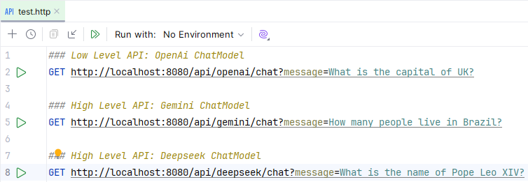
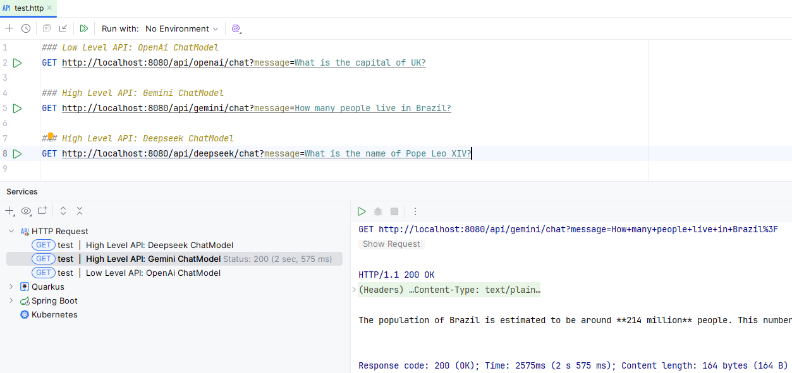
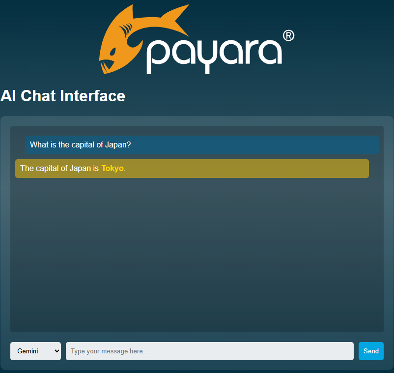

# Payara Micro 集成

LangChain4j 可以无缝集成到 Payara Micro 应用程序中，利用 Jakarta EE 和 MicroProfile 的标准特性进行依赖注入和配置。

本指南演示了如何创建直接实例化并使用 LangChain4j 模型的 JAX-RS 资源，其配置由 MicroProfile Config 管理。

## Maven 依赖

首先，在你的 pom.xml 文件中添加 langchain4j 核心依赖以及所需的特定模型集成模块：
```xml
<properties>
    <project.build.sourceEncoding>UTF-8</project.build.sourceEncoding>
    <maven.compiler.release>21</maven.compiler.release>
    <jakartaee-api.version>10.0.0</jakartaee-api.version>
    <payara.version>6.2025.5</payara.version>
    <version.langchain4j>1.22.0</version.langchain4j>
</properties>

<dependencies>
    <dependency>
        <groupId>dev.langchain4j</groupId>
        <artifactId>langchain4j-open-ai</artifactId>
        <version>${version.langchain4j}</version>
    </dependency>
    
    <dependency>
        <groupId>dev.langchain4j</groupId>
        <artifactId>langchain4j-google-ai-gemini</artifactId>
        <version>${version.langchain4j}</version>
    </dependency>
    
    <dependency>
        <groupId>jakarta.platform</groupId>
        <artifactId>jakarta.jakartaee-api</artifactId>
        <version>${jakartaee-api.version}</version>
        <scope>provided</scope>
    </dependency>
</dependencies>
```

## 配置多个模型

你可以通过在 MicroProfile 配置文件（位于 `src/main/resources/META-INF/microprofile-config.properties`）中提供各自的属性来配置多个 AI 模型，如下所示：
```
openai.api.key=${OPENAI_API_KEY}
openai.chat.model=gpt-4o-mini

google-ai-gemini.chat-model.api-key=${GEMINI_KEY}
google-ai-gemini.chat-model.model-name=gemini-2.0-flash-lite

deepseek.api.key=${DEEPSEEK_API_KEY}
deepseek.chat.model=deepseek-reasoner
```

## 实现聊天资源

在这种方式中，每个 JAX-RS 资源都负责自己的 AI 模型实例。该模式为每个提供商重复使用。

`RestConfiguration` 类继承 `jakarta.ws.rs.core.Application`，为所有 REST 端点定义基础路径 `/api`：

```java
import jakarta.ws.rs.ApplicationPath;
import jakarta.ws.rs.core.Application;

@ApplicationPath("api")
public class RestConfiguration extends Application {
}
```
对于每个模型，我们有一个 JAX-RS 资源类，它：

- 使用 `@Inject` 和 `@ConfigProperty` 注入配置属性。
- 使用带有 `@PostConstruct` 注解的方法，在属性注入后构建模型实例。
- 创建一个 `@GET` 端点来与模型交互。

```java
@Path("openai")
public class OpenAiChatModelResource {

    @Inject
    @ConfigProperty(name = "openai.api.key")
    private String openAiApiKey;

    @Inject
    @ConfigProperty(name = "openai.chat.model")
    private String modelName;

    private OpenAiChatModel chatModel;

    @PostConstruct
    public void init() {
        chatModel = OpenAiChatModel.builder()
                .apiKey(openAiApiKey)
                .modelName(modelName)
                .build();
    }

    @GET
    @Path("chat")
    @Produces(MediaType.TEXT_PLAIN)
    public String chat(@QueryParam("message") @DefaultValue("Hello") String message) {
        return chatModel.generate(message);
    }
}
```

`GeminiChatModelResource` 和 `DeepSeekChatModelResource` 使用相同的模式。

注意最后一个类复用了 `OpenAiChatModel` 类，只是将 baseUrl 更改为 [deepseek API](https://api.deepseek.com)，展示了该库的灵活性。

## API 文档

示例项目包含一个 Swagger UI，用于交互式地探索和测试 API 端点。

webapp 文件夹中的 `index.html` 文件配置 Swagger UI 加载由 Payara Micro 在 `/openapi` 端点自动生成的 OpenAPI 规范：
```json
openapi: 3.0.0
info:
  title: Deployed Resources
  version: 1.0.0
...
        
endpoints:
/:
- /api/deepseek/chat
- /api/gemini/chat
- /api/openai/chat
components: {}
```

## 运行示例应用

该项目配置为使用 Payara Micro Maven 插件运行。

### 前提条件：
- Java SE 21+
- 可运行的 Maven

### 执行
1. 在项目根目录中打开一个终端。
2. 设置 API 密钥所需的环境变量。应用需要它们来与 AI 服务进行身份验证。你必须配置：
   - OPENAI_API_KEY
   - GEMINI_KEY
   - DEEPSEEK_API_KEY
3. 执行以下 Maven 命令：`mvn clean package payara-micro:start`

服务器启动后，你可以通过两种方式测试端点：

1. 如果你使用的是 **IntelliJ IDEA**（旗舰版）或**其他**具有类似功能的 IDE，可以直接从 `.http` 文件中执行请求：

    a. 打开位于 `src/test/resources/` 中的 `test.http` 文件。
    
    b. IDE 会在每个请求定义旁边显示一个绿色的"播放"小图标：
    

    c. 点击你想要运行的请求旁边的图标。API 的响应将直接显示在 IDE 的工具窗口中：
    

2. 使用 AI 聊天界面

    在浏览器中访问 http://localhost:8080/。这将打开一个交互式的**聊天页面**，你可以直接在浏览器中探索和测试可用的端点：
    
