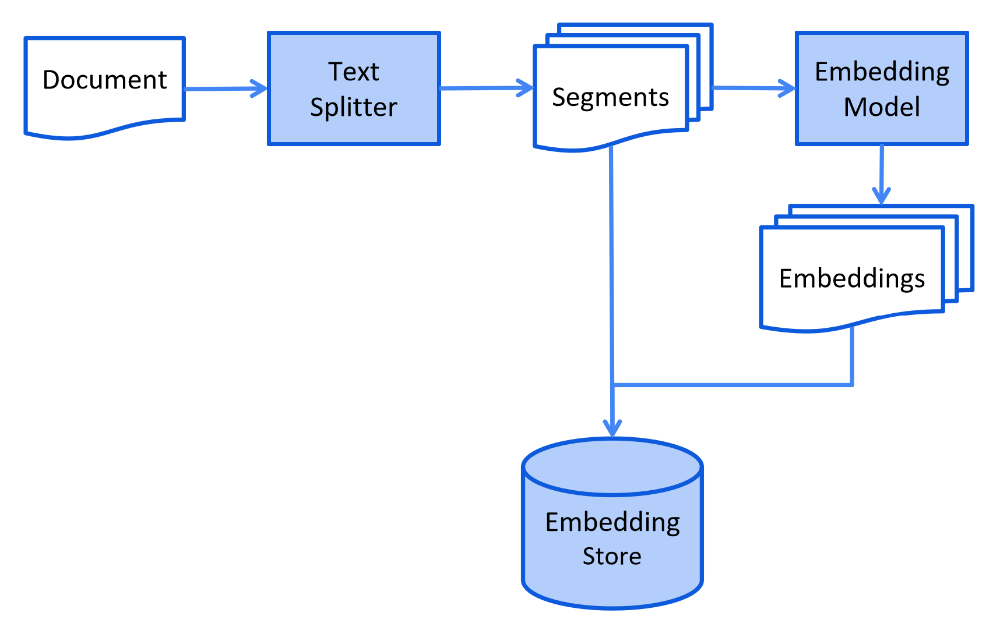
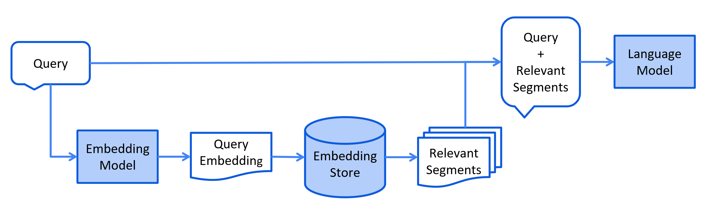
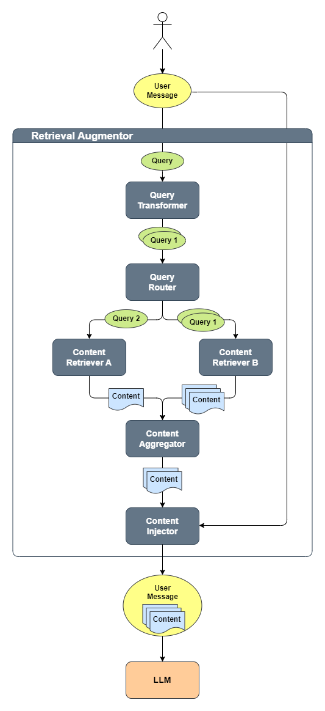

# RAG（检索增强生成）

LLM 的知识仅限于其训练数据。
如果你想让 LLM 了解领域特定知识或专有数据，你可以：
- 使用 RAG，我们将在本节中介绍
- 用你的数据对 LLM 进行微调
- [同时结合 RAG 和微调](https://gorilla.cs.berkeley.edu/blogs/9_raft.html)


## 什么是 RAG？
简单来说，RAG 是一种在将提示词发送给 LLM 之前，从你的数据中查找相关信息片段
并将其注入提示词的方式。
这样 LLM 就能获得（希望是）相关的信息，并利用这些信息来回复，
从而降低产生幻觉的可能性。

相关信息片段可以使用各种
[信息检索](https://en.wikipedia.org/wiki/Information_retrieval)方法来查找。
最流行的是：
- 全文（关键字）搜索。该方法使用 TF-IDF 和 BM25 等技术，
将查询中的关键字（例如用户提出的问题）与文档数据库进行匹配来搜索文档。
它根据这些关键字在每个文档中的频率和相关性对结果进行排名。
- 向量搜索，也称为"语义搜索"。
文本文档通过嵌入模型转换为数字向量。
然后基于查询向量与文档向量之间的余弦相似度
或其他相似度/距离度量来查找和排名文档，
从而捕获更深层的语义含义。
- 混合。结合多种搜索方法（例如全文 + 向量）通常能提高搜索效果。

目前，本页主要聚焦于向量搜索。
全文搜索和混合搜索目前仅由 Azure AI Search 集成和 Elasticsearch 支持，
详见 `AzureAiSearchContentRetriever` 和 `ElasticsearchContentRetriever`。
我们计划在不久的将来将全文搜索和混合搜索纳入 RAG 工具箱。


## RAG 阶段
RAG 过程分为两个截然不同的阶段：索引（indexing）和检索（retrieval）。
LangChain4j 为这两个阶段都提供了工具。

### 索引

在索引阶段，文档会经过预处理，以便在检索阶段能够高效搜索。

根据所使用的信息检索方法不同，该过程会有所不同。
对于向量搜索，这通常包括清理文档、用额外的数据和元数据丰富文档、
将它们切分成更小的片段（即分块/chunking）、对这些片段进行嵌入（embedding），最后将它们存储在向量存储（也称为向量数据库）中。

索引阶段通常离线进行，即不需要最终用户等待其完成。
例如，可以通过一个 cron 任务在每周周末重新索引公司内部文档来实现。
负责索引的代码也可以是一个只处理索引任务的独立应用程序。

不过，在某些场景下，最终用户可能希望上传自己的自定义文档，使其对 LLM 可用。
在这种情况下，索引应在线进行，并作为主应用的一部分。

下面是索引阶段的简化示意图：



### 检索

检索阶段通常在线进行，当用户提交一个需要使用已索引文档来回答的问题时发生。

根据所使用的信息检索方法不同，该过程会有所不同。
对于向量搜索，这通常包括对用户查询（问题）进行嵌入
并在向量存储中执行相似度搜索。
然后，相关的片段（原始文档的片段）会被注入提示词并发送给 LLM。

下面是检索阶段的简化示意图：



## LangChain4j 中的 RAG 变体

LangChain4j 提供三种 RAG 变体：
- [Easy RAG](rag.md#easy-rag)：最便捷的 RAG 入门方式
- [Naive RAG](rag.md#naive-rag)：基于向量搜索的 RAG 基础实现
- [Advanced RAG](rag.md#advanced-rag)：模块化 RAG 框架，支持查询转换、从多个来源检索以及重排等额外步骤


## Easy RAG
LangChain4j 具有 "Easy RAG" 功能，让你尽可能轻松地上手 RAG。
你不需要了解嵌入、选择向量存储、寻找合适的嵌入模型，
也不用弄清楚如何解析和切分文档等等。
只需指向你的文档，LangChain4j 就会施展它的魔法。

如果你需要可定制的 RAG，请跳转到[下一节](rag.md#核心-rag-api)。

如果你正在使用 Quarkus，有一种更简单的方式来使用 Easy RAG。
请阅读 [Quarkus 文档](https://docs.quarkiverse.io/quarkus-langchain4j/dev/rag-easy-rag.html)。

!!! note
    这种 "Easy RAG" 的质量当然会低于量身定制的 RAG 配置。
    不过，这是学习 RAG 和/或制作概念验证的最简单方式。
    之后，你可以从 Easy RAG 平稳过渡到更高级的 RAG，
    调整并定制越来越多的方面。

1. 导入 `langchain4j-easy-rag` 依赖：
```xml
<dependency>
    <groupId>dev.langchain4j</groupId>
    <artifactId>langchain4j-easy-rag</artifactId>
    <version>1.22.0-beta32</version>
</dependency>
```

2. 让我们加载你的文档：
```java
List<Document> documents = FileSystemDocumentLoader.loadDocuments("/home/langchain4j/documentation");
```
这将加载指定目录中的所有文件。

<details>
<summary>底层发生了什么？</summary>

支持多种文档类型的 Apache Tika 库
被用于检测文档类型并解析它们。
由于我们没有显式指定使用哪个 `DocumentParser`，
`FileSystemDocumentLoader` 将通过 SPI 加载由 `langchain4j-easy-rag` 依赖提供的
`ApacheTikaDocumentParser`。
</details>

<details>
<summary>如何自定义文档加载？</summary>

如果你想从所有子目录加载文档，可以使用 `loadDocumentsRecursively` 方法：
```java
List<Document> documents = FileSystemDocumentLoader.loadDocumentsRecursively("/home/langchain4j/documentation");
```
此外，你可以使用 glob 或正则表达式来过滤文档：
```java
PathMatcher pathMatcher = FileSystems.getDefault().getPathMatcher("glob:*.pdf");
List<Document> documents = FileSystemDocumentLoader.loadDocuments("/home/langchain4j/documentation", pathMatcher);
```

!!! note
    使用 `loadDocumentsRecursively` 方法时，你可能想
    在 glob 中使用双星号（而不是单个）：`glob:**.pdf`。
</details>

3. 现在，我们需要预处理文档并将其存储到专门的向量存储中，也就是向量数据库。
这是为了在用户提问时快速找到相关信息。
我们可以使用 30 多种[受支持的向量存储](../integrations/embedding-stores/index.md)中的任意一种，
但为简单起见，我们将使用内存中的向量存储：
```java
InMemoryEmbeddingStore<TextSegment> embeddingStore = new InMemoryEmbeddingStore<>();
EmbeddingStoreIngestor.ingest(documents, embeddingStore);
```

<details>
<summary>底层发生了什么？</summary>

1. `EmbeddingStoreIngestor` 通过 SPI 从 `langchain4j-easy-rag` 依赖加载 `DocumentSplitter`。
每个 `Document` 会被切分成更小的片段（`TextSegment`），每个片段不超过 300 个 token，
重叠 30 个 token。

2. `EmbeddingStoreIngestor` 通过 SPI 从 `langchain4j-easy-rag` 依赖加载 `EmbeddingModel`。
每个 `TextSegment` 会通过 `EmbeddingModel` 转换为 `Embedding`。

!!! note
    我们为 Easy RAG 选择了 [bge-small-en-v1.5](https://huggingface.co/BAAI/bge-small-en-v1.5) 作为默认嵌入模型。
    它在 [MTEB 排行榜](https://huggingface.co/spaces/mteb/leaderboard)上取得了令人印象深刻的分数，
    而且其量化版本仅占用 24 兆字节空间。
    因此，我们可以轻松将其加载到内存中，并使用 [ONNX Runtime](https://onnxruntime.ai/) 在同一进程中运行。

    是的，没错，你可以完全离线地将文本转换为嵌入，无需任何外部服务，
    就在同一个 JVM 进程中。
    LangChain4j 提供了一些流行的嵌入模型
    [开箱即用](../integrations/embedding-models/1-in-process.md)。

3. 所有 `TextSegment`-`Embedding` 对都被存储在 `EmbeddingStore` 中。
</details>

4. 最后一步是创建一个 [AI 服务](ai-services.md)，作为我们访问 LLM 的 API：
```java
interface Assistant {

    String chat(String userMessage);
}

ChatModel chatModel = OpenAiChatModel.builder()
    .apiKey(System.getenv("OPENAI_API_KEY"))
    .modelName(GPT_4_O_MINI)
    .build();

Assistant assistant = AiServices.builder(Assistant.class)
    .chatModel(chatModel)
    .chatMemory(MessageWindowChatMemory.withMaxMessages(10))
    .contentRetriever(EmbeddingStoreContentRetriever.from(embeddingStore))
    .build();
```
这里，我们配置 `Assistant` 使用 OpenAI LLM 来回答用户问题，
记住对话中最近的 10 条消息，
并从包含我们文档的 `EmbeddingStore` 中检索相关内容。

5. 现在，我们准备好和它聊天了！
```java
String answer = assistant.chat("How to do Easy RAG with LangChain4j?");
```


## 核心 RAG API
LangChain4j 提供了一组丰富的 API，让你轻松构建自定义 RAG 管道，
从简单的到高级的都有。
在本节中，我们将介绍主要的领域类和 API。


### 文档（Document）
`Document` 类表示整个文档，例如单个 PDF 文件或网页。
目前，`Document` 只能表示文本信息，
但未来的更新将使它能够支持图像和表格。

<details>
<summary>常用方法</summary>

- `Document.text()` 返回 `Document` 的文本
- `Document.metadata()` 返回 `Document` 的 `Metadata`（见下文 "元数据" 部分）
- `Document.toTextSegment()` 将 `Document` 转换为 `TextSegment`（见下文 "文本片段" 部分）
- `Document.from(String, Metadata)` 从文本和 `Metadata` 创建 `Document`
- `Document.from(String)` 从文本创建 `Document`，`Metadata` 为空
</details>

### 元数据（Metadata）
每个 `Document` 都包含 `Metadata`。
它存储关于 `Document` 的元信息，例如它的名称、来源、最后更新日期、所有者，
或其他任何相关细节。

`Metadata` 以键值映射的形式存储，其中键为 `String` 类型，
值可以是以下类型之一：`String`、`Integer`、`Long`、`Float`、`Double`、`UUID`。

`Metadata` 有几个方面的用处：
- 当将 `Document` 的内容包含到给 LLM 的提示词中时，
也可以包含元数据条目，为 LLM 提供额外需要考虑的信息。
例如，提供 `Document` 的名称和来源有助于提高 LLM 对内容的理解。
- 当搜索要包含在提示词中的相关内容时，
可以按照 `Metadata` 条目进行过滤。
例如，你可以将语义搜索缩小到仅属于特定所有者的 `Document`。
- 当 `Document` 的来源被更新时（例如文档的特定页面），
可以通过其元数据条目（例如 "id"、"source" 等）轻松定位对应的 `Document`，
并同样在 `EmbeddingStore` 中更新它，以保持同步。

<details>
<summary>常用方法</summary>

- `Metadata.from(Map)` 从 `Map` 创建 `Metadata`
- `Metadata.put(String key, String value)` / `put(String, int)` / 等等，向 `Metadata` 添加一个条目
- `Metadata.putAll(Map)` 向 `Metadata` 添加多个条目
- `Metadata.getString(String key)` / `getInteger(String key)` / 等等，返回 `Metadata` 条目的值，并将其转换（cast）为所需类型
- `Metadata.containsKey(String key)` 检查 `Metadata` 是否包含具有指定键的条目
- `Metadata.remove(String key)` 按键从 `Metadata` 中移除一个条目
- `Metadata.copy()` 返回 `Metadata` 的副本
- `Metadata.toMap()` 将 `Metadata` 转换为 `Map`
- `Metadata.merge(Metadata)` 将当前 `Metadata` 与另一个 `Metadata` 合并
</details>

### 文档加载器（Document Loader）
你可以从 `String` 创建 `Document`，但更简单的方法是使用库中包含的文档加载器之一：
- `langchain4j` 模块中的 `FileSystemDocumentLoader`
- `langchain4j` 模块中的 `ClassPathDocumentLoader`
- `langchain4j` 模块中的 `UrlDocumentLoader`
- `langchain4j-document-loader-amazon-s3` 模块中的 `AmazonS3DocumentLoader`
- `langchain4j-document-loader-azure-storage-blob` 模块中的 `AzureBlobStorageDocumentLoader`
- `langchain4j-document-loader-github` 模块中的 `GitHubDocumentLoader`
- `langchain4j-document-loader-google-cloud-storage` 模块中的 `GoogleCloudStorageDocumentLoader`
- `langchain4j-document-loader-selenium` 模块中的 `SeleniumDocumentLoader`
- `langchain4j-document-loader-playwright` 模块中的 `PlaywrightDocumentLoader`
- `langchain4j-document-loader-tencent-cos` 模块中的 `TencentCosDocumentLoader`


### 文档解析器（Document Parser）
`Document` 可以表示各种格式的文件，例如 PDF、DOC、TXT 等。
要解析这些格式中的每一种，库中包含了一个 `DocumentParser` 接口及其若干实现：
- `langchain4j` 模块中的 `TextDocumentParser`，可解析纯文本格式的文件（如 TXT、HTML、MD 等）
- `langchain4j-document-parser-apache-pdfbox` 模块中的 `ApachePdfBoxDocumentParser`，可解析 PDF 文件
- `langchain4j-document-parser-apache-poi` 模块中的 `ApachePoiDocumentParser`，可解析 MS Office 文件格式
（如 DOC、DOCX、PPT、PPTX、XLS、XLSX 等）
- `langchain4j-document-parser-apache-tika` 模块中的 `ApacheTikaDocumentParser`，
可自动检测并解析几乎现有的所有文件格式
- `langchain4j-document-parser-docling` 模块中的 `DoclingDocumentParser`，
使用 [Docling Java](https://docling-project.github.io/docling-java/current/) 和 [Docling](https://docling.ai) 处理文档。
- `langchain4j-document-parser-markdown` 模块中的 `MarkdownDocumentParser`，
可解析 markdown 格式的文件
- `langchain4j-document-parser-yaml` 模块中的 `YamlDocumentParser`，
可解析 yaml 格式的文件

下面是如何从文件系统加载一个或多个 `Document` 的示例：
```java
// Load a single document
Document document = FileSystemDocumentLoader.loadDocument("/home/langchain4j/file.txt", new TextDocumentParser());

// Load all documents from a directory
List<Document> documents = FileSystemDocumentLoader.loadDocuments("/home/langchain4j", new TextDocumentParser());

// Load all *.txt documents from a directory
PathMatcher pathMatcher = FileSystems.getDefault().getPathMatcher("glob:*.txt");
List<Document> documents = FileSystemDocumentLoader.loadDocuments("/home/langchain4j", pathMatcher, new TextDocumentParser());

// Load all documents from a directory and its subdirectories
List<Document> documents = FileSystemDocumentLoader.loadDocumentsRecursively("/home/langchain4j", new TextDocumentParser());
```

你也可以在未显式指定 `DocumentParser` 的情况下加载文档。
在这种情况下，将使用默认的 `DocumentParser`。
默认的解析器通过 SPI 加载（例如来自 `langchain4j-document-parser-apache-tika` 或 `langchain4j-easy-rag`，如果导入了其中之一）。
如果通过 SPI 找不到任何 `DocumentParser`，则会使用 `TextDocumentParser` 作为回退。


### 文档转换器（Document Transformer）
`DocumentTransformer` 的实现可以执行各种文档转换，例如：
- 清理：这涉及从 `Document` 的文本中移除不必要的噪音，可以节省 token 并减少干扰。
- 过滤：将特定 `Document` 完全排除在搜索之外。
- 丰富：可以向 `Document` 添加额外信息，以潜在地提升搜索结果。
- 摘要：可以对 `Document` 进行摘要，并将其简短摘要存储在 `Metadata` 中，
以便稍后包含在每个 `TextSegment`（下文将介绍）中，从而潜在地改进搜索。
- 等等。

在此阶段还可以添加、修改或删除 `Metadata` 条目。

目前，开箱即用的唯一实现是
`langchain4j-document-transformer-jsoup` 模块中的 `HtmlToTextDocumentTransformer`，
它可以从原始 HTML 中提取所需的文本内容和元数据条目。

由于不存在放之四海而皆准的方案，我们建议实现你自己的 `DocumentTransformer`，
针对你的独特数据进行定制。


### 图转换器（Graph Transformer）

`GraphTransformer` 是一个接口，它通过提取**语义图元素**（如节点和关系），
将非结构化的 `Document` 对象转换为结构化的 `GraphDocument`。
它非常适合将原始文本转换为结构化的语义图

`GraphTransformer` 将原始文档转换为 `GraphDocument`。其中包括：

* 一组**节点**（`GraphNode`），表示文本中的实体或概念。
* 一组**关系**（`GraphEdge`），表示这些实体之间的连接方式。
* 作为 `source` 的原始 `Document`。

默认实现是 `LLMGraphTransformer`，它使用语言模型（例如 OpenAI）通过提示词工程从自然语言中提取图信息。

#### 主要优势

* **实体和关系提取**：识别关键概念及其语义连接。
* **图表示**：输出可直接集成到知识图谱或图数据库中。
* **模型驱动的解析**：使用大型语言模型从无结构文本中推断结构。

#### Maven 依赖

```xml
<dependency>
  <groupId>dev.langchain4j</groupId>
  <artifactId>langchain4j-community-llm-graph-transformer</artifactId>
  <version>${latest version here}</version>
</dependency>
```

#### 使用示例

```java
import dev.langchain4j.data.document.Document;
import dev.langchain4j.model.openai.OpenAiChatModel;
import dev.langchain4j.community.data.document.graph.GraphDocument;
import dev.langchain4j.community.data.document.graph.GraphNode;
import dev.langchain4j.community.data.document.graph.GraphEdge;
import dev.langchain4j.community.data.document.transformer.graph.GraphTransformer;
import dev.langchain4j.community.data.document.transformer.graph.llm.LLMGraphTransformer;

import java.time.Duration;
import java.util.Set;

public class GraphTransformerExample {
    public static void main(String[] args) {
        // Create a GraphTransformer backed by an LLM
        GraphTransformer transformer = new LLMGraphTransformer(
            OpenAiChatModel.builder()
                .apiKey(System.getenv("OPENAI_API_KEY"))
                .timeout(Duration.ofSeconds(60))
                .build()
        );

        // Input document
        Document document = Document.from("Barack Obama was born in Hawaii and served as the 44th President of the United States.");

        // Transform the document
        GraphDocument graphDocument = transformer.transform(document);

        // Access nodes and relationships
        Set<GraphNode> nodes = graphDocument.nodes();
        Set<GraphEdge> relationships = graphDocument.relationships();

        nodes.forEach(System.out::println);
        relationships.forEach(System.out::println);
    }
}
```

#### 输出示例

```
GraphNode(name=Barack Obama, type=Person)
GraphNode(name=Hawaii, type=Location)
GraphEdge(from=Barack Obama, predicate=was born in, to=Hawaii)

GraphEdge(from=Barack Obama, predicate=served as, to=President of the United States)
```


### 文本片段（TextSegment）
一旦你的 `Document` 加载完毕，就该将它们切分（分块）成更小的片段了。
LangChain4j 的领域模型包含一个 `TextSegment` 类，表示 `Document` 的一个片段。
顾名思义，`TextSegment` 只能表示文本信息。

<details>
<summary>该不该切分？</summary>

你可能希望在提示词中只包含少数相关片段，而不是整个知识库，原因有以下几点：
- LLM 的上下文窗口有限，因此整个知识库可能放不进去
- 你在提示词中提供的信息越多，LLM 处理并作出响应所需的时间就越长
- 你在提示词中提供的信息越多，你的花费就越多
- 提示词中的不相关信息可能会分散 LLM 的注意力，并增加幻觉的可能性
- 你在提示词中提供的信息越多，就越难解释 LLM 是基于哪些信息作出响应的

我们可以通过将知识库切分成更小的、更容易消化的片段来应对这些问题。
这些片段应该多大？这是一个好问题。和往常一样，视情况而定。

目前广泛使用的方案有 2 种：
1. 每个文档（例如 PDF 文件、网页等）都是原子性的、不可分割的。
在 RAG 管道的检索过程中，检索出 N 个最相关的文档并注入提示词。
在这种情况下，你很可能需要使用长上下文 LLM，因为文档可能相当长。
如果检索完整文档很重要，
例如当你不能错过任何细节时，这种方法就适用。
- 优点：不会丢失上下文。
- 缺点：
  - 消耗的 token 更多。
  - 有时，文档可能包含多个章节/主题，而并非所有这些都与查询相关。
  - 向量搜索质量会受到影响，因为各种大小的完整文档被压缩成单个固定长度的向量。

2. 文档被切分成更小的片段，例如章节、段落，有时甚至是句子。
在 RAG 管道的检索过程中，检索出 N 个最相关的片段并注入提示词。
挑战在于确保每个片段都为 LLM 提供了足够的上下文/信息来理解它。
缺失的上下文可能导致 LLM 误解给定的片段并产生幻觉。
一种常见策略是将文档切分成有重叠的片段，但这并不能完全解决问题。
这里有一些高级技术可以提供帮助，例如 "sentence window retrieval"（句子窗口检索）、"auto-merging retrieval"（自动合并检索），
以及 "parent document retrieval"（父文档检索）。
我们不会在这里深入细节，但本质上，这些方法有助于获取检索片段周围的更多上下文，
为 LLM 提供检索片段前后额外的信息。
- 优点：
  - 向量搜索质量更好。
  - token 消耗减少。
- 缺点：可能仍会丢失一些上下文。

</details>

<details>
<summary>常用方法</summary>

- `TextSegment.text()` 返回 `TextSegment` 的文本
- `TextSegment.metadata()` 返回 `TextSegment` 的 `Metadata`
- `TextSegment.from(String, Metadata)` 从文本和 `Metadata` 创建 `TextSegment`
- `TextSegment.from(String)` 从文本创建 `TextSegment`，`Metadata` 为空
</details>

### 文档切分器（Document Splitter）
LangChain4j 有一个 `DocumentSplitter` 接口，并带有若干开箱即用的实现：
- `DocumentByParagraphSplitter`
- `DocumentByLineSplitter`
- `DocumentBySentenceSplitter`
- `DocumentByWordSplitter`
- `DocumentByCharacterSplitter`
- `DocumentByRegexSplitter`
- 递归：`DocumentSplitters.recursive(...)`

它们的工作原理都如下：
1. 你实例化一个 `DocumentSplitter`，指定所需 `TextSegment` 的大小，
以及可选的以字符或 token 为单位的重叠量。
2. 你调用 `DocumentSplitter` 的 `split(Document)` 或 `splitAll(List<Document>)` 方法。
3. `DocumentSplitter` 将给定的 `Document` 切分成更小的单元，
其性质因切分器而异。例如，`DocumentByParagraphSplitter` 将
文档切分成段落（由两个或多个连续换行符定义），
而 `DocumentBySentenceSplitter` 则使用 OpenNLP 库的句子检测器将
文档切分成句子，依此类推。
4. 然后 `DocumentSplitter` 将这些较小的单元（段落、句子、单词等）组合成 `TextSegment`，
尝试在不超出第 1 步设置的限制的前提下，在单个 `TextSegment` 中包含尽可能多的单元。
如果某些单元仍然太大而放不进 `TextSegment`，它会调用一个子切分器。
这是一个能够将放不下的单元切分成更细粒度单元的 `DocumentSplitter`。
所有 `Metadata` 条目都会从 `Document` 复制到每个 `TextSegment`。
会为每个文本片段添加一个唯一的元数据条目 "index"。
第一个 `TextSegment` 将包含 `index=0`，第二个包含 `index=1`，依此类推。


### 文本片段转换器（Text Segment Transformer）
`TextSegmentTransformer` 类似于 `DocumentTransformer`（上文已介绍），但它转换的是 `TextSegment`。

与 `DocumentTransformer` 一样，不存在放之四海而皆准的方案，
因此我们建议实现你自己的 `TextSegmentTransformer`，针对你的独特数据进行定制。

对改进检索效果相当有效的一种技术是在每个 `TextSegment` 中包含 `Document` 的标题或简短摘要。


### 嵌入（Embedding）
`Embedding` 类封装了一个表示所嵌入内容（通常是文本，例如 `TextSegment`）
"语义含义"的数字向量。

在这里阅读更多关于向量嵌入的内容：
- https://www.elastic.co/what-is/vector-embedding
- https://www.pinecone.io/learn/vector-embeddings/
- https://cloud.google.com/blog/topics/developers-practitioners/meet-ais-multitool-vector-embeddings

<details>
<summary>常用方法</summary>

- `Embedding.dimension()` 返回嵌入向量的维度（其长度）
- `CosineSimilarity.between(Embedding, Embedding)` 计算两个 `Embedding` 之间的余弦相似度
- `Embedding.normalize()` 对嵌入向量进行归一化（原地）
</details>


### 嵌入模型（Embedding Model）
`EmbeddingModel` 接口表示一种特殊类型的模型，它将文本转换为 `Embedding`。

当前支持的嵌入模型可在[这里](../integrations/embedding-models/index.md)找到。

<details>
<summary>常用方法</summary>

- `EmbeddingModel.embed(String)` 嵌入给定文本
- `EmbeddingModel.embed(TextSegment)` 嵌入给定的 `TextSegment`
- `EmbeddingModel.embedAll(List<TextSegment>)` 嵌入所有给定的 `TextSegment`
- `EmbeddingModel.dimension()` 返回该模型生成的 `Embedding` 的维度
</details>

#### 请求/响应 API 与每次调用参数

除了上面的便捷方法外，`EmbeddingModel` 还接受一个 `EmbeddingRequest` 并返回一个
`EmbeddingResponse`，这允许你传递**每次调用参数**：

```java
EmbeddingResponse response = embeddingModel.embed(EmbeddingRequest.builder()
    .input("What is the capital of France?")
    .inputType(EmbeddingInputType.QUERY) // query vs document, see the section below
    .dimensions(256)                     // reduce output dimensionality (on models that support it)
    .build());

List<Embedding> embeddings = response.embeddings();
```

每次调用参数严格遵循 opt-in（显式启用）原则：每个提供商通过 `supportedParameters()` 声明其所支持的内容。
如果请求使用了模型不支持的参数，它会快速失败并抛出 `UnsupportedFeatureException`，
而不是静默忽略。另请参阅
[查询与文档嵌入（opt-in）](#查询与文档嵌入opt-in)。

#### 多模态嵌入

一些模型会将图像（以及交错的文本 + 图像）嵌入到同一向量空间。从 `Content`
部件构建输入；在支持该功能的模型（Cohere Embed v4、Voyage 多模态、Google Gemini Embedding 2、Amazon Titan
Multimodal、Jina CLIP 等）上，这些部件会融合成单个嵌入：

```java
EmbeddingResponse response = embeddingModel.embed(EmbeddingRequest.builder()
    .input(TextContent.from("a photo of a cat"), ImageContent.from("https://example.com/cat.png"))
    .build());
```

模型通过 `supportedContentTypes()` 声明其支持的模态；向仅支持文本的模型传入图像
会快速失败并抛出 `UnsupportedFeatureException`。`EmbeddingModel` 的可观测性（监听器）在
[可观测性](observability.md)教程中介绍。


### 向量存储（Embedding Store）
`EmbeddingStore` 接口表示 `Embedding` 的存储，也称为向量数据库。
它允许存储并高效搜索相似（在嵌入空间中距离较近）的 `Embedding`。

当前支持的向量存储可在[这里](../integrations/embedding-stores/index.md)找到。

`EmbeddingStore` 可以单独存储 `Embedding`，也可以连同对应的 `TextSegment` 一起存储：
- 它可以只按 ID 存储 `Embedding`。原始嵌入数据可以存储在其他地方，并使用 ID 进行关联。
- 它可以同时存储 `Embedding` 和被嵌入的原始数据（通常是 `TextSegment`）。

<details>
<summary>常用方法</summary>

- `EmbeddingStore.add(Embedding)` 将给定的 `Embedding` 添加到存储中，并返回一个随机 ID
- `EmbeddingStore.add(String id, Embedding)` 将给定 ID 的 `Embedding` 添加到存储中
- `EmbeddingStore.add(Embedding, TextSegment)` 将给定的 `Embedding` 及其关联的 `TextSegment` 添加到存储中，并返回一个随机 ID
- `EmbeddingStore.addAll(List<Embedding>)` 将给定的 `Embedding` 列表添加到存储中，并返回一个随机 ID 列表
- `EmbeddingStore.addAll(List<Embedding>, List<TextSegment>)` 将给定的 `Embedding` 列表及其关联的 `TextSegment` 添加到存储中，并返回一个随机 ID 列表
- `EmbeddingStore.addAll(List<String> ids, List<Embedding>, List<TextSegment>)` 将给定的 `Embedding` 列表及其关联的 ID 和 `TextSegment` 添加到存储中
- `EmbeddingStore.search(EmbeddingSearchRequest)` 搜索最相似的 `Embedding`
- `EmbeddingStore.remove(String id)` 按 ID 从存储中移除单个 `Embedding`
- `EmbeddingStore.removeAll(Collection<String> ids)` 从存储中移除所有 ID 存在于给定集合中的 `Embedding`。
- `EmbeddingStore.removeAll(Filter)` 从存储中移除所有匹配指定 `Filter` 的 `Embedding`
- `EmbeddingStore.removeAll()` 从存储中移除所有 `Embedding`
</details>


#### 嵌入搜索请求（EmbeddingSearchRequest）
`EmbeddingSearchRequest` 表示在 `EmbeddingStore` 中进行搜索的请求。
它具有以下属性：
- `Embedding queryEmbedding`：用作参考的嵌入。
- `int maxResults`：要返回的最大结果数。这是一个可选参数。默认值：3。
- `double minScore`：最低分数，取值范围为 0 到 1（含两端）。只有分数 >= `minScore` 的嵌入才会被返回。这是一个可选参数。默认值：0。
- `Filter filter`：搜索时应用于 `Metadata` 的过滤器。只有 `Metadata` 匹配 `Filter` 的 `TextSegment` 才会被返回。

#### 过滤器（Filter）
`Filter` 允许在执行向量搜索时按 `Metadata` 条目进行过滤。

目前，支持以下 `Filter` 类型/操作：
-  `IsEqualTo`
-  `IsNotEqualTo`
-  `IsGreaterThan`
-  `IsGreaterThanOrEqualTo`
-  `IsLessThan`
-  `IsLessThanOrEqualTo`
-  `IsIn`
-  `IsNotIn`
-  `ContainsString`
-  `And`
-  `Not`
-  `Or`

!!! note
    并非所有向量存储都支持按 `Metadata` 过滤，
    请参见[这里](https://docs.langchain4j.dev/integrations/embedding-stores/)的 "Filtering by Metadata" 列。

    一些支持按 `Metadata` 过滤的存储并不支持所有可能的 `Filter` 类型/操作。
    例如，`ContainsString` 目前仅由 Milvus、PgVector 和 Qdrant 支持。

有关 `Filter` 的更多详情可在[这里](https://github.com/langchain4j/langchain4j/pull/610)找到。


#### 嵌入搜索结果（EmbeddingSearchResult）
`EmbeddingSearchResult` 表示在 `EmbeddingStore` 中搜索的结果。
它包含一个 `EmbeddingMatch` 列表。


#### 嵌入匹配（Embedding Match）
`EmbeddingMatch` 表示一个匹配的 `Embedding` 及其相关度分数、ID 和原始嵌入数据（通常是 `TextSegment`）。


### 向量存储摄入器（Embedding Store Ingestor）
`EmbeddingStoreIngestor` 表示一个摄入管道，负责
将 `Document` 摄入到 `EmbeddingStore` 中。

在最简单的配置中，`EmbeddingStoreIngestor` 使用指定的 `EmbeddingModel`
对提供的 `Document` 进行嵌入，并将它们及其 `Embedding` 一起存储到指定的 `EmbeddingStore` 中：

```java
EmbeddingStoreIngestor ingestor = EmbeddingStoreIngestor.builder()
        .embeddingModel(embeddingModel)
        .embeddingStore(embeddingStore)
        .build();

ingestor.ingest(document1);
ingestor.ingest(document2, document3);
IngestionResult ingestionResult = ingestor.ingest(List.of(document4, document5, document6));
```

`EmbeddingStoreIngestor` 中的所有 `ingest()` 方法都返回一个 `IngestionResult`。
`IngestionResult` 包含有用的信息，包括 `TokenUsage`，
它显示了用于嵌入的 token 数量。

可选地，`EmbeddingStoreIngestor` 可以使用指定的 `DocumentTransformer` 来转换 `Document`。
如果你想在对 `Document` 进行嵌入之前清理、丰富或格式化它们，这会很有用。

可选地，`EmbeddingStoreIngestor` 可以使用指定的 `DocumentSplitter` 将 `Document` 切分成 `TextSegment`。
如果 `Document` 较大，且你想将它们切分成更小的 `TextSegment` 以提高
相似度搜索的质量并减少发送给 LLM 的提示词的大小和成本，这会很有用。

可选地，`EmbeddingStoreIngestor` 可以使用指定的 `TextSegmentTransformer` 来转换 `TextSegment`。
如果你想在对 `TextSegment` 进行嵌入之前清理、丰富或格式化它们，这会很有用。

一个示例：
```java
EmbeddingStoreIngestor ingestor = EmbeddingStoreIngestor.builder()

    // adding userId metadata entry to each Document to be able to filter by it later
    .documentTransformer(document -> {
        document.metadata().put("userId", "12345");
        return document;
    })

    // splitting each Document into TextSegments of 1000 tokens each, with a 200-token overlap
    .documentSplitter(DocumentSplitters.recursive(1000, 200, new OpenAiTokenCountEstimator("gpt-4o-mini")))

    // adding a name of the Document to each TextSegment to improve the quality of search
    .textSegmentTransformer(textSegment -> TextSegment.from(
            textSegment.metadata().getString("file_name") + "\n" + textSegment.text(),
            textSegment.metadata()
    ))

    .embeddingModel(embeddingModel)
    .embeddingStore(embeddingStore)
    .build();
```

#### 查询与文档嵌入（opt-in）

一些嵌入模型（例如 Cohere Embed v4、Voyage、Google）在文档
和查询以不同方式嵌入时会产生更好的检索质量。你可以通过声明输入类型来启用：在
`EmbeddingStoreIngestor` 上声明 `DOCUMENT`（用于被索引的片段），在 `EmbeddingStoreContentRetriever` 上声明 `QUERY`（用于
查询，见[向量存储内容检索器](#向量存储内容检索器embedding-store-content-retriever)）。

```java
EmbeddingStoreIngestor ingestor = EmbeddingStoreIngestor.builder()
    .embeddingModel(embeddingModel)
    .embeddingStore(embeddingStore)
    .embeddingInputType(EmbeddingInputType.DOCUMENT)
    .build();
```

当未设置 `embeddingInputType` 时，不会发送输入类型。当它被设置时，所选的 `EmbeddingModel` 必须
支持输入类型参数（参见其 `supportedParameters()`），否则嵌入会快速失败并抛出
`UnsupportedFeatureException`。


## Naive RAG

一旦我们的文档完成摄入（见前面各节），我们就可以创建
一个 `EmbeddingStoreContentRetriever` 来启用 naive RAG 功能。

当使用 [AI 服务](ai-services.md) 时，naive RAG 可以按如下方式配置：
```java
ContentRetriever contentRetriever = EmbeddingStoreContentRetriever.builder()
    .embeddingStore(embeddingStore)
    .embeddingModel(embeddingModel)
    .maxResults(5)
    .minScore(0.75)
    .build();

Assistant assistant = AiServices.builder(Assistant.class)
    .chatModel(model)
    .contentRetriever(contentRetriever)
    .build();
```

[Naive RAG 示例](https://github.com/langchain4j/langchain4j-examples/blob/main/rag-examples/src/main/java/_2_naive/Naive_RAG_Example.java)


## Advanced RAG

Advanced RAG 可以通过 LangChain4j 的以下核心组件实现：
- `QueryTransformer`
- `QueryRouter`
- `ContentRetriever`
- `ContentAggregator`
- `ContentInjector`

下图展示了这些组件如何协同工作：


过程如下：
1. 用户产生一个 `UserMessage`，它被转换成一个 `Query`
2. `QueryTransformer` 将该 `Query` 转换成一个或多个 `Query`
3. 每个 `Query` 由 `QueryRouter` 路由到一个或多个 `ContentRetriever`
4. 每个 `ContentRetriever` 为每个 `Query` 检索相关的 `Content`
5. `ContentAggregator` 将所有检索到的 `Content` 合并成一个最终的排序列表
6. 这个 `Content` 列表被注入到原始的 `UserMessage` 中
7. 最后，包含原始查询以及注入的相关内容的 `UserMessage` 被发送给 LLM

有关更多详情，请参阅每个组件的 Javadoc。

### 检索增强器（Retrieval Augmentor）

`RetrievalAugmentor` 是进入 RAG 管道的入口点。
它负责用从各种来源检索到的相关 `Content`
来增强 `ChatMessage`。

可以在创建 [AI 服务](ai-services.md) 时指定一个 `RetrievalAugmentor` 实例：
```java
Assistant assistant = AiServices.builder(Assistant.class)
    ...
    .retrievalAugmentor(retrievalAugmentor)
    .build();
```
每次调用 AI 服务时，都会调用指定的 `RetrievalAugmentor`
来增强当前的 `UserMessage`。

你可以使用 `RetrievalAugmentor` 的默认实现
（下文介绍），也可以实现一个自定义的。

### 默认检索增强器（Default Retrieval Augmentor）

LangChain4j 提供了 `RetrievalAugmentor` 接口的一个开箱即用实现：
`DefaultRetrievalAugmentor`，它应该适用于大多数 RAG 用例。
它的灵感来自[这篇文章](https://blog.langchain.dev/deconstructing-rag)
和[这篇论文](https://arxiv.org/abs/2312.10997)。
建议查阅这些资源以更好地理解这一概念。

### 查询（Query）
`Query` 表示 RAG 管道中的用户查询。
它包含查询的文本和查询元数据。

#### 查询元数据（Query Metadata）
`Query` 中的 `Metadata` 包含可能对 RAG 管道中
各个组件有用的信息，例如：
- `Metadata.userMessage()` - 应该被增强的原始 `UserMessage`
- `Metadata.chatMemoryId()` - 带有 `@MemoryId` 注解的方法参数的值。更多详情见[这里](ai-services.md#聊天记忆)。这可以用于识别用户，并在检索期间应用访问限制或过滤器。
- `Metadata.chatMemory()` - 所有之前的 `ChatMessage`。这有助于理解 `Query` 被提出时的上下文。
- `Metadata.invocationParameters()` - 包含在调用 AI 服务时可以指定的 `InvocationParameters`：

```java
interface Assistant {
    String chat(@UserMessage String userMessage, InvocationParameters parameters);
}

InvocationParameters parameters = InvocationParameters.from(Map.of("userId", "12345"));
String response = assistant.chat("Hello", parameters);
```

`InvocationParameters` 也可以在其他 AI 服务组件中访问，例如：
- [带 `@Tool` 注解的方法](tools.md#invocationparameters)
- [`ToolProvider`](tools.md#动态指定工具)：在 `ToolProviderRequest` 中
- [`ToolArgumentsErrorHandler`](tools.md#处理工具参数错误)
  和 [`ToolExecutionErrorHandler`](https://docs.langchain4j.dev/tutorials/tools#handling-tool-execution-errors)：
  在 `ToolErrorContext` 中

参数存储在一个可变的、线程安全的 `Map` 中。

数据可以在 `InvocationParameters` 内部在 AI 服务组件之间传递
（例如，从一个 RAG 组件到另一个 RAG 组件，或从 RAG 组件到工具），
在 AI 服务的单次调用期间。

### 查询转换器（Query Transformer）
`QueryTransformer` 将给定的 `Query` 转换成一个或多个 `Query`。
目标是通过修改或扩展原始 `Query` 来提升检索质量。

一些已知的改进检索的方法包括：
- 查询压缩
- 查询扩展
- 查询重写
- 退后一步提示（step-back prompting）
- 假设性文档嵌入（HyDE）

更多详情可在[这里](https://blog.langchain.dev/query-transformations/)找到。

LangChain4j 还有一个可选的社区[提示词重复](../integrations/prompt-repetition/index.md)模块，提供 `RepeatingQueryTransformer`。它在内容检索之前重复检索查询，应该用于转换查询本身，而不是发送给模型的最终增强提示词。

#### 默认查询转换器（Default Query Transformer）
`DefaultQueryTransformer` 是在 `DefaultRetrievalAugmentor` 中使用的默认实现。
它不会对 `Query` 进行任何修改，只是将其原样传递。

#### 压缩查询转换器（Compressing Query Transformer）
`CompressingQueryTransformer` 使用 LLM 将给定的 `Query`
和之前的对话压缩成一个独立的 `Query`。
当用户可能提出指代之前问题或答案中信息的后续问题时，这很有用。

这里有一个示例：
```
User: Tell me about John Doe
AI: John Doe was a ...
User: Where did he live?
```
查询 `Where did he live?` 本身无法检索到所需的信息，
因为没有对 John Doe 的显式引用，使得 `he` 指代谁并不清楚。

当使用 `CompressingQueryTransformer` 时，LLM 会阅读整个对话
并将 `Where did he live?` 转换为 `Where did John Doe live?`。

#### 扩展查询转换器（Expanding Query Transformer）
`ExpandingQueryTransformer` 使用 LLM 将给定的 `Query` 扩展成多个 `Query`。
这很有用，因为 LLM 可以用各种方式重新组织和改写 `Query`，
这将有助于检索到更相关的内容。

### 内容（Content）
`Content` 表示与用户 `Query` 相关的内容。
目前，它仅限于文本内容（即 `TextSegment`），
但未来可能支持其他模态（例如图像、音频、视频等）。

### 内容检索器（Content Retriever）
`ContentRetriever` 使用给定的 `Query` 从底层数据源中检索 `Content`。
底层数据源可以是几乎任何东西：
- 向量存储
- 全文搜索引擎
- 向量和全文搜索的混合
- 网页搜索引擎
- 知识图谱
- SQL 数据库
- 等等。

`ContentRetriever` 返回的 `Content` 列表按相关度排序，从高到低。

#### 向量存储内容检索器（Embedding Store Content Retriever）
`EmbeddingStoreContentRetriever` 使用 `EmbeddingModel` 对 `Query` 进行嵌入，
从 `EmbeddingStore` 中检索相关的 `Content`。

这里有一个示例：
```java
EmbeddingStore embeddingStore = ...
EmbeddingModel embeddingModel = ...

ContentRetriever contentRetriever = EmbeddingStoreContentRetriever.builder()
    .embeddingStore(embeddingStore)
    .embeddingModel(embeddingModel)
    .maxResults(3)
     // maxResults can also be specified dynamically depending on the query
    .dynamicMaxResults(query -> 3)
    .minScore(0.75)
     // minScore can also be specified dynamically depending on the query
    .dynamicMinScore(query -> 0.75)
    .filter(metadataKey("userId").isEqualTo("12345"))
    // filter can also be specified dynamically depending on the query
    .dynamicFilter(query -> {
        String userId = query.metadata().invocationParameters().get("userId");
        return metadataKey("userId").isEqualTo(userId);
    })
    .build();

interface Assistant {
    String chat(@UserMessage String userMessage, InvocationParameters parameters);
}

InvocationParameters parameters = InvocationParameters.from(Map.of("userId", "12345"));
String response = assistant.chat("Hello", parameters);
```

要以 `input_type=query` 嵌入查询（与摄入器的 `DOCUMENT` 配对，见
[查询与文档嵌入（opt-in）](#查询与文档嵌入opt-in)），在检索器上设置输入类型：

```java
ContentRetriever contentRetriever = EmbeddingStoreContentRetriever.builder()
    .embeddingStore(embeddingStore)
    .embeddingModel(embeddingModel)
    .embeddingInputType(EmbeddingInputType.QUERY)
    .build();
```

默认值不变（不发送输入类型）。`EmbeddingModel` 必须支持 `input_type` 参数。

#### 网页搜索内容检索器（Web Search Content Retriever）
`WebSearchContentRetriever` 使用 `WebSearchEngine` 从网络上检索相关的 `Content`。

所有支持的 `WebSearchEngine` 集成可[在这里](../integrations/web-search-engines/index.md)找到。

这里有一个示例：
```java
WebSearchEngine googleSearchEngine = GoogleCustomWebSearchEngine.builder()
        .apiKey(System.getenv("GOOGLE_API_KEY"))
        .csi(System.getenv("GOOGLE_SEARCH_ENGINE_ID"))
        .build();

ContentRetriever contentRetriever = WebSearchContentRetriever.builder()
        .webSearchEngine(googleSearchEngine)
        .maxResults(3)
        .build();
```
完整示例可[在这里](https://github.com/langchain4j/langchain4j-examples/blob/main/rag-examples/src/main/java/_3_advanced/_08_Advanced_RAG_Web_Search_Example.java)找到。

#### SQL 数据库内容检索器（SQL Database Content Retriever）
`SqlDatabaseContentRetriever` 是 `ContentRetriever` 的一个实验性实现，
位于 `langchain4j-experimental-sql` 模块中。

它使用 `DataSource` 和一个 LLM 来为给定的自然语言 `Query` 生成并执行 SQL 查询。

有关更多信息，请参阅 `SqlDatabaseContentRetriever` 的 Javadoc。

这里有一个[示例](https://github.com/langchain4j/langchain4j-examples/blob/main/rag-examples/src/main/java/_3_advanced/_10_Advanced_RAG_SQL_Database_Retreiver_Example.java)。

#### Azure AI Search 内容检索器（Azure AI Search Content Retriever）
`AzureAiSearchContentRetriever` 是与
[Azure AI Search](https://azure.microsoft.com/en-us/products/ai-services/ai-search)的集成。
它支持全文、向量和混合搜索，以及重排。
它位于 `langchain4j-azure-ai-search` 模块中。
有关更多信息，请参阅 `AzureAiSearchContentRetriever` 的 Javadoc。

#### Neo4j 内容检索器（Neo4j Content Retriever）
`Neo4jContentRetriever` 是与 [Neo4j](https://neo4j.com/) 图数据库的集成。
它将自然语言查询转换为 Neo4j Cypher 查询，
并在 Neo4j 中运行这些查询来检索相关信息。
它位于 `langchain4j-community-neo4j-retriever` 模块中。

#### Elasticsearch 内容检索器（Elasticsearch Content Retriever）
`ElasticsearchContentRetriever` 是与
[Elasticsearch](https://www.elastic.co/elasticsearch)的集成。
它支持全文、向量和混合搜索。
它位于 `langchain4j-elasticsearch` 模块中。
有关更多信息，请参阅 `ElasticsearchContentRetriever` 的 Javadoc。

### 查询路由器（Query Router）
`QueryRouter` 负责将 `Query` 路由到合适的 `ContentRetriever`。

#### 默认查询路由器（Default Query Router）
`DefaultQueryRouter` 是在 `DefaultRetrievalAugmentor` 中使用的默认实现。
它将每个 `Query` 路由到所有已配置的 `ContentRetriever`。

#### 语言模型查询路由器（Language Model Query Router）
`LanguageModelQueryRouter` 使用 LLM 来决定将给定的 `Query` 路由到哪里。

#### 决策模型查询路由器（Decision Model Query Router）
`DecisionModelQueryRouter` 使用[决策模型](decision-models.md)来决定哪些 `ContentRetriever`
可以帮助回答给定的 `Query`。当没有可以时，不执行检索。

### 内容聚合器（Content Aggregator）
`ContentAggregator` 负责聚合来自以下来源的多个 `Content` 排序列表：
- 多个 `Query`
- 多个 `ContentRetriever`
- 两者兼有

#### 默认内容聚合器（Default Content Aggregator）
`DefaultContentAggregator` 是 `ContentAggregator` 的默认实现，
它执行两阶段的互惠排名融合（Reciprocal Rank Fusion, RRF）。
有关更多详情，请参见 [`DefaultContentAggregator` Javadoc](https://javadoc.io/doc/dev.langchain4j/langchain4j-core/latest/dev/langchain4j/rag/content/aggregator/DefaultContentAggregator.html)。

#### 重排内容聚合器（Re-Ranking Content Aggregator）
`ReRankingContentAggregator` 使用 `ScoringModel`（如 Cohere）来执行重排。
也可以使用[决策模型](decision-models.md#对检索内容进行重排)，配合 `DecisionScoringModel`。
支持的评分（重排）模型完整列表可在
[这里](https://docs.langchain4j.dev/category/scoring-reranking-models)找到。
有关更多详情，请参见 [`ReRankingContentAggregator` Javadoc](https://javadoc.io/doc/dev.langchain4j/langchain4j-core/latest/dev/langchain4j/rag/content/aggregator/ReRankingContentAggregator.html)。

### 内容注入器（Content Injector）

`ContentInjector` 负责将 `ContentAggregator` 返回的 `Content` 注入到 `UserMessage` 中。

#### 默认内容注入器（Default Content Injector）

`DefaultContentInjector` 是 `ContentInjector` 的默认实现，它简单地将 `Content`
追加到 `UserMessage` 的末尾，前缀为 `Answer using the following information:`。

你可以用 3 种方式自定义 `Content` 如何被注入到 `UserMessage` 中：
- 覆盖默认的 `PromptTemplate`：
```java
RetrievalAugmentor retrievalAugmentor = DefaultRetrievalAugmentor.builder()
    .contentInjector(DefaultContentInjector.builder()
        .promptTemplate(PromptTemplate.from("{{userMessage}}\n{{contents}}"))
        .build())
    .build();
```
请注意，`PromptTemplate` 必须包含 `{{userMessage}}` 和 `{{contents}}` 变量。
- 扩展 `DefaultContentInjector` 并覆盖其中一个 `format` 方法
- 实现一个自定义的 `ContentInjector`

`DefaultContentInjector` 还支持从检索到的 `Content.textSegment()` 注入 `Metadata` 条目：
```java
DefaultContentInjector.builder()
    .metadataKeysToInclude(List.of("source"))
    .build()
```
在这种情况下，`TextSegment.text()` 前面会加上 "content: " 前缀，
并且 `Metadata` 中的每个值前面都会加上其键。
最终的 `UserMessage` 将如下所示：
```
How can I cancel my reservation?

Answer using the following information:
content: To cancel a reservation, go to ...
source: ./cancellation_procedure.html

content: Cancellation is allowed for ...
source: ./cancellation_policy.html
```

### 并行化

当只有一个 `Query` 和一个 `ContentRetriever` 时，
`DefaultRetrievalAugmentor` 会在同一线程中执行查询路由和内容检索。
否则，会使用一个 `Executor` 来并行化处理。
默认情况下，使用经过修改的（`keepAliveTime` 为 1 秒而不是 60 秒）`Executors.newCachedThreadPool()`，
但你可以在创建 `DefaultRetrievalAugmentor` 时提供自定义的 `Executor` 实例：
```java
DefaultRetrievalAugmentor.builder()
        ...
        .executor(executor)
        .build;
```


## 访问来源

如果你希望在使用 [AI 服务](ai-services.md) 时访问来源（用于增强消息的检索到的 `Content`），
你可以通过将返回类型包装在 `Result` 类中轻松实现：
```java
interface Assistant {

    Result<String> chat(String userMessage);
}

Result<String> result = assistant.chat("How to do Easy RAG with LangChain4j?");

String answer = result.content();
List<Content> sources = result.sources();
```

在流式情况下，可以使用 `onRetrieved()` 方法指定一个 `Consumer<List<Content>>`：
```java
interface Assistant {

    TokenStream chat(String userMessage);
}

assistant.chat("How to do Easy RAG with LangChain4j?")
    .onRetrieved((List<Content> sources) -> ...)
    .onPartialResponse(...)
    .onCompleteResponse(...)
    .onError(...)
    .start();
```

## 控制聊天记忆中存储的内容

当使用 [AI 服务](ai-services.md) 配合 `RetrievalAugmentor` 时，
你可以控制聊天记忆中存储的是**增强后的**用户消息（注入了检索到的 `Content`）
还是**原始的**用户消息。

该行为通过 `AiServices` 构建器上的 `storeRetrievedContentInChatMemory` 选项进行配置。

### 配置

- `true`（默认）  
  在聊天记忆中存储**增强后的** `UserMessage`（原始查询加上检索到的内容）。
  同一个增强后的消息也会发送给 LLM。

- `false`  
  仅在聊天记忆中存储**原始的** `UserMessage`（不包含检索到的内容）。
  增强后的消息在推理期间仍会发送给 LLM。

只存储原始用户消息在你想保持聊天历史简洁并与用户的实际输入保持一致时可能很有用，
同时仍为 LLM 提供检索到的上下文以用于答案生成。

### 示例

```java
interface Assistant {

    String chat(String userMessage);
}

ChatModel chatModel = OpenAiChatModel.builder()
    .apiKey(System.getenv("OPENAI_API_KEY"))
    .modelName(GPT_4_O_MINI)
    .build();

MessageWindowChatMemory chatMemory =
    MessageWindowChatMemory.withMaxMessages(10);

RetrievalAugmentor retrievalAugmentor =
    DefaultRetrievalAugmentor.builder()
        .contentRetriever(
            EmbeddingStoreContentRetriever.from(embeddingStore, embeddingModel))
        .build();

Assistant assistant = AiServices.builder(Assistant.class)
    .chatModel(chatModel)
    .chatMemory(chatMemory)
    .retrievalAugmentor(retrievalAugmentor)
    // Store only the original user message in chat memory
    .storeRetrievedContentInChatMemory(false)
    .build();
```


!!! note
    整个检索图都有异步对应物（`augmentAsync`、`retrieveAsync`、`routeAsync`、
    `aggregateAsync`），因此 RAG 不必阻塞线程。尚未实现其对应物的组件
    默认会大声失败，而不是静默阻塞；改为使用
    `DefaultRetrievalAugmentor` 或 `EmbeddingStoreContentRetriever` 上的 `offloadBlocking(true)`
    来显式启用将其卸载到线程。
    见[非阻塞与响应式](non-blocking.md)。

## 示例

- [Easy RAG](https://github.com/langchain4j/langchain4j-examples/blob/main/rag-examples/src/main/java/_1_easy/Easy_RAG_Example.java)
- [Naive RAG](https://github.com/langchain4j/langchain4j-examples/blob/main/rag-examples/src/main/java/_2_naive/Naive_RAG_Example.java)
- [带查询压缩的 Advanced RAG](https://github.com/langchain4j/langchain4j-examples/blob/main/rag-examples/src/main/java/_3_advanced/_01_Advanced_RAG_with_Query_Compression_Example.java)
- [带查询路由的 Advanced RAG](https://github.com/langchain4j/langchain4j-examples/blob/main/rag-examples/src/main/java/_3_advanced/_02_Advanced_RAG_with_Query_Routing_Example.java)
- [带重排的 Advanced RAG](https://github.com/langchain4j/langchain4j-examples/blob/main/rag-examples/src/main/java/_3_advanced/_03_Advanced_RAG_with_ReRanking_Example.java)
- [包含元数据的 Advanced RAG](https://github.com/langchain4j/langchain4j-examples/blob/main/rag-examples/src/main/java/_3_advanced/_04_Advanced_RAG_with_Metadata_Example.java)
- [带元数据过滤的 Advanced RAG](https://github.com/langchain4j/langchain4j-examples/blob/main/rag-examples/src/main/java/_3_advanced/_05_Advanced_RAG_with_Metadata_Filtering_Examples.java)
- [带多个检索器的 Advanced RAG](https://github.com/langchain4j/langchain4j-examples/blob/main/rag-examples/src/main/java/_3_advanced/_07_Advanced_RAG_Multiple_Retrievers_Example.java)
- [带网页搜索的 Advanced RAG](https://github.com/langchain4j/langchain4j-examples/blob/main/rag-examples/src/main/java/_3_advanced/_08_Advanced_RAG_Web_Search_Example.java)
- [带 SQL 数据库的 Advanced RAG](https://github.com/langchain4j/langchain4j-examples/blob/main/rag-examples/src/main/java/_3_advanced/_10_Advanced_RAG_SQL_Database_Retreiver_Example.java)
- [跳过检索](https://github.com/langchain4j/langchain4j-examples/blob/main/rag-examples/src/main/java/_3_advanced/_06_Advanced_RAG_Skip_Retrieval_Example.java)
- [RAG + 工具](https://github.com/langchain4j/langchain4j-examples/blob/main/customer-support-agent-example/src/test/java/dev/langchain4j/example/CustomerSupportAgentIT.java)
- [加载文档](https://github.com/langchain4j/langchain4j-examples/blob/main/other-examples/src/main/java/DocumentLoaderExamples.java)
